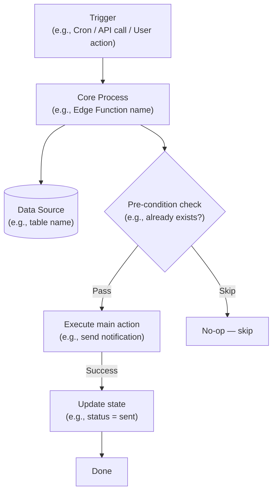
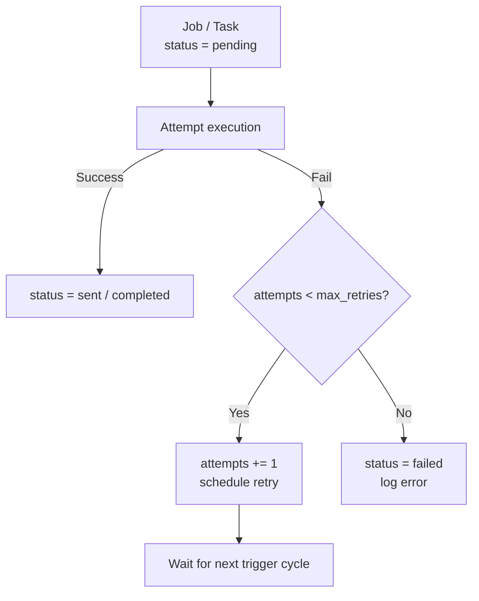
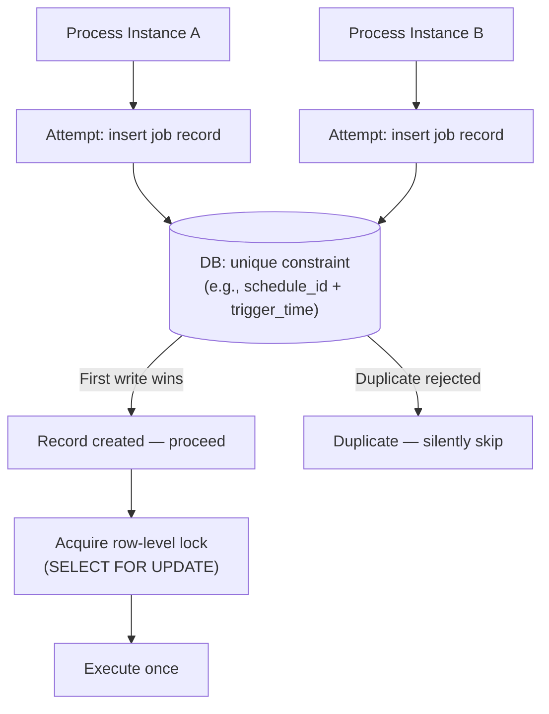
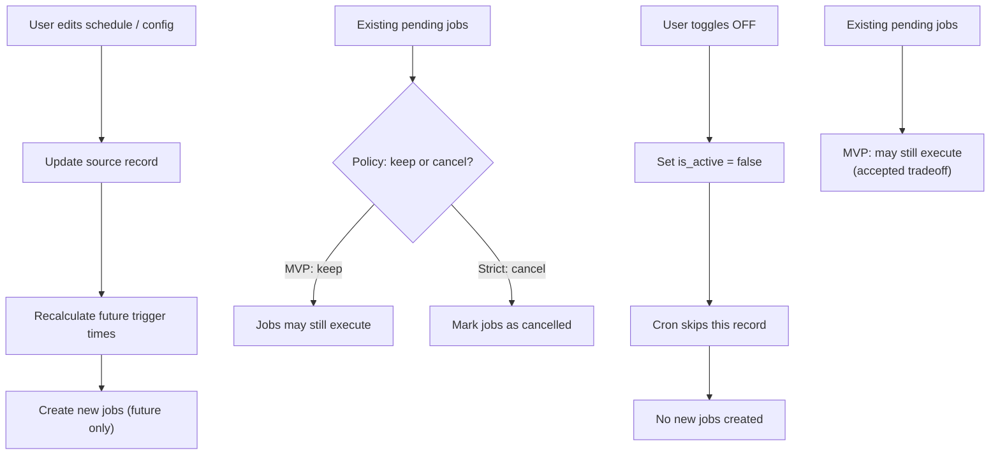

# L4 Technical Workflows — Guide & Patterns

L4 zooms into the technical engine of a single feature. It answers:
**"When things go wrong at the code level, what exactly happens?"**

---

## When L4 Is Required

Required when any flow in the PRD has at least one of:

| Trigger | Signal |
|---------|--------|
| Async / background processing | Cron, queue, worker, scheduler |
| External service with failure modes | Push, payment, email/SMS, webhook |
| Idempotency requirements | Must not run twice / charge twice |
| Concurrent writes | Two users or processes writing same record |
| Multi-step state machine | Row transitions: pending → sent → failed |

Skip for: CRUD screens, read-only views, settings pages, profile forms.

---

## File Structure

One `[feature-name]-L4.md` per major feature that triggers L4.

Each file contains exactly **four flowcharts** in order:

1. Happy Path
2. Error & Retry
3. Idempotency & Concurrency
4. Edge Cases

---

## Flow 1 — Happy Path

Normal execution from trigger to success. No errors, no edge cases.
Shows: trigger → processing steps → success state.



---

## Flow 2 — Error & Retry

What happens on failure. Shows: failure detection → retry logic → terminal states.



Key decisions to show:
- What counts as a failure (timeout, error code, exception)
- Retry limit and backoff strategy
- Terminal failure state and alerting

---

## Flow 3 — Idempotency & Concurrency

Prevents duplicate execution when two processes run simultaneously or when a trigger fires twice.



Key mechanisms to show:
- Unique constraint definition (which fields form the natural key)
- Row-level locking if needed
- Duplicate detection and silent skip pattern

---

## Flow 4 — Edge Cases

User-initiated state changes that affect in-flight jobs. The cases that cause the most bugs in production.

Show each relevant case as a separate subflow within the same diagram, or split into multiple diagrams if the file gets long.

**Common edge cases:**



---

## Naming Conventions

| Element | Convention | Example |
|---------|------------|---------|
| L4 file | `[feature-name]-L4.md` | `reminder-system-L4.md` |
| Diagram comment header | `%% Flow N — [name]` | `%% Flow 1 — Happy Path` |
| Node labels | `["Short description\n(detail)"]` | `["Edge Function:\ngenerate_jobs"]` |
| Database nodes | `[("table name")]` | `[("reminder_jobs")]` |
| Decision nodes | `{"Question?"}` | `{"attempts < max?"}` |

---

## Mermaid Quick Reference

```
flowchart TD               — top-down layout (default for L4)
flowchart LR               — left-right (use for wide state machines)

Node["Label"]              — rectangle (process / action)
Node[("Label")]            — cylinder (database / data store)
Node{"Label"}              — diamond (decision)
Node(["Label"])            — rounded rect (start / end)

-->                        — arrow
-->|"label"|               — labeled arrow
%% comment                 — inline comment
```
