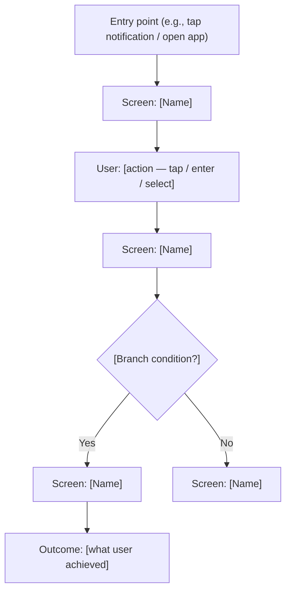
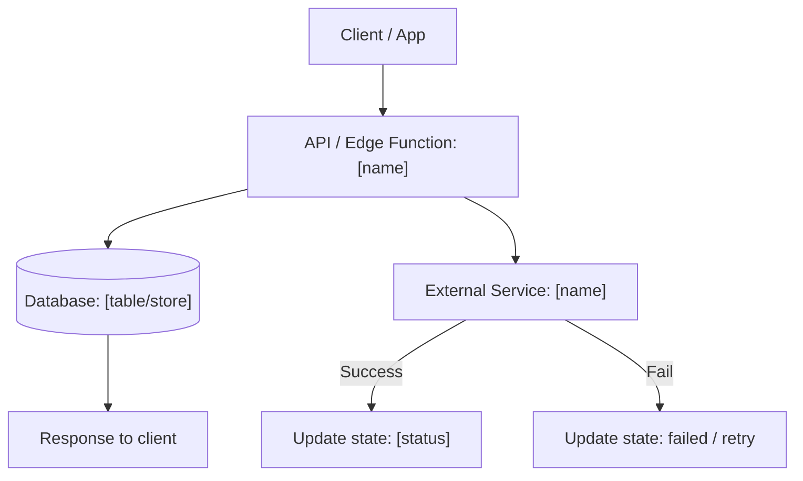

# PRD Template

Use this as the structure for every PRD. Adapt depth based on product complexity.
Not every section needs the same level of detail for every product.

---

# [Product Name] — [Tagline or subtitle]

## 1. Overview & Goals

### Problem Statement
- Frame each problem as: [User type] doing [activity] has [problem] because [root cause].
- Explain why current solutions are inadequate.

### Product Goals
- 3–5 clear, measurable goals using action verbs.
- Each goal directly addresses a problem above.
- Good: "Reduce quiz creation time from 30 min to under 5 min"
- Bad: "Make it easier to create quizzes"

### Target Users
- Primary persona: role, age range, technical comfort level
- Context of use: when, where, how often, on what devices
- Key motivation: what drives them to seek a solution

### Scope & Non-Scope

**In Scope (this version):**
- Feature / capability 1
- Feature / capability 2

**Out of Scope:**
- Feature X — reason deferred (e.g., "V2 after validating core loop")
- Feature Y — reason excluded
- This section prevents scope creep. Be explicit.

### Success Metrics

| Metric | Target | How to Measure |
|--------|--------|----------------|
| [Metric 1] | [Value] | [Method] |
| [Metric 2] | [Value] | [Method] |

Include both leading indicators (daily active users, creation rate) and lagging indicators (30-day retention, NPS).

---

## 2. User Stories

### Story 1: [Short descriptive title]
- **User Role**: [Who]
- **Goal**: [What they want to achieve and why]
- **User Flow**:
  1. [Step-by-step, specific enough for a designer to wireframe]
  2. [Include what the system does at each step]
  3. [Cover the happy path completely]
- **Acceptance Criteria**:
  - [Testable condition — a QA engineer must be able to verify this]
  - [Include performance: "responds within 2s"]
  - [Include edge cases: "shows error if file exceeds 10MB"]

### Story 2: [Title]
...

Write 3–5 stories covering core use cases. Order by user journey priority.

---

## 3. Functional Requirements

### Feature Breakdown

| Feature | Description | Priority | Dependencies |
|---------|-------------|----------|--------------|
| [Feature 1] | [What it does] | Must-have | None |
| [Feature 2] | [What it does] | Should-have | Feature 1 |
| [Feature 3] | [What it does] | Nice-to-have | None |

MoSCoW:
- **Must-have**: Product doesn't work without this
- **Should-have**: Important but can ship without
- **Nice-to-have**: Enhances experience, defer if needed

### Information Architecture
- Key screens/pages and their purpose
- Navigation flow between screens
- Main data entities and their relationships

---

## 4. Architecture Flows

Add one subsection per major feature flow with non-trivial behavior.
Skip this section entirely for simple CRUD features.

### [Feature Name] (e.g., "Notification & Scheduling")

#### L0 — Intent & Outcome

**Intent**
- [What the user wants to avoid — pain point, no tech language]
- [What the user wants to achieve — desired outcome]

**Outcome**
- [What success looks like — specific, user-observable, measurable]

#### L1 — Business Flow

1. [Actor] does [action]
2. [System / Actor] responds with [result]
3. [Next step]
4. ...

#### L2 — User Flow

#### L3 — System Flow

---

## 5. Non-Functional Requirements

| Requirement | Target |
|-------------|--------|
| Performance | [Response time, concurrent users, throughput] |
| Security | [Auth method, encryption, privacy compliance] |
| Scalability | [Expected growth, infrastructure approach] |
| Accessibility | [Mobile responsive, WCAG level, browsers] |
| Localization | [Languages, regional considerations] |

---

## 6. Technical Considerations

- Suggested tech stack (frontend, backend, database, hosting)
- Key API integrations and third-party services
- Data model overview (main entities and relationships)
- AI/ML components if applicable: model, provider, expected accuracy
- Infrastructure: hosting, CDN, monitoring

Keep this section high-level for non-technical audiences.

---

## 7. UI/UX Direction

### Design Language
- Color palette with hex codes and usage
- Typography preferences
- Brand personality keywords (3–5 words)

### Key Interaction Patterns
- Mobile-first or desktop-first
- Key animations / transitions
- Loading states and empty states

Optional — include only if user provides design direction or asks for it.

---

## 8. Risks & Mitigations

| Risk | Impact | Likelihood | Mitigation |
|------|--------|------------|------------|
| [Technical risk] | High/Med/Low | High/Med/Low | [Strategy] |
| [Market risk] | High/Med/Low | High/Med/Low | [Strategy] |
| [Dependency risk] | High/Med/Low | High/Med/Low | [Strategy] |

Include at least 3 risks. Consider: technical feasibility, third-party dependencies, market timing, team capacity, regulatory.

---

## 9. Timeline & Milestones

| Phase | Scope | Duration | Target Date |
|-------|-------|----------|-------------|
| Phase 1 (MVP) | [Core features] | [X weeks] | [Date] |
| Phase 2 | [Enhanced features] | [X weeks] | [Date] |
| Phase 3 | [Scale & optimization] | [X weeks] | [Date] |

Optional — include if user wants phasing or has timeline constraints.

---

## 10. Open Questions

- [ ] [Decision needed from stakeholder]
- [ ] [Question needing user research]
- [ ] [Technical question needing investigation]

Flag unknowns honestly. This section shows maturity — better to surface questions than to pretend you have all the answers.
