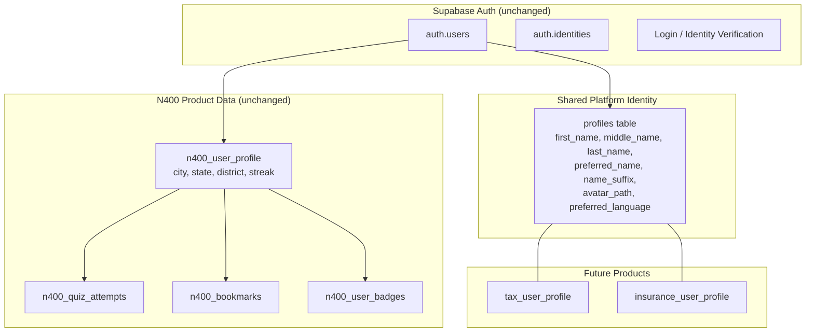

# Identity & User Profile Architecture — Implementation Plan (v4)

> **For agentic workers:** REQUIRED SUB-SKILL: Use superpowers:subagent-driven-development (recommended) or superpowers:executing-plans to implement this plan task-by-task. Steps use checkbox (`- [ ]`) syntax for tracking.

**Goal:** Extend the existing `profiles` table into a shared Manna ecosystem identity with structured legal name fields, storage-backed avatars, and multi-provider OAuth (Google, Facebook, Apple) — designed for long-term document automation across immigration, tax, and insurance products.

**Architecture:** Additive-only schema changes to the production `profiles` table. No table renames, no column drops, no redesign. The `profiles` table becomes the shared platform identity; `n400_user_profile` remains N400-owned product data. OAuth flows use Supabase Auth's built-in identity linking — zero provider-specific columns in the application database. Display names are always generated dynamically from structured name fields — never stored. Avatar paths are stored as relative storage paths — never as full URLs.

**Tech Stack:** Next.js 16 (App Router), Supabase Auth + SSR, Supabase Storage (avatars), PostgreSQL (additive migrations)

---

## Current State Analysis

### What Exists Today

#### `profiles` table (shared platform identity)
| Column | Type | Nullable | Default |
|--------|------|----------|---------|
| `id` | uuid (PK → auth.users) | NO | — |
| `full_name` | text | YES | — |
| `email` | text | YES | — |
| `role` | text | NO | `'client'` |
| `created_at` | timestamptz | NO | `now()` |

#### `n400_user_profile` table (N400 product data)
| Column | Type | Nullable | Default |
|--------|------|----------|---------|
| `user_id` | uuid (PK → auth.users) | NO | — |
| `city` | text | YES | — |
| `state_code` | char | YES | — |
| `zipcode` | char | YES | — |
| `district_number` | integer | YES | — |
| `district_resolved_at` | timestamptz | YES | — |
| `current_streak` | integer | NO | 0 |
| `longest_streak` | integer | NO | 0 |
| `last_activity_date` | date | YES | — |
| `created_at` | timestamptz | NO | `now()` |
| `updated_at` | timestamptz | NO | `now()` |

#### Auth Providers
- **Email** only (1 identity in `auth.identities`)
- **No OAuth** configured — no `signInWithOAuth`, no callback routes
- **Trigger** `on_auth_user_created` → `handle_new_user()` inserts into `profiles` with `full_name` from `raw_user_meta_data` and role `'client'`

#### Auth Flow (current)
```
Email/Password → Supabase Auth → handle_new_user trigger → profiles row created
                                → Login page checks profile.role → redirect
                                → Middleware gates /admin, /portal, /n400app by role
                                → N400 profile gate: redirect to /setup if no n400_user_profile row
```

#### RLS on profiles (current — to be tightened)
| Policy | Command | Expression |
|--------|---------|------------|
| `authenticated_can_read_profiles` | SELECT | `true` |
| `users_read_own_profile` | SELECT | `auth.uid() = id` |
| `users_update_own_profile` | UPDATE | `auth.uid() = id` |

#### Profile Page (N400) — [page.tsx](file:///Users/anhnguyen/Obsidian/Business%20planning/apps/website/src/app/%5Blocale%5D/n400app/profile/page.tsx)
- **Hardcoded** display name: `"Liberty Learner"`
- **Hardcoded** avatar: `/images/n400/illu-wink.png`
- **Hardcoded** email: `liberty.learner@email.com`
- No profile editing capability
- Shows learning stats, badges, address/district, audio preference

#### AuthProvider — [AuthProvider.tsx](file:///Users/anhnguyen/Obsidian/Business%20planning/apps/website/src/components/providers/AuthProvider.tsx)
- Exposes `user`, `profile`, `session`, `loading`
- Profile interface: `{ id, full_name, email, role, created_at }`
- Only `signIn` (email/password) and `signUp` (email/password) — no OAuth

#### Key Files
| File | Role |
|------|------|
| [AuthProvider.tsx](file:///Users/anhnguyen/Obsidian/Business%20planning/apps/website/src/components/providers/AuthProvider.tsx) | Client-side auth context |
| [middleware.ts](file:///Users/anhnguyen/Obsidian/Business%20planning/apps/website/src/middleware.ts) | Server-side auth guard + role check |
| [supabase.ts](file:///Users/anhnguyen/Obsidian/Business%20planning/apps/website/src/lib/supabase.ts) | Browser + server Supabase clients |
| [user-state.tsx](file:///Users/anhnguyen/Obsidian/Business%20planning/apps/website/src/lib/n400/user-state.tsx) | N400 learning state (product data) |
| [login/page.tsx](file:///Users/anhnguyen/Obsidian/Business%20planning/apps/website/src/app/%5Blocale%5D/%28auth%29/login/page.tsx) | Email-only login page |
| [signup/page.tsx](file:///Users/anhnguyen/Obsidian/Business%20planning/apps/website/src/app/%5Blocale%5D/%28auth%29/signup/page.tsx) | Email-only signup page |
| [profile/page.tsx](file:///Users/anhnguyen/Obsidian/Business%20planning/apps/website/src/app/%5Blocale%5D/n400app/profile/page.tsx) | N400 account page (hardcoded identity) |

---

## User Review Required

> [!IMPORTANT]
> **Supabase Dashboard Configuration Required.** Google, Facebook, and Apple OAuth providers must be manually enabled in the [Supabase Auth Dashboard](https://supabase.com/dashboard/project/ffsrlmtqzlidnuitkdvw/auth/providers) with their respective client IDs and secrets. This plan covers the application code only — provider credentials are operator-side.

> [!WARNING]
> **RLS Security Review.** The current policy `authenticated_can_read_profiles` allows ANY authenticated user to read ALL profiles (using `true`). The plan replaces this with explicit per-role policies (see [Phase 1 RLS section](#complete-rls-policy-set)). Note: today there is **no admin-specific read policy** — the internal app currently reads all profiles via the permissive `true` policy. After tightening, internal app reads depend on the new `is_admin()`-based policy. Verified against the live DB (2026-07-03): the sole existing profile has role `'admin'`, and migration `003_role_unification.sql` constrains roles to `('admin','staff','client')` — the `ultimate_admin` role **no longer exists** and must not appear in any policy.

> [!NOTE]
> **Migration file location — RESOLVED.** `006_profiles_identity.sql` and `007_avatars_storage.sql` go in `apps/internal_app/supabase/migrations/`, continuing the 001–005 series there. Rationale: that series owns the `profiles` table history (`003_role_unification.sql` already modified it there); the repo convention is *table ownership*, not feature origin — `apps/website/supabase/migrations/` uses the `n400_` prefix for N400 product tables only. Adding SQL files does not violate monorepo isolation (no internal app code changes). The stale root `supabase/migrations/` directory (April-era 001–005, superseded by the internal_app series) should be archived/deleted separately to avoid confusion — it is NOT the target.

> [!IMPORTANT]
> **Avatar Storage Bucket.** A new public Supabase Storage bucket (`avatars`) will be created. Provider avatars will be **downloaded and re-uploaded** to this bucket on first login. `profiles` stores only the relative `avatar_path` — full URLs are generated dynamically by `getAvatarUrl()`, enabling future storage migration (R2, S3, etc.) without database changes.

## Resolved Decisions

| # | Question | Decision |
|---|----------|----------|
| 1 | **N400 Login Flow** — separate login page vs shared? | **Shared.** OAuth buttons are added to the existing `/login` and `/signup` pages. No separate N400 login page. All users enter through the same MannaOS portal. |
| 2 | **Role for OAuth users** — `'client'` or new role? | **`'client'`.** All OAuth users default to `'client'` role, same as email signup. No new roles introduced. |
| 3 | **Internal app TypeScript impact** | **Zero changes.** The website and internal app share the same Supabase database but define their own TypeScript types independently. No shared Profile interface exists. The internal app continues reading `full_name` and `role` unchanged. |

---

## Design Principles

```
Authentication proves identity.        → Supabase Auth
Shared Profile represents identity.    → profiles table
Learning represents study.             → n400_* tables
Gamification motivates study.           → n400_user_badges
Dashboard encourages action.           → UI layer

Identity is shared across the Manna ecosystem.
Learning remains isolated within N400 Ready.
Legal names are stored as structured components — never split from free text.
Display names are generated dynamically — never stored.
Avatar paths are relative — never full URLs.
Authentication providers initialize identity on first login only.
The Profile becomes application-owned after creation — providers never overwrite it.
Each product manages its own onboarding state.
```

---

## Proposed Changes

### Phase 1: Database — Structured Legal Name Model

> Extend `profiles` with structured name fields, constrained metadata, and relative avatar path. Zero destructive changes. `full_name` remains as legacy. **No automated name splitting** — existing users complete structured fields via profile edit or onboarding.

#### [MODIFY] `profiles` table (new migration)

**New columns:**

| Column | Type | Nullable | Default | Constraint | Purpose |
|--------|------|----------|---------|------------|---------|
| `first_name` | text | YES | NULL | — | Legal first name |
| `middle_name` | text | YES | NULL | — | Legal middle name (optional) |
| `last_name` | text | YES | NULL | — | Legal last name |
| `preferred_name` | text | YES | NULL | — | Everyday preferred name (optional, e.g., "Chris") |
| `name_suffix` | text | YES | NULL | — | Name suffix (optional, e.g., "Jr.", "III") |
| `avatar_path` | text | YES | NULL | — | Relative storage path (e.g., `{user_id}/avatar.webp`) |
| `preferred_language` | text | NO | `'en'` | CHECK `IN ('en','vi')` | Supported UI languages |
| `updated_at` | timestamptz | YES | `now()` | — | Last profile modification |
| `profile_source` | text | YES | NULL | CHECK `IN ('email','google','facebook','apple','system','migration')` | Bootstrap identity source (audit only) |
| `profile_initialized_at` | timestamptz | YES | NULL | — | When profile was first populated from provider |

> [!IMPORTANT]
> **No `display_name` column.** Display names are always generated dynamically. See [Name Display Rules](#name-display-rules).

> [!IMPORTANT]
> **No `bio` column in Phase 1.** Bio has no document automation use. Deferred to a future social profile phase.

> [!IMPORTANT]
> **No `onboarding_completed` column.** Each product manages its own onboarding state in its own product tables (e.g., `n400_user_profile` existence already serves as the N400 onboarding gate).

> [!IMPORTANT]
> **No `last_active_at` column.** Activity tracking creates frequent writes with limited value. Future implementation should use analytics/event tables instead.

> [!IMPORTANT]
> **No backfill name splitting.** Human names are not reliably machine-splittable across cultures (`Nguyen Van A`, `Juan Carlos Gomez`, `Jean Claude Van Damme`). Existing users have `first_name = NULL` / `last_name = NULL` and complete them via profile edit. `full_name` serves as the legacy fallback until structured fields are populated.

> [!NOTE]
> **`full_name` is preserved as legacy.** Not removed, not renamed. New code reads structured fields with `full_name` fallback. Old code reads `full_name` unchanged.

#### `avatar_path` vs `avatar_url`

The column is `avatar_path` (relative path), **not** `avatar_url` (full URL):

```
Stored in DB:     {user_id}/avatar.webp
Generated at runtime: https://{supabase_url}/storage/v1/object/public/avatars/{user_id}/avatar.webp
```

**Benefits:**
- No database migration if CDN changes
- No migration if bucket name changes
- No migration if storage moves to Cloudflare R2, S3, etc.
- Single `getAvatarUrl(path)` utility generates URLs

#### Name Display Rules

The application generates display names dynamically using these rules:

| Rule | Condition | Output | Example |
|------|-----------|--------|---------|
| **1** | `preferred_name` exists | `preferred_name` + `last_name` | Chris Nguyen |
| **2** | No `preferred_name` | `first_name` + `last_name` | Christopher Nguyen |
| **3** | No `last_name` | `preferred_name` or `first_name` alone | Madonna |
| **4** | No structured fields | `full_name` (legacy fallback) | Christopher Nguyen |
| **5** | Nothing populated | `'User'` | User |

**Middle name** never appears in normal UI — only in legal/document contexts.

**Legal document formatting** generates: `first_name` + `middle_name` (if present) + `last_name` + `name_suffix` (if present)
Examples: `Christopher Van Nguyen` · `Christopher Van Nguyen Jr.`

#### `full_name` → Structured Fields Migration Strategy

| Phase | Action | How |
|-------|--------|-----|
| **Now** | Add structured columns with NULL values for existing users | Migration 006 — no backfill splitting |
| **Now** | New code reads structured fields; falls back to `full_name` if NULL | `getDisplayName()` utility |
| **Now** | New OAuth users get structured fields from provider `given_name` / `family_name` | Trigger uses provider-separated fields when available |
| **Gradual** | UI prompts existing users to complete structured name during profile edit | Soft prompt, not blocking |
| **Future** | Once all active users have structured fields, `full_name` becomes truly legacy | No rush — never blocks |

#### Complete RLS Policy Set

> [!CAUTION]
> **No self-referencing policies.** A policy on `profiles` must never subquery `profiles` directly — Postgres raises `42P17: infinite recursion detected in policy for relation "profiles"`, which breaks **every** read on the table for **all** users. Admin checks go through a `SECURITY DEFINER` helper function (`public.is_admin()`) that bypasses RLS.

> [!CAUTION]
> **Role model.** Migration `003_role_unification.sql` constrains `profiles.role` to `('admin', 'staff', 'client')`. `ultimate_admin` was renamed to `admin` and no longer exists. All policies below use `role = 'admin'`.

After migration, `profiles` will have these explicit policies:

| Policy Name | Command | Role | Expression |
|-------------|---------|------|------------|
| `users_read_own_profile` | SELECT | `authenticated` | `(SELECT auth.uid()) = id` |
| `admins_read_all_profiles` | SELECT | `authenticated` | `public.is_admin()` |
| `users_update_own_profile` | UPDATE | `authenticated` | USING: `(SELECT auth.uid()) = id` / WITH CHECK: `(SELECT auth.uid()) = id` |
| `admins_update_all_profiles` | UPDATE | `authenticated` | USING: `public.is_admin()` / WITH CHECK: `public.is_admin()` |

> [!NOTE]
> INSERT policy is not needed — profile rows are created exclusively by the `handle_new_user` trigger (SECURITY DEFINER, bypasses RLS).

> [!CAUTION]
> **RLS alone does not prevent role self-escalation.** `WITH CHECK ((SELECT auth.uid()) = id)` still allows a user to UPDATE their own row and set `role = 'admin'`. A `BEFORE UPDATE` trigger (`profiles_protect_role`, included in the migration below) rejects role changes from non-admin end users.

#### [NEW] Migration file: `006_profiles_identity.sql`

```sql
-- ============================================================
-- 006_profiles_identity.sql
-- Add structured legal name fields + constrained metadata
-- to the shared profiles table. Fully additive.
--
-- IMPORTANT: No backfill name splitting. Existing users keep
-- first_name/last_name as NULL until they edit their profile.
-- ============================================================

-- Structured legal name fields (all nullable)
ALTER TABLE profiles ADD COLUMN IF NOT EXISTS first_name text;
ALTER TABLE profiles ADD COLUMN IF NOT EXISTS middle_name text;
ALTER TABLE profiles ADD COLUMN IF NOT EXISTS last_name text;
ALTER TABLE profiles ADD COLUMN IF NOT EXISTS preferred_name text;
ALTER TABLE profiles ADD COLUMN IF NOT EXISTS name_suffix text;

-- Avatar: relative storage path, NOT a full URL
ALTER TABLE profiles ADD COLUMN IF NOT EXISTS avatar_path text;

-- Constrained metadata
ALTER TABLE profiles ADD COLUMN IF NOT EXISTS preferred_language text
  DEFAULT 'en' NOT NULL
  CONSTRAINT profiles_preferred_language_check
  CHECK (preferred_language IN ('en', 'vi'));

ALTER TABLE profiles ADD COLUMN IF NOT EXISTS updated_at timestamptz DEFAULT now();

-- Audit metadata
ALTER TABLE profiles ADD COLUMN IF NOT EXISTS profile_source text
  CONSTRAINT profiles_source_check
  CHECK (profile_source IN ('email', 'google', 'facebook', 'apple', 'system', 'migration'));

ALTER TABLE profiles ADD COLUMN IF NOT EXISTS profile_initialized_at timestamptz;

-- Backfill: set profile_source for existing users (no name splitting)
UPDATE profiles
SET
  profile_source = 'email',
  profile_initialized_at = created_at
WHERE profile_source IS NULL;

-- ============================================================
-- TRIGGER: Safe replacement strategy
-- 1. Create new function with a different name
-- 2. Swap the trigger to use the new function
-- 3. Drop the old function
-- ============================================================

-- Step 1: Create new trigger function
CREATE OR REPLACE FUNCTION public.handle_new_user_v2()
RETURNS trigger AS $$
DECLARE
  raw_name text;
  given text;
  family text;
  provider text;
BEGIN
  -- Determine provider source
  provider := COALESCE(
    NEW.raw_app_meta_data ->> 'provider',
    'email'
  );

  -- Extract name components
  -- OAuth providers (Google, Facebook) expose given_name / family_name
  -- when available — use these directly instead of splitting full_name
  given := NEW.raw_user_meta_data ->> 'given_name';
  family := NEW.raw_user_meta_data ->> 'family_name';

  -- Legacy: capture full_name for backward compatibility
  raw_name := COALESCE(
    NEW.raw_user_meta_data ->> 'full_name',
    NEW.raw_user_meta_data ->> 'name',
    ''
  );

  -- Fallback: if provider didn't expose structured names,
  -- leave first_name/last_name as NULL — user completes later.
  -- NEVER derive first_name from the email prefix: these are
  -- LEGAL name fields feeding document automation. "chris.nguyen92"
  -- must never become a legal first name. UI fallback for a fully
  -- empty profile is handled by getDisplayName() → 'User'.

  INSERT INTO public.profiles (
    id, full_name, email, role,
    first_name, last_name,
    preferred_language, profile_source, profile_initialized_at
  )
  VALUES (
    NEW.id,
    NULLIF(raw_name, ''),
    NEW.email,
    'client',
    given,
    family,
    'en',
    provider,
    now()
  )
  ON CONFLICT (id) DO NOTHING;

  RETURN NEW;
END;
$$ LANGUAGE plpgsql SECURITY DEFINER;

-- Step 2: Swap the trigger to use the new function
DROP TRIGGER IF EXISTS on_auth_user_created ON auth.users;
CREATE TRIGGER on_auth_user_created
  AFTER INSERT ON auth.users
  FOR EACH ROW EXECUTE FUNCTION public.handle_new_user_v2();

-- Step 3: Drop old function (safe — trigger no longer references it)
DROP FUNCTION IF EXISTS public.handle_new_user();

-- ============================================================
-- RLS: Complete replacement policy set
--
-- CAUTION: Policies on profiles must NOT subquery profiles —
-- that causes infinite recursion (42P17) and breaks ALL reads.
-- Admin checks go through the SECURITY DEFINER helper below.
-- ============================================================

-- Helper: SECURITY DEFINER bypasses RLS, so no recursion.
-- Role model per 003_role_unification.sql: ('admin','staff','client').
CREATE OR REPLACE FUNCTION public.is_admin()
RETURNS boolean AS $$
  SELECT EXISTS (
    SELECT 1 FROM public.profiles
    WHERE id = auth.uid() AND role = 'admin'
  );
$$ LANGUAGE sql SECURITY DEFINER STABLE SET search_path = public;

-- Drop all existing profile policies
DROP POLICY IF EXISTS "authenticated_can_read_profiles" ON profiles;
DROP POLICY IF EXISTS "users_read_own_profile" ON profiles;
DROP POLICY IF EXISTS "Users can view their own profile" ON profiles;
DROP POLICY IF EXISTS "Admins can view all profiles" ON profiles;
DROP POLICY IF EXISTS "users_update_own_profile" ON profiles;
DROP POLICY IF EXISTS "Users can update their own profile" ON profiles;

-- SELECT: Users read own profile
CREATE POLICY "users_read_own_profile" ON profiles FOR SELECT
  TO authenticated
  USING ((SELECT auth.uid()) = id);

-- SELECT: Admins read all profiles
CREATE POLICY "admins_read_all_profiles" ON profiles FOR SELECT
  TO authenticated
  USING (public.is_admin());

-- UPDATE: Users update own profile
-- NOTE: WITH CHECK here does NOT prevent role self-escalation —
-- the profiles_protect_role trigger below handles that.
CREATE POLICY "users_update_own_profile" ON profiles FOR UPDATE
  TO authenticated
  USING ((SELECT auth.uid()) = id)
  WITH CHECK ((SELECT auth.uid()) = id);

-- UPDATE: Admins update all profiles
CREATE POLICY "admins_update_all_profiles" ON profiles FOR UPDATE
  TO authenticated
  USING (public.is_admin())
  WITH CHECK (public.is_admin());

-- No INSERT policy — rows created by SECURITY DEFINER trigger only.

-- ============================================================
-- Role protection: block role self-escalation
-- RLS WITH CHECK cannot compare NEW vs OLD — a trigger can.
-- service_role requests have auth.uid() = NULL and pass through.
-- ============================================================
CREATE OR REPLACE FUNCTION public.protect_profile_role()
RETURNS trigger AS $$
BEGIN
  IF NEW.role IS DISTINCT FROM OLD.role
     AND auth.uid() IS NOT NULL       -- end-user request (not service_role)
     AND NOT public.is_admin() THEN
    RAISE EXCEPTION 'changing role requires admin privileges';
  END IF;
  RETURN NEW;
END;
$$ LANGUAGE plpgsql;

DROP TRIGGER IF EXISTS profiles_protect_role ON profiles;
CREATE TRIGGER profiles_protect_role
  BEFORE UPDATE ON profiles
  FOR EACH ROW EXECUTE FUNCTION public.protect_profile_role();

-- ============================================================
-- Auto-update updated_at via trigger
-- ============================================================
CREATE OR REPLACE FUNCTION public.update_profiles_updated_at()
RETURNS trigger AS $$
BEGIN
  NEW.updated_at = now();
  RETURN NEW;
END;
$$ LANGUAGE plpgsql;

DROP TRIGGER IF EXISTS profiles_updated_at ON profiles;
CREATE TRIGGER profiles_updated_at
  BEFORE UPDATE ON profiles
  FOR EACH ROW EXECUTE FUNCTION public.update_profiles_updated_at();
```

> [!NOTE]
> **Trigger rollback safety:** The migration creates `handle_new_user_v2()` first, swaps the trigger, then drops the old function. If the new function has issues, rolling back restores the old trigger cleanly.

> [!NOTE]
> **`updated_at` is maintained exclusively by the trigger** — the migration does not backfill `updated_at` to avoid misrepresenting modification timestamps. For existing rows, `updated_at` will be NULL until the user actually edits their profile.

---

### Phase 2: Avatar Storage

> Create Supabase Storage bucket for user avatars. Provider avatars are downloaded and re-hosted here — never stored as external URLs.

#### [NEW] Storage bucket: `avatars` (migration `007_avatars_storage.sql`)

```sql
-- Create avatars storage bucket (public for CDN-served images)
INSERT INTO storage.buckets (id, name, public)
VALUES ('avatars', 'avatars', true)
ON CONFLICT (id) DO NOTHING;

-- RLS: Users can upload/upsert their own avatar
-- Note: upsert requires INSERT + SELECT + UPDATE policies
CREATE POLICY "Users upload own avatar"
ON storage.objects FOR INSERT
TO authenticated
WITH CHECK (bucket_id = 'avatars' AND (storage.foldername(name))[1] = auth.uid()::text);

CREATE POLICY "Users read own avatar"
ON storage.objects FOR SELECT
TO authenticated
USING (bucket_id = 'avatars' AND (storage.foldername(name))[1] = auth.uid()::text);

CREATE POLICY "Users update own avatar"
ON storage.objects FOR UPDATE
TO authenticated
USING (bucket_id = 'avatars' AND (storage.foldername(name))[1] = auth.uid()::text)
WITH CHECK (bucket_id = 'avatars' AND (storage.foldername(name))[1] = auth.uid()::text);

CREATE POLICY "Users delete own avatar"
ON storage.objects FOR DELETE
TO authenticated
USING (bucket_id = 'avatars' AND (storage.foldername(name))[1] = auth.uid()::text);

-- Public read for all avatars (since bucket is public, CDN-served)
CREATE POLICY "Public avatar read"
ON storage.objects FOR SELECT
TO public
USING (bucket_id = 'avatars');
```

> [!IMPORTANT]
> **Upsert compatibility:** Storage upsert (`{ upsert: true }`) requires INSERT + SELECT + UPDATE policies. All three are included above. Verify with `supabase.storage.from('avatars').upload(path, file, { upsert: true })` during testing.

**File path convention:** `{user_id}/avatar.{ext}`

> [!WARNING]
> **CDN cache invalidation.** The bucket is public and Supabase's CDN caches objects by URL. Upserting a new image at the **same path** means users keep seeing the stale avatar until the cache expires. Mitigation: `getAvatarUrl()` appends a cache-busting `?v=` parameter derived from `profiles.updated_at` (see Phase 4). Additionally, if the replacement image has a different extension (e.g. `.jpg` → `.webp`), the old file must be deleted on upload or it is orphaned in the bucket.

#### Avatar Initialization Strategy

```
First Login (OAuth)
  ↓
Auth callback route reads provider avatar URL from user.user_metadata.avatar_url
  ↓
Server detects Content-Type and image format
  ↓
Server downloads and (optionally) resizes image
  ↓
Server uploads to Storage: {user_id}/avatar.{detected_ext}
  ↓
Updates profiles.avatar_path = '{user_id}/avatar.{ext}'
  ↓
Application calls getAvatarUrl(profile.avatar_path) to render

─────────────────────────────────────────────────

User uploads custom avatar later
  ↓
Replaces file in {user_id}/avatar.{ext} via upsert
  ↓
Updates profiles.avatar_path
  ↓
Custom avatar is NEVER overwritten by future provider logins

─────────────────────────────────────────────────

Avatar bootstrap fails (network error, Apple provides no avatar, etc.)
  ↓
profiles.avatar_path remains NULL
  ↓
Application renders initials fallback via getInitials()
  ↓
Authentication succeeds regardless — avatar failure NEVER blocks auth
```

> [!IMPORTANT]
> **Avatar bootstrap must never block authentication.** If the download/upload fails for any reason, auth completes normally and the user sees an initials-based fallback until they upload manually.

> [!NOTE]
> **Content-Type detection:** OAuth providers serve different image formats. The callback route must read the `Content-Type` header to determine the correct file extension. Do not hardcode `.jpg` — Google may serve `.png`, Facebook may serve `.jpg`, Apple may provide nothing.

---

### Phase 3: OAuth — Auth Callback Route + Avatar Bootstrap

> Server-side route to exchange OAuth code for session and bootstrap avatar on first login.

#### [NEW] `apps/website/src/app/api/auth/callback/route.ts`

Supabase OAuth flow with avatar bootstrap:

```
Google/Facebook/Apple Login Button
  ↓
supabase.auth.signInWithOAuth({ provider, redirectTo })
  ↓
Provider consent screen
  ↓
/api/auth/callback?code=...
  ↓
Server: exchangeCodeForSession() → sets cookie
  ↓
Check if profiles.avatar_path is NULL (first login)
  ↓ YES
  Read provider avatar from user.user_metadata.avatar_url
  ↓
  Detect Content-Type → download image → upload to Storage
  ↓
  UPDATE profiles SET avatar_path = '{user_id}/avatar.{ext}'
  ↓ FAILURE? → skip gracefully, user sees initials
  ↓
Redirect → /n400app (or /portal, based on context)
```

**Key principle:** The callback route downloads the provider avatar and stores it internally. Subsequent logins **never overwrite** existing `avatar_path` — the profile is application-owned after initialization.

#### [MODIFY] [AuthProvider.tsx](file:///Users/anhnguyen/Obsidian/Business%20planning/apps/website/src/components/providers/AuthProvider.tsx)

Add `signInWithOAuth(provider)` method to the auth context:

```typescript
// New method added to AuthContextType
signInWithOAuth: (provider: 'google' | 'facebook' | 'apple') => Promise<void>;
```

The implementation calls `supabase.auth.signInWithOAuth()` with the provider and a `redirectTo` pointing to `/api/auth/callback`.

#### [MODIFY] Profile interface update in AuthProvider

```typescript
export interface Profile {
  id: string;
  // Legacy field — preserved for backward compat
  full_name: string | null;
  // Structured legal name
  first_name: string | null;
  middle_name: string | null;
  last_name: string | null;
  preferred_name: string | null;
  name_suffix: string | null;
  // Identity
  avatar_path: string | null;      // Relative storage path
  preferred_language: 'en' | 'vi';
  email: string | null;
  // Role model per 003_role_unification.sql — 'ultimate_admin' no longer exists
  role: "admin" | "staff" | "client";
  created_at: string;
  updated_at: string | null;
  // Audit
  profile_source: 'email' | 'google' | 'facebook' | 'apple' | 'system' | 'migration' | null;
  profile_initialized_at: string | null;
}
```

---

### Phase 4: Profile Utilities — Single Source of Truth

> Shared utility module for all name rendering and avatar URL generation. Future Manna products import from here — never duplicate formatting logic.

#### [NEW] `apps/website/src/lib/profile-utils.ts`

```typescript
// ============================================================
// profile-utils.ts — Single source of truth for name rendering
// and avatar URL generation across all Manna applications.
//
// RULES:
// - Display names are NEVER stored in the database.
// - Avatar URLs are NEVER stored in the database.
// - Middle names NEVER appear in normal application UI.
// ============================================================

export interface ProfileNameFields {
  first_name: string | null;
  middle_name: string | null;
  last_name: string | null;
  preferred_name: string | null;
  name_suffix: string | null;
  full_name: string | null; // legacy fallback
}

/**
 * Generate display name dynamically. Never stored in the database.
 *
 * Rule 1: preferred_name + last_name → "Chris Nguyen"
 * Rule 2: first_name + last_name    → "Christopher Nguyen"
 * Rule 3: preferred_name or first_name alone → "Madonna"
 * Rule 4: full_name (legacy fallback) → "Christopher Nguyen"
 * Rule 5: nothing → "User"
 */
export function getDisplayName(p: ProfileNameFields): string {
  const primary = p.preferred_name || p.first_name;
  if (primary && p.last_name) return `${primary} ${p.last_name}`;
  if (primary) return primary;
  if (p.full_name) return p.full_name;
  return 'User';
}

/**
 * Short name for compact UI (e.g., greeting, avatar label).
 * Returns preferred_name, or first_name, or first word of full_name.
 */
export function getShortName(p: ProfileNameFields): string {
  if (p.preferred_name) return p.preferred_name;
  if (p.first_name) return p.first_name;
  if (p.full_name) return p.full_name.split(' ')[0];
  return 'User';
}

/**
 * Generate legal full name for document automation.
 * Format: first_name [middle_name] last_name [name_suffix]
 * Middle name is included here — the ONLY context where it appears.
 */
export function getLegalName(p: ProfileNameFields): string {
  const parts = [
    p.first_name,
    p.middle_name,
    p.last_name,
    p.name_suffix,
  ].filter(Boolean);
  return parts.join(' ') || p.full_name || '';
}

/**
 * Generate initials for avatar fallback.
 * Falls back to full_name so legacy users (NULL structured fields)
 * get real initials instead of '?'.
 */
export function getInitials(p: ProfileNameFields): string {
  const first = (p.preferred_name || p.first_name || '')[0] || '';
  const last = (p.last_name || '')[0] || '';
  if (first || last) return (first + last).toUpperCase();
  if (p.full_name) {
    const words = p.full_name.trim().split(/\s+/);
    const a = words[0]?.[0] || '';
    const b = words.length > 1 ? words[words.length - 1][0] || '' : '';
    return (a + b).toUpperCase() || '?';
  }
  return '?';
}

/**
 * Generate a public avatar URL from a relative storage path.
 * This is the ONLY place that knows about the storage backend.
 *
 * Returns null if avatar_path is null (caller renders initials fallback).
 *
 * `version` (pass profile.updated_at) is appended as a cache-buster —
 * the public bucket is CDN-cached by URL, so replacing the image at
 * the same path would otherwise serve a stale avatar.
 *
 * Future: swap implementation to Cloudflare R2, S3, etc.
 * without any application-wide code changes.
 */
export function getAvatarUrl(
  avatarPath: string | null,
  version?: string | null,
): string | null {
  if (!avatarPath) return null;
  const supabaseUrl = process.env.NEXT_PUBLIC_SUPABASE_URL;
  if (!supabaseUrl) return null;
  const v = version ? `?v=${encodeURIComponent(version)}` : '';
  return `${supabaseUrl}/storage/v1/object/public/avatars/${avatarPath}${v}`;
}
```

> [!IMPORTANT]
> **`getAvatarUrl()` is the single abstraction layer** between the application and storage. All avatar rendering goes through this function. Never construct storage URLs elsewhere. This enables future migration to Cloudflare R2, S3, or custom CDN without application-wide changes.

---

### Phase 5: Login & Signup UI — OAuth Buttons

> Add Google/Facebook/Apple buttons to existing auth pages.

#### [MODIFY] [login/page.tsx](file:///Users/anhnguyen/Obsidian/Business%20planning/apps/website/src/app/%5Blocale%5D/%28auth%29/login/page.tsx)

Add OAuth button section above the email form:

```
┌────────────────────────────┐
│       Welcome to Manna     │
│                            │
│  [🔵 Continue with Google] │
│  [🔵 Continue with Facebook│
│  [⚫ Continue with Apple]  │
│                            │
│  ─── or sign in with email ── │
│                            │
│  [Email field]             │
│  [Password field]          │
│  [Sign in button]          │
│                            │
│  Forgot password? Sign up  │
└────────────────────────────┘
```

#### [MODIFY] [signup/page.tsx](file:///Users/anhnguyen/Obsidian/Business%20planning/apps/website/src/app/%5Blocale%5D/%28auth%29/signup/page.tsx)

Same OAuth button section added above the email form. The existing `fullName` field maps to the legacy `full_name` via the trigger. Structured name fields are populated during onboarding or profile edit.

#### [NEW] `apps/website/src/components/auth/OAuthButtons.tsx`

Shared component for OAuth provider buttons:

```typescript
// Renders Google, Facebook, Apple sign-in buttons
// Calls signInWithOAuth from AuthProvider
// Shows loading state per provider
// Handles errors gracefully
```

---

### Phase 6: Profile Editing UI — Structured Name Fields

> Replace hardcoded profile page with dynamic, editable profile using structured legal name fields.

#### [MODIFY] [profile/page.tsx](file:///Users/anhnguyen/Obsidian/Business%20planning/apps/website/src/app/%5Blocale%5D/n400app/profile/page.tsx)

Replace hardcoded identity section with data from `useAuth().profile` + `getDisplayName()`:

```
BEFORE:                          AFTER:
┌───────────────────────┐       ┌───────────────────────────────┐
│ [static wink image]   │       │ [avatar via getAvatarUrl()    │
│ Liberty Learner       │       │  or initials via getInitials()]│
│ N400 Candidate        │       │ {getDisplayName(profile)}     │
│ liberty@email.com     │       │ N400 Candidate                │
│ Texas                 │       │ {user.email}                  │
│                       │       │ [✏️ Edit Profile]             │
└───────────────────────┘       └───────────────────────────────┘
```

#### [NEW] `apps/website/src/app/[locale]/n400app/profile/edit/page.tsx`

Profile editing page with structured name fields:

```
┌──────────────────────────────────────┐
│ Edit Profile                          │
│                                       │
│ [Avatar upload/change]                │
│                                       │
│ First Name*:     [Christopher_____]   │
│ Middle Name:     [Van_____________]   │  ← "Used only for legal documents"
│ Last Name*:      [Nguyen__________]   │
│ Preferred Name:  [Chris___________]   │  ← "How your name appears in the app"
│ Name Suffix:     [___(e.g. Jr.)___]   │
│                                       │
│ Language:        [English ▼]          │
│                                       │
│ [Save Changes]  [Cancel]              │
│                                       │
│ ── Connected Accounts ──              │
│ ✅ Google (chris@gmail.com)           │
│ ➕ Link Facebook                      │
│ ➕ Link Apple                         │
│                                       │
│ ⚠️ Email & auth managed by           │
│    Supabase Auth (read-only)          │
└──────────────────────────────────────┘
```

> [!NOTE]
> Middle Name and Preferred Name include helper text explaining they are optional. Name Suffix includes example text ("e.g. Jr., III"). First Name and Last Name are required for complete profile but may remain empty — the `getDisplayName()` fallback chain handles all states gracefully.

#### [NEW] `apps/website/src/lib/profile.ts`

Profile service module:

```typescript
// updateProfile(userId, { first_name, middle_name, last_name,
//   preferred_name, name_suffix, preferred_language }) → profiles table
//
// uploadAvatar(userId, file) → detect format → upload to storage bucket
//   → upsert {user_id}/avatar.{ext} → update profiles.avatar_path
//
// getLinkedProviders() → reads from supabase.auth.getUser().identities
//
// IMPORTANT: Updates to profiles NEVER touch full_name.
//   full_name is legacy and only written by the trigger on first signup.
//
// IMPORTANT: Uses supabase.storage.from('avatars').upload(..., { upsert: true })
//   to handle both first upload and replacement.
```

---

### Phase 7: First-Login Flow + Profile Synchronization

> Initialize profile from OAuth provider data. Provider supplies initial values only — profile becomes application-owned immediately. Synchronization is inherent via shared database.

#### First-Login Flow

```
OAuth/Email Sign Up
  ↓
handle_new_user_v2 trigger fires
  → profiles.first_name = provider given_name (if available)
  → profiles.last_name = provider family_name (if available)
  → profiles.full_name = raw provider name (legacy)
  → profiles.profile_source = 'google' | 'facebook' | 'apple' | 'email'
  → profiles.profile_initialized_at = now()
  ↓
/api/auth/callback
  → Downloads provider avatar → uploads to Storage (if available)
  → Updates profiles.avatar_path (if download succeeded)
  → Redirects to /n400app
  ↓
Middleware: n400_user_profile exists?
  → NO: Redirect to /n400app/setup (existing route)
  ↓
/n400app/setup
  → User completes address setup
  → Creates n400_user_profile row (existing behavior)
  ↓
Redirect to /n400app (dashboard)
```

#### Provider-Owned vs Application-Owned

```
FIRST LOGIN ONLY:                    ALL SUBSEQUENT LOGINS:
┌────────────────────┐              ┌────────────────────┐
│ Provider supplies:  │              │ Provider supplies:  │
│ • given_name       │              │ • Authentication    │
│ • family_name      │              │   ONLY              │
│ • avatar           │              │                     │
│ • email            │              │ Profile is NOT      │
│                     │              │ overwritten.         │
│ Initializes:       │              │                     │
│ • first_name       │              │ User may have        │
│ • last_name        │              │ changed their name,  │
│ • avatar_path      │              │ avatar, or language. │
│ • profile_source   │              │ Those changes are    │
└────────────────────┘              │ preserved.           │
                                     └────────────────────┘
```

#### Middleware — [middleware.ts](file:///Users/anhnguyen/Obsidian/Business%20planning/apps/website/src/middleware.ts)

**Zero changes needed.** The existing gate (`!n400Profile → redirect /setup`) already covers the first-login case because `n400_user_profile` is only created during `/setup`. Each product manages its own onboarding via its own product table — no shared `onboarding_completed` flag.

#### Profile Synchronization

**Already inherently correct.** Both N400 Ready and MannaOS use the same Supabase project (`ffsrlmtqzlidnuitkdvw`) and the same `profiles` table:

```
Edit profile in N400  → UPDATE profiles → MannaOS reads same row → instant
Edit profile in MannaOS → UPDATE profiles → N400 reads same row → instant
```

No additional sync mechanism needed. Supabase Realtime is out of scope for v1.

---

## Ownership Boundaries (Preserved)



**What lives where:**

| Domain | Table | Fields |
|--------|-------|--------|
| **Auth** (Supabase-managed) | `auth.users`, `auth.identities` | Login, providers, JWT |
| **Shared Profile** | `profiles` | first_name, middle_name, last_name, preferred_name, name_suffix, avatar_path, preferred_language, role |
| **N400 Learning** | `n400_user_profile` | city, state, district, streak |
| **N400 Gamification** | `n400_user_badges`, `n400_badges` | Badges, achievements |
| **N400 Progress** | `n400_quiz_attempts`, `n400_question_attempts`, `n400_bookmarks` | Attempts, scores, bookmarks |

> [!IMPORTANT]
> Learning statistics, gamification, and progress data **remain in N400 product tables**. They never migrate to the shared `profiles` table. Future Manna products create their own product-specific tables following the same `{product}_user_profile` pattern.

---

## Connected Accounts Architecture

Multiple auth providers are supported but they are **authentication methods, not separate users**:

```
┌─────────────┐    ┌─────────────┐    ┌─────────────┐    ┌─────────────┐
│   Google     │    │  Facebook   │    │    Apple     │    │    Email    │
│  Provider    │    │  Provider   │    │  Provider    │    │  Provider   │
└──────┬──────┘    └──────┬──────┘    └──────┬──────┘    └──────┬──────┘
       │                  │                  │                  │
       └──────────────────┴──────────────────┴──────────────────┘
                                    │
                          ┌─────────▼─────────┐
                          │   auth.identities   │
                          │   (multiple rows    │
                          │    per user)        │
                          └─────────┬─────────┘
                                    │
                          ┌─────────▼─────────┐
                          │    auth.users       │
                          │    (ONE row)        │
                          └─────────┬─────────┘
                                    │
                          ┌─────────▼─────────┐
                          │     profiles        │
                          │     (ONE row)       │
                          │                     │
                          │  first_name         │
                          │  last_name          │
                          │  preferred_name     │
                          │  avatar_path        │
                          │  ...                │
                          └─────────────────────┘
```

Supabase Auth's "Automatically link identities" setting handles identity linking when the same email is used across providers.

> [!NOTE]
> **Different-email identity merge is intentionally out of scope for v1.** If a user signs up with `chris@gmail.com` via Google and later with `chris@icloud.com` via Apple, these are treated as separate accounts. Future account merge functionality may require manual verification workflows.

---

## Explicit Scope Exclusions

| Exclusion | Rationale |
|-----------|-----------|
| **Account deletion** | Requires defining cascade behavior across profiles, avatars, product tables, auth, and storage. Deferred to a dedicated phase. |
| **Different-email identity merge** | Requires manual verification workflows. Out of scope for v1. |
| **Realtime subscriptions** | Read-on-mount is sufficient for v1. |
| **Internal app code changes** | **Zero changes required.** Each app defines its own TypeScript types independently — no shared Profile interface exists. Internal app continues reading `full_name` and `role` unchanged. |
| **Bio field** | No document automation use. Deferred to future social profile phase. |
| **`last_active_at`** | Creates frequent writes. Deferred to analytics/event tables. |
| **Shared `onboarding_completed`** | Each product manages its own onboarding. N400 already uses `n400_user_profile` existence as its gate. |
| **OAuth provider credentials** | Operator-side configuration in Supabase Dashboard. |

---

## Implementation Order

| Phase | Scope | Risk | Dependencies |
|-------|-------|------|--------------|
| **1. Database migration** | Structured name columns, constrained metadata, trigger v2, RLS overhaul | Low — additive only | None |
| **2. Avatar storage** | Create bucket, upsert-compatible policies | Low | Phase 1 |
| **3. Auth callback + avatar bootstrap** | `/api/auth/callback` + download provider avatar | Medium — SSR + image handling | Phase 1, 2 |
| **4. Profile utilities** | `profile-utils.ts` — name rendering + `getAvatarUrl()` | Low — pure functions | Phase 1 |
| **5. AuthProvider update** | New profile fields, `signInWithOAuth` | Medium — context change | Phase 1, 3 |
| **6. OAuth buttons** | Login/signup UI changes | Low | Phase 5 |
| **7. Profile editing + dynamic profile** | Edit page, profile service, avatar upload, dynamic profile page | Medium — new UI surface | Phase 1, 2, 4, 5 |

**Recommended execution order:** 1 → 2 → 4 → 3 → 5 → 6 → 7

---

## Backward Compatibility

| Component | Impact | Mitigation |
|-----------|--------|------------|
| `profiles` table | New nullable columns added | Existing queries continue to work — they won't SELECT new columns |
| `full_name` column | **Preserved, not removed** | Legacy code reads unchanged; new code uses structured fields with `full_name` fallback |
| `handle_new_user` trigger | Replaced by `handle_new_user_v2` | Safe swap: create new → swap trigger → drop old. Rollback-safe. |
| RLS policies | Replaced with explicit set | User self-access unchanged; admin access moves from permissive `true` policy to `is_admin()` — verify internal app reads after migration |
| `AuthProvider.Profile` interface | New optional fields added | TypeScript extension — consumers see `null` for new fields |
| Login page | OAuth buttons added above existing form | Email flow unchanged — buttons are additive |
| Profile page | Hardcoded values replaced with dynamic | Was placeholder data — improvement, not breakage |
| `n400_user_profile` | **Zero changes** | Product data table completely untouched |
| Middleware | **Zero changes** | Existing gate logic preserved |
| Internal app | **Zero changes required** | Each app defines its own TypeScript types — no shared interface to update |

---

## Risks & Mitigations

| Risk | Severity | Mitigation |
|------|----------|------------|
| OAuth identity linking creates duplicate `auth.users` | Medium | Supabase handles natively — enable "Automatically link identities" in Auth Dashboard |
| Provider doesn't expose `given_name`/`family_name` | Low | Structured fields stay NULL; user sees `full_name` fallback; completes via profile edit |
| `handle_new_user_v2` trigger has issues | Low | Safe swap strategy: old function still exists until new one is verified |
| RLS tightening breaks internal app | **Medium** | Internal app currently reads all profiles via the permissive `true` policy being dropped. Verified: the sole internal user has role `'admin'`, matching the new `is_admin()` policy. **Test internal app reads immediately after migration.** |
| RLS policy recursion (42P17) | High (mitigated) | Admin checks use SECURITY DEFINER `is_admin()` — policies never subquery `profiles` directly. |
| Role self-escalation via own-profile UPDATE | High (mitigated) | `profiles_protect_role` BEFORE UPDATE trigger rejects role changes from non-admin end users. |
| Avatar download fails in callback route | Low | Graceful degradation: `avatar_path` stays NULL, user sees initials. Auth never blocked. |
| Apple provides no avatar | Low | Same graceful degradation. Apple's privacy-forward approach means many users will have no provider avatar. |
| Storage upsert fails due to missing policies | Low | All three required policies (INSERT + SELECT + UPDATE) included. Verify with `{ upsert: true }` during testing. |
| Storage CORS | Low | Configure allowed origins in Supabase Dashboard |

---

## Testing Strategy

### Automated Tests
```bash
# TypeScript compilation check
cd apps/website && npx tsc --noEmit

# Existing tests still pass
cd apps/website && npx jest

# Profile utilities — pure function tests
cd apps/website && npx jest src/lib/profile-utils.test.ts

# Profile service tests
cd apps/website && npx jest src/lib/profile.test.ts
```

### profile-utils.ts Test Cases
| Test | Input | Expected |
|------|-------|----------|
| `getDisplayName` preferred_name + last_name | `{preferred_name: 'Chris', last_name: 'Nguyen'}` | `'Chris Nguyen'` |
| `getDisplayName` first_name + last_name | `{first_name: 'Christopher', last_name: 'Nguyen'}` | `'Christopher Nguyen'` |
| `getDisplayName` no last_name | `{preferred_name: 'Madonna'}` | `'Madonna'` |
| `getDisplayName` legacy fallback | `{full_name: 'Old Name'}` | `'Old Name'` |
| `getDisplayName` empty | `{}` | `'User'` |
| `getShortName` preferred | `{preferred_name: 'Chris', first_name: 'Christopher'}` | `'Chris'` |
| `getShortName` first only | `{first_name: 'Christopher'}` | `'Christopher'` |
| `getShortName` legacy | `{full_name: 'Christopher Nguyen'}` | `'Christopher'` |
| `getLegalName` full | `{first: 'Christopher', middle: 'Van', last: 'Nguyen'}` | `'Christopher Van Nguyen'` |
| `getLegalName` with suffix | `{..., name_suffix: 'Jr.'}` | `'Christopher Van Nguyen Jr.'` |
| `getInitials` structured | `{preferred_name: 'Chris', last_name: 'Nguyen'}` | `'CN'` |
| `getInitials` legacy fallback | `{full_name: 'Christopher Nguyen'}` | `'CN'` |
| `getInitials` empty | `{}` | `'?'` |
| `getAvatarUrl` with path | `'abc-123/avatar.webp'` | `'{SUPABASE_URL}/storage/v1/object/public/avatars/abc-123/avatar.webp'` |
| `getAvatarUrl` with version | `('abc-123/avatar.webp', '2026-07-03T00:00:00Z')` | same URL + `?v=` cache-buster |
| `getAvatarUrl` null | `null` | `null` |

### Manual Verification
1. **Email signup** → verify `first_name`/`last_name` are NULL (no splitting), `full_name` populated, `profile_source = 'email'`
2. **Google OAuth** → verify `first_name` from `given_name`, `last_name` from `family_name`, avatar downloaded to Storage
3. **Profile edit** → enter preferred_name "Chris" → verify profile page shows "Chris Nguyen" via `getDisplayName()`
4. **Middle name** → enter middle name → verify it does NOT appear in normal UI, but `getLegalName()` includes it
5. **Avatar upload** → upload image → verify stored via upsert in `{user_id}/avatar.{ext}` → displayed via `getAvatarUrl()`
6. **Avatar persistence** → sign in again with Google → verify `avatar_path` is NOT overwritten
7. **Apple OAuth (no avatar)** → verify auth succeeds, user sees initials fallback
8. **Linked identities** → sign in with Google → link Facebook → verify both appear on profile edit page
9. **Legacy compat** → verify existing user (NULL structured fields) sees name via `full_name` fallback
10. **RLS** → verify user A cannot read user B's profile; admin can read all; **no 42P17 recursion error on any profile read**
10a. **Role protection** → as a non-admin user, attempt `UPDATE profiles SET role = 'admin' WHERE id = auth.uid()` → must be rejected by `profiles_protect_role`
10b. **Internal app** → after migration, verify internal app (role `'admin'`) can still read all profiles
11. **Constraint validation** → verify `preferred_language` rejects values other than `'en'`/`'vi'`
12. **Constraint validation** → verify `profile_source` rejects invalid values

### Supabase Advisors

Run after migration to check for security/performance issues — via the Supabase Dashboard (Advisors page) or the MCP tool `get_advisors`. (There is no `supabase db advisors` CLI command.)
