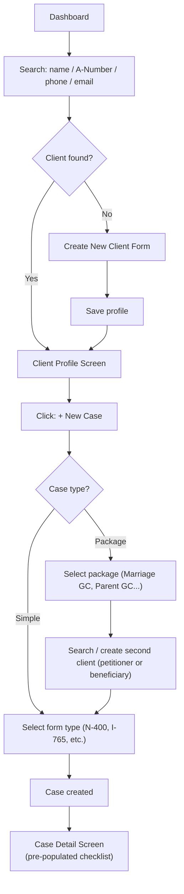
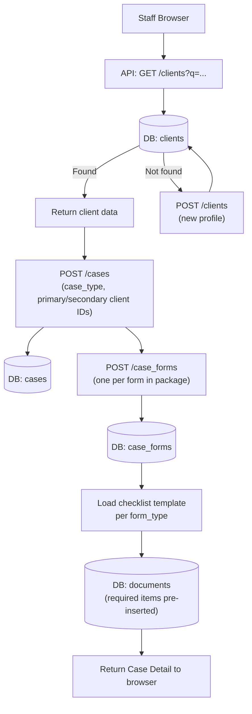
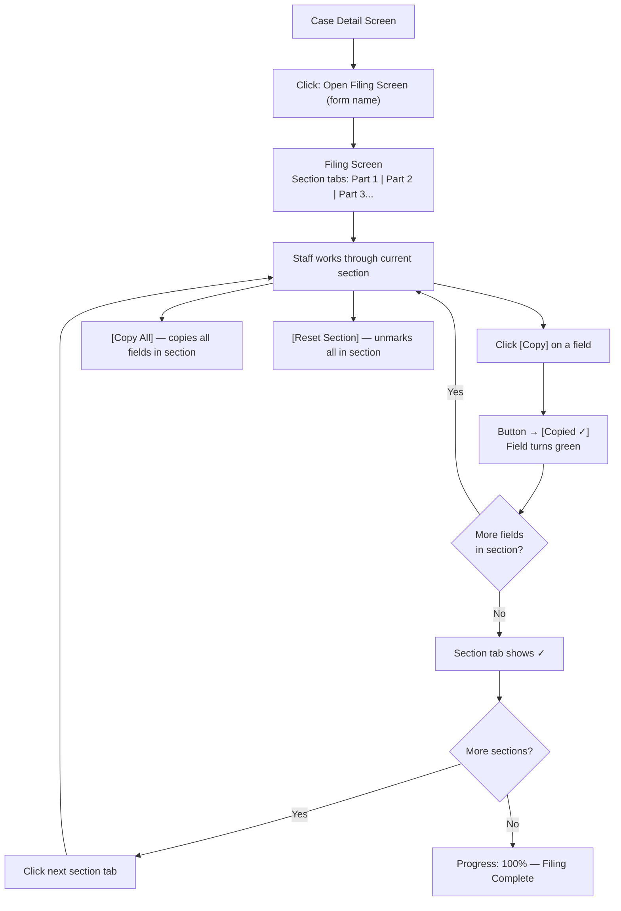
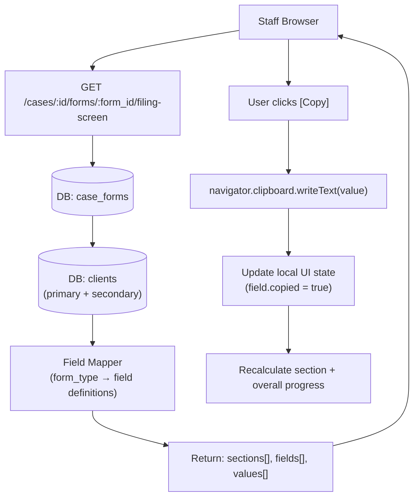
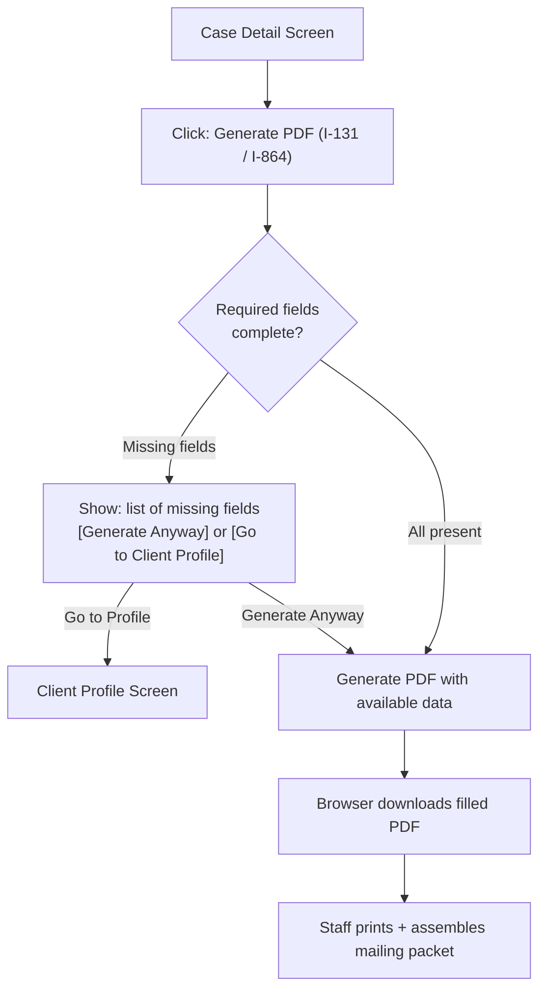
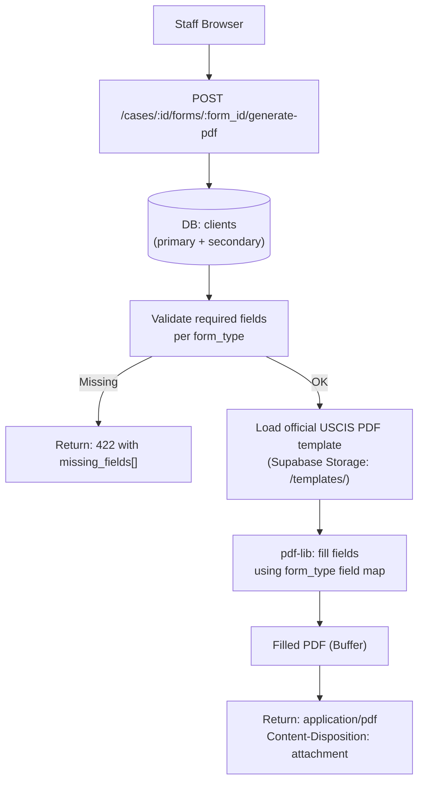
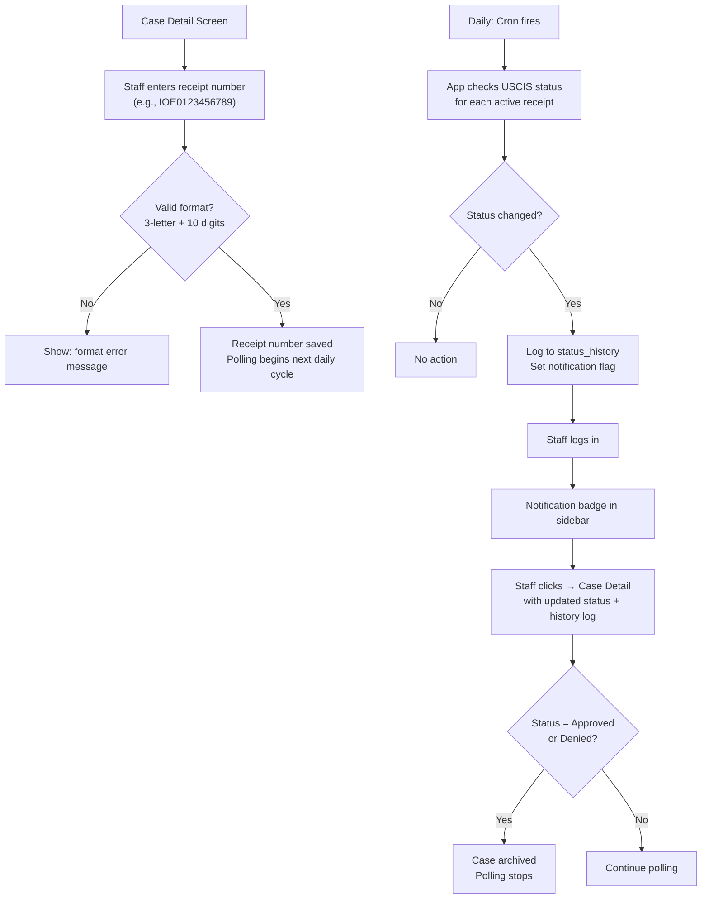
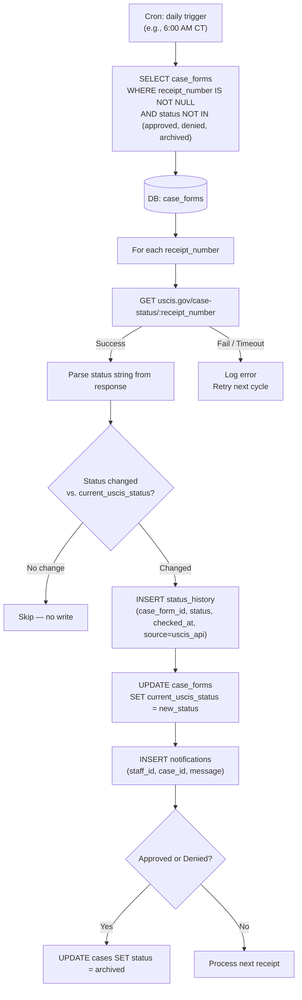
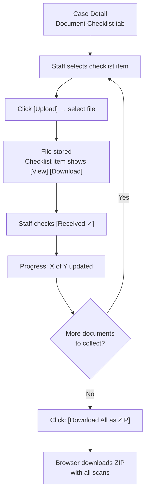
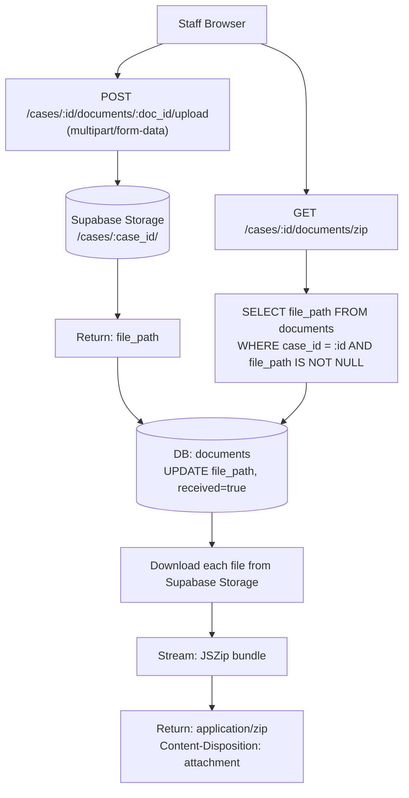

# MOS Internal Staff App — Product Requirements Document

**Version:** 1.0
**Date:** April 9, 2026
**Owner:** Manna One Solution, Houston, TX
**URL:** `app.mannaonesolution.com`
**Stack:** Next.js + Supabase (PostgreSQL + Auth + Storage) + Vercel

---

## 1. Overview & Goals

### Problem Statement

- Immigration staff at Manna One Solution manually re-type client information into each USCIS online form, creating errors, slowing intake, and making audits difficult.
- Staff use paper checklists and memory to track which documents have been collected, leading to missed items and last-minute delays before filing.
- After submitting a case, staff must manually check USCIS.gov for status updates on each receipt number — a tedious, easy-to-forget task that causes clients to go without timely updates.
- Client records are not stored centrally, so cross-selling Tax, Insurance, and AI services to existing immigration clients depends entirely on staff memory.

### Product Goals

1. **Eliminate re-entry:** Client data collected once populates all filing screens and PDF forms automatically — targeting under 2 minutes from intake to case open.
2. **Zero transcription errors:** Structured copy-paste filing screen with per-field [Copy] buttons and visual progress ensures staff copy the right value to the right USCIS field every time.
3. **Automated case tracking:** USCIS status polled daily per active receipt number; staff notified in-app on any change — no manual checking required.
4. **Permanent client database:** Every client record persists with full case history and cross-sell tags, enabling proactive outreach for Tax, Insurance, and AI services.
5. **Mail-ready PDF output:** I-131, I-864, and other mail-filed forms auto-filled from client data and downloaded as filled PDFs — staff prints and mails without any manual form-filling.

### Target Users

**Primary — Staff (2–5 people)**
- Role: Case processors, intake coordinators, and office managers at MOS
- Technical comfort: Moderate — familiar with USCIS portal, Google Workspace, basic web apps
- Context: Desktop-first, dual-monitor setup; one screen for USCIS portal, one for this app
- Frequency: Daily use, multiple cases per day
- Access: Create/manage clients, cases, log payments, use filing assistant

**Secondary — Ultimate Admin (1 person — business owner only)**
- Role: Business owner with full operational control
- Additional access: Everything Staff can do, PLUS: configure document checklist templates, manage fee schedules, finance dashboard with revenue/expense tracking, manage staff accounts, view audit trail, export financial reports
- Note: Separate login credentials from Staff accounts. Architecture designed so an intermediate "Admin" role (office manager tier) can be inserted later as the team grows

### Scope & Non-Scope

**In Scope (V1):**
- Client profile CRM with full immigration data fields
- Simple and Package case management
- Document checklist per form type with scan upload and ZIP download — **checklist templates configurable by Ultimate Admin via UI**
- Filing Assistant: copy-paste screen (Mode A) and filled USCIS PDF (Mode B)
- USCIS receipt number tracking with daily polling and in-app notifications
- Cross-sell tagging and manual opportunity flags
- Staff auth (email + password), Ultimate Admin and Staff roles
- **Ultimate Admin: configurable document checklist templates per form type**
- **Ultimate Admin: fee schedule management (USCIS fees + MOS service fees per form/service type)**
- **Finance: milestone-based payment tracking for immigration cases, simple payment tracking for other services**
- **Finance: expense tracking per case/job (USCIS fees, postage, translation, medical exam referral, etc.)**
- **Finance: Ultimate Admin dashboard — revenue (month/quarter), 4 service cards (Immigration/Tax/Insurance/AI), client metrics, charts and visual indicators**
- **Finance: CSV export of financial data (filterable by date range, service type, client)**
- **Non-immigration service tracker: generic job model for Tax, Insurance, AI services (client, fee, deadline, status, payments)**
- **Audit trail: append-only log of all changes (fee schedule, checklist templates, payments, case status, client edits) — viewable by Ultimate Admin**

**Out of Scope:**
- AI document extraction (upload → auto-fill) — Phase 2
- n8n automated cross-sell workflows — Phase 2
- Automated USCIS fee change monitoring — Phase 2
- Tax-specific case management (quarterly deadlines, franchise fees, payroll cycles) — Phase 2 (generic job tracker covers V1)
- AI service-specific fields (client goals, business type, detailed plans) — Phase 2 (generic job tracker covers V1)
- Client portal / self-service — Phase 3
- Spanish language UI — Phase 3
- Mobile app — Phase 3
- Filing directly through attorney USCIS account — excluded (UPL concern)
- App giving legal advice, selecting forms, or advising on eligibility — excluded (UPL; this tool is a transcription aid only, operated under attorney supervision or by EOIR-accredited staff)

### Success Metrics

| Metric | Target | How to Measure |
|--------|--------|----------------|
| Client intake + case open time | < 2 minutes for returning client | Time from login to case created, observed in testing |
| Filing screen coverage | 100% of fields for N-400, I-485, I-130, I-765 | Manual field audit vs. USCIS form |
| USCIS status check reliability | Daily poll for all active cases | `status_history` log — no gaps > 25 hours |
| Document checklist accuracy | Pre-populated correctly per form type | QA test per form type before launch |
| PDF fill accuracy | Zero manual corrections needed for I-131, I-864 | Staff review during UAT |
| Staff adoption | All cases entered in app within 30 days of launch | Count of cases in DB vs. known caseload |

---

## 2. User Stories

### Story 1: New Client Intake and Case Creation

- **User Role:** Immigration Staff
- **Goal:** Collect a new client's information once and open a case without any re-entry
- **User Flow:**
  1. Staff logs in at `app.mannaonesolution.com`
  2. Clicks **+ New Client** from the dashboard
  3. Fills in client profile form (name, DOB, A-Number, address, immigration history, etc.)
  4. Saves profile — client record created in database
  5. Clicks **+ New Case** from client profile
  6. Selects case type: **Simple** (e.g., N-400) or **Package** (e.g., Marriage Green Card)
  7. For Package: searches for and selects second client (petitioner or beneficiary), or creates new
  8. Selects form type(s) — package templates pre-select the standard form bundle
  9. Case created; app displays pre-populated document checklist
- **Acceptance Criteria:**
  - Returning client found by name, A-Number, phone, or email — no re-entry required
  - Package case links exactly two client profiles
  - Document checklist pre-populated per form type before staff touches it
  - Case creation completes in under 60 seconds for returning clients

### Story 2: Filing Assistant — Copy-Paste Screen

- **User Role:** Immigration Staff
- **Goal:** Fill out an online USCIS form quickly and accurately using client data already in the system
- **User Flow:**
  1. Staff opens the case, clicks **Open Filing Screen** for the relevant form
  2. Filing screen opens side-by-side with USCIS portal on second monitor
  3. Staff works through Part 1: sees each field label, value, and [Copy] button
  4. Clicks [Copy] → value copied to clipboard → button shows [Copied ✓] → field turns green
  5. Staff pastes into USCIS portal field, moves to next
  6. Section tab shows ✓ when all fields in that section are marked copied
  7. Staff uses [Copy All] for a section to copy all values at once
  8. Completes all sections; progress indicator reaches 100%
- **Acceptance Criteria:**
  - Every USCIS form field has a corresponding entry on the filing screen
  - [Copy] copies exactly the value shown — no trailing spaces or formatting artifacts
  - Copied state persists during the session; [Reset Section] clears it
  - Package cases: separate filing screen tab per form (I-130 / I-485 / I-765 / I-131)
  - Progress indicator shows X of Y fields copied in real time

### Story 3: Filing Assistant — PDF Generation

- **User Role:** Immigration Staff
- **Goal:** Generate a pre-filled USCIS PDF for mail-filed forms (I-131, I-864) without typing
- **User Flow:**
  1. Staff opens the case, clicks **Generate PDF** for I-131 or I-864
  2. App fills a pre-converted AcroForm template (original USCIS XFA PDF converted offline via Adobe Acrobat Pro) with client data using `pdf-lib`
  3. Staff clicks **Download PDF**
  4. Staff prints, assembles packet with document copies, mails to USCIS
- **Acceptance Criteria:**
  - AcroForm template version matches the USCIS form version currently accepted
  - All fields populated correctly from client profile data
  - Download produces a valid, printable PDF
  - If required client fields are missing, app shows specific missing-field warning before generating
  - Template version label is visible on the generated PDF so staff can verify currency

### Story 4: Document Checklist Management

- **User Role:** Immigration Staff
- **Goal:** Track which documents have been collected for a case and download the full packet for mailing
- **User Flow:**
  1. Staff opens case → sees document checklist pre-populated per form type
  2. For each document: checks off **Received** checkbox and uploads scan
  3. Staff can add custom checklist items for unusual cases
  4. Progress indicator shows X of Y required documents received
  5. When ready to file: clicks **Download All as ZIP** → downloads full document packet
- **Acceptance Criteria:**
  - Checklist pre-populated before staff adds anything
  - Upload accepts common image and PDF formats; stored in Supabase Storage
  - [View] and [Download] available per document
  - ZIP contains all uploaded scans, named clearly
  - App warns (not blocks) if required documents are unchecked when staff opens Filing Assistant

### Story 5: USCIS Case Status Tracking

- **User Role:** Immigration Staff
- **Goal:** Know immediately when USCIS updates a case status without manually checking the website
- **User Flow:**
  1. After submission, staff enters receipt number(s) on the case (one per form)
  2. App begins polling USCIS case status endpoint daily
  3. When USCIS status changes, staff sees in-app notification
  4. Staff clicks notification → opens case → views full status history log
  5. Staff manually updates internal case status as appropriate
- **Acceptance Criteria:**
  - Receipt number validated against format: 3-letter prefix + 10 digits (e.g., `IOE0123456789`)
  - Daily poll runs for all cases not in Approved / Denied / Archived status
  - Status change logged to `status_history` with timestamp and source
  - In-app notification shown on next staff login after status change
  - Package cases: separate receipt number and status per form, plus master case status

### Story 6: Ultimate Admin — Configurable Document Checklists

- **User Role:** Ultimate Admin
- **Goal:** Modify document checklist templates per form type without code changes, so the app always reflects current filing requirements
- **User Flow:**
  1. Ultimate Admin navigates to **Settings → Checklist Templates**
  2. Selects a form type (e.g., N-400, I-485, Marriage Green Card package)
  3. Sees ordered list of checklist items, each with label and required/optional toggle
  4. Adds, removes, reorders, or renames items
  5. Clicks **Save** — changes apply to all new cases and all open/unfiled cases
  6. Cases already submitted to USCIS (status = Submitted or beyond) retain their original checklist
- **Acceptance Criteria:**
  - One template per form type; package types have a master template + per-form sub-templates
  - Changes propagate immediately to new cases and open cases (status = Documents Pending or Ready to File)
  - Cases with status Submitted, In Progress, RFE, Approved, Denied, or Archived are frozen — checklist unchanged
  - Audit log records who changed what and when
  - Staff cannot access the Checklist Templates screen — Ultimate Admin only

### Story 7: Ultimate Admin — Fee Schedule Management

- **User Role:** Ultimate Admin
- **Goal:** Set and update USCIS filing fees and MOS service fees per form/service type without code changes
- **User Flow:**
  1. Ultimate Admin navigates to **Settings → Fee Schedule**
  2. Sees a table: form/service type | USCIS fee | MOS service fee | Total to client
  3. Edits any fee value and clicks **Save**
  4. New cases/jobs created after the change use the updated fees
- **Acceptance Criteria:**
  - Immigration forms: USCIS fee + MOS fee per form type (N-400, I-485, etc.)
  - Non-immigration services: MOS fee per service type (Tax Return, Insurance, AI Consultation, etc.)
  - Staff sees fees on case/job creation but cannot override — only Ultimate Admin can adjust per-client
  - Audit log records all fee changes with old value → new value

### Story 8: Staff — Payment Logging (Immigration Cases)

- **User Role:** Staff
- **Goal:** Log client payments against milestone-based payment schedules for immigration cases
- **User Flow:**
  1. Staff opens case → **Payments** tab
  2. Sees payment schedule: milestone name, amount due, status (paid/unpaid)
  3. When client pays, staff clicks **Log Payment** on the relevant milestone
  4. Enters: amount, date, method (cash / check / card / Zelle)
  5. Milestone marked as paid; remaining balance updates
- **Acceptance Criteria:**
  - Payment schedule set at case creation with milestone labels and amounts (e.g., "$800 at intake, $700 at document collection, $1,000 at filing")
  - Total of milestones equals total fee charged to client
  - Staff can log partial payments against a milestone
  - Case shows: total owed, total paid, remaining balance
  - If client cancels: case marked Cancelled, unpaid milestones voided (non-refundable policy), paid milestones retained as revenue

### Story 9: Staff — Expense Logging

- **User Role:** Staff
- **Goal:** Log expenses incurred per case/job so revenue calculations reflect true profit
- **User Flow:**
  1. Staff opens case/job → **Expenses** tab
  2. Clicks **+ Add Expense**
  3. Enters: label (e.g., "USCIS I-485 filing fee", "Translation service", "Postage"), amount, date, paid by (MOS or client)
  4. Expense appears in the list; case net revenue updates
- **Acceptance Criteria:**
  - USCIS filing fee auto-populated as an expense from the fee schedule when case is created (staff confirms or adjusts)
  - Additional expenses can be added at any time (postage, translation, notarization, medical exam referral)
  - "Paid by" field distinguishes MOS-paid costs (reduce revenue) from client-paid costs (informational only)
  - Net revenue per case = total client payments - total MOS-paid expenses

### Story 10: Staff — Non-Immigration Job Tracking (Tax, Insurance, AI)

- **User Role:** Staff
- **Goal:** Track basic service jobs for Tax, Insurance, and AI clients alongside immigration cases
- **User Flow:**
  1. Staff navigates to **Jobs** (or from a client profile, clicks **+ New Job**)
  2. Selects service type: Tax, Insurance, or AI
  3. Enters: description, fee (auto-populated from fee schedule), deadline (if applicable)
  4. Job created; staff logs payments and expenses as work progresses
  5. Marks job as complete when done
- **Acceptance Criteria:**
  - Generic model: works the same for Tax, Insurance, and AI
  - Status lifecycle: Open → In Progress → Complete
  - Payment logging: total fee, payments received, outstanding balance
  - Expense logging: same as immigration cases
  - Revenue from jobs rolls up to the Ultimate Admin dashboard alongside immigration case revenue
  - Designed for future expansion: Tax module can add deadline types (personal/business/quarterly/franchise/sales tax/payroll), AI module can add client goals and business type fields — without changing the generic job structure

### Story 11: Ultimate Admin — Finance Dashboard

- **User Role:** Ultimate Admin
- **Goal:** See the financial health of the business at a glance with minimal reading — charts and numbers
- **User Flow:**
  1. Ultimate Admin logs in → lands on **Dashboard**
  2. Top section: total revenue this month and this quarter (large numbers)
  3. Four service cards: Immigration, Tax, Insurance, AI — each showing revenue and active case/job count
  4. Clicks **Immigration** card → drill-down: bar/donut chart of active cases by type (N-400, I-485, etc.) + outstanding balances table
  5. Clicks **Tax/Insurance/AI** card → drill-down: active jobs list with fees and status
  6. Clients section: active clients count, new clients this month, trend line chart
- **Acceptance Criteria:**
  - Revenue = total client payments received - total MOS-paid expenses (net revenue)
  - Dashboard loads in under 2 seconds
  - Charts: bar chart for cases by type, donut chart for revenue by service, line chart for client growth
  - Minimal text — numbers, charts, cards, and trend indicators
  - Only Ultimate Admin sees the finance dashboard; Staff sees a simpler dashboard (their active cases, recent activity, notifications)

### Story 12: Ultimate Admin — Financial Export

- **User Role:** Ultimate Admin
- **Goal:** Export financial data for accounting / tax filing
- **User Flow:**
  1. Ultimate Admin navigates to **Finance → Export**
  2. Selects filters: date range, service type (or all), specific client (or all)
  3. Clicks **Export CSV**
  4. Downloads CSV with: client name, case/job type, service type, total fee, payments received (with dates and methods), expenses (with labels and amounts), net revenue
- **Acceptance Criteria:**
  - CSV format compatible with QuickBooks / Excel import
  - Filterable by date range, service type, client
  - Includes all payment and expense line items, not just totals
  - Audit trail logs each export (who, when, what filters)

### Story 13: Ultimate Admin — Audit Trail

- **User Role:** Ultimate Admin
- **Goal:** See a complete log of all changes made in the system for accountability
- **User Flow:**
  1. Ultimate Admin navigates to **Settings → Audit Log**
  2. Sees a searchable, filterable table: timestamp, user, action, entity, old value → new value
  3. Filters by: user, action type, date range, entity (client / case / payment / fee schedule / checklist template)
- **Acceptance Criteria:**
  - Append-only — no one can edit or delete log entries
  - Covers: fee schedule changes, checklist template changes, payment logs, expense logs, case status changes, client profile edits, staff account changes
  - Searchable by keyword; filterable by user, action type, date range
  - Only Ultimate Admin can view the audit log

---

## 3. Functional Requirements

### Feature Breakdown

| Feature | Description | Priority | Dependencies |
|---------|-------------|----------|--------------|
| Client Profile CRM | Create, search, edit full client profiles | Must-have | None |
| Case Manager | Create Simple and Package cases, link clients | Must-have | Client Profile |
| Document Checklist | Per-form checklist with upload, progress, ZIP | Must-have | Case Manager |
| Checklist Template Manager | Ultimate Admin configures checklist items per form type via UI | Must-have | Document Checklist |
| Filing Assistant — Mode A | Copy-paste screen for online forms | Must-have | Client Profile, Case Manager |
| Filing Assistant — Mode B | Filled USCIS PDF download for mail forms | Must-have | Client Profile, Case Manager |
| USCIS Status Tracker | Daily poll, status history, in-app notification | Must-have | Case Manager |
| Staff Auth | Email/password login, Ultimate Admin + Staff roles | Must-have | None |
| Fee Schedule Manager | Ultimate Admin sets USCIS + MOS fees per form/service type | Must-have | Staff Auth |
| Payment Tracking | Milestone-based payments for immigration; simple for other services | Must-have | Case Manager, Fee Schedule |
| Expense Tracking | Log costs per case/job (USCIS fees, postage, translation, etc.) | Must-have | Case Manager |
| Non-Immigration Job Tracker | Generic job model for Tax, Insurance, AI services | Must-have | Client Profile, Fee Schedule |
| Ultimate Admin Dashboard | Revenue, service cards, case charts, client metrics — visual-heavy | Must-have | Payment Tracking, Expense Tracking |
| Financial Export | CSV export filterable by date/service/client | Should-have | Payment Tracking, Expense Tracking |
| Audit Trail | Append-only log of all changes, viewable by Ultimate Admin | Must-have | Staff Auth |
| Cross-Sell Tagging | Tag services used, surface opportunities | Should-have | Client Profile |
| Case Archiving | Approved/Denied cases archived, not deleted | Must-have | Case Tracker |
| Staff Account Management | Ultimate Admin creates/deactivates staff accounts | Should-have | Staff Auth |

### Information Architecture

**Navigation (sidebar):**
- Dashboard — **Staff:** active cases, recent activity, notifications. **Ultimate Admin:** finance dashboard with revenue, service cards, client metrics
- Clients — search and manage client profiles
- Cases — all immigration cases filterable by status, form type, assigned staff
- Jobs — non-immigration service jobs (Tax, Insurance, AI) filterable by service type, status
- Notifications — unread USCIS status changes
- **Ultimate Admin only:**
  - Finance → Export (CSV export with filters)
  - Settings → Checklist Templates (configure per form type)
  - Settings → Fee Schedule (set USCIS + MOS fees)
  - Settings → Staff Accounts (create/deactivate)
  - Settings → Audit Log (searchable change history)

**Key Screens:**
- Client Profile — view/edit all personal and immigration data; case history tab; jobs tab; cross-sell tags
- Case Detail — document checklist, filing screen links, receipt numbers, status log, payments tab, expenses tab, notes
- Filing Screen (Mode A) — full-width, section-tabbed copy-paste interface
- PDF Generator (Mode B) — generate and download filled form
- Job Detail — service type, description, fee, deadline, payments, expenses, status
- Ultimate Admin Dashboard — revenue cards (month/quarter), 4 service drill-down cards, client metrics section with charts
- Checklist Template Editor — ordered list of items per form type with add/remove/reorder/required toggle
- Fee Schedule Editor — table of form/service types with USCIS fee + MOS fee columns
- Audit Log Viewer — searchable/filterable table of all system changes

**Data Relationships:**
- One Client → many Cases (as primary or secondary)
- One Client → many Jobs (non-immigration services)
- One Case → many CaseForms → many Documents, many StatusHistory entries
- One CaseForm → one receipt number → many StatusHistory entries
- One Case or Job → many Payments (milestone-based or simple)
- One Case or Job → many Expenses
- All changes → AuditLog (append-only)

---

## 4. Architecture Flows

### 4.1 Client Intake & Case Creation

#### L0 — Intent & Outcome

**Intent**
- Staff want to avoid re-entering the same client information for every new case or form
- Staff want to open a new case and have the document checklist ready immediately

**Outcome**
- A complete client profile exists in the system after one data entry session
- A case is created in under 2 minutes for returning clients with a fully pre-populated checklist

#### L1 — Business Flow

1. Staff searches for client by name, A-Number, phone, or email
2. If returning: existing profile loads — no re-entry needed
3. If new: staff fills client profile form and saves
4. Staff selects case type (Simple or Package)
5. For Package: staff selects or creates second client (petitioner/beneficiary)
6. Staff selects form type(s); package templates pre-bundle standard forms
7. System creates case and case_forms records; generates document checklist per form type
8. Staff lands on Case Detail screen with checklist ready

#### L2 — User Flow



#### L3 — System Flow



---

### 4.2 Filing Assistant — Mode A (Copy-Paste Screen)

#### L0 — Intent & Outcome

**Intent**
- Staff want to avoid mistyping client data into USCIS online forms field by field
- Staff want to know exactly which fields have been copied and which remain

**Outcome**
- Every USCIS form field is pre-loaded from client data with a single-click copy
- Staff can see section-level and overall filing progress in real time

#### L1 — Business Flow

1. Staff opens Filing Screen for a form from Case Detail
2. App loads all client data mapped to the selected form's field structure
3. Staff works through sections in order, clicking [Copy] per field
4. Staff pastes each value into the corresponding USCIS portal field
5. Copied fields are marked green; section tabs show ✓ when complete
6. When all sections show ✓, filing is complete

#### L2 — User Flow



#### L3 — System Flow



---

### 4.3 Filing Assistant — Mode B (PDF Generation)

#### L0 — Intent & Outcome

**Intent**
- Staff want to mail a completed USCIS form without hand-writing or typing into the PDF themselves
- Staff want a print-ready document that can go directly into the mailing packet

**Outcome**
- A correctly filled, print-ready USCIS PDF downloaded in one click, with no manual field entry

#### L1 — Business Flow

1. Staff clicks **Generate PDF** for a mail-filed form (I-131 or I-864)
2. App checks for required client fields; warns on any gaps
3. App maps client data to official USCIS PDF fields using `pdf-lib`
4. Filled PDF returned to browser for download
5. Staff prints and assembles the mailing packet

#### L2 — User Flow



#### L3 — System Flow



---

### 4.4 USCIS Case Status Tracker

#### L0 — Intent & Outcome

**Intent**
- Staff want to stop manually checking USCIS.gov for updates on dozens of receipt numbers
- Staff want to be alerted the moment USCIS updates a case, not days later

**Outcome**
- Every active case is checked daily; staff see in-app notification within 24 hours of any USCIS status change

#### L1 — Business Flow

1. After filing, staff enters receipt number(s) on the case (one per form)
2. System validates receipt number format and stores it
3. Daily cron job queries USCIS public status endpoint for all active receipt numbers
4. If status changed: log to `status_history`, set notification flag for assigned staff
5. Staff logs in, sees notification badge, clicks to view updated case
6. When case reaches Approved or Denied: polling stops, case is archived

#### L2 — User Flow



#### L3 — System Flow



> **L4 required** — daily cron, external service failure modes, multi-step state machine.
> See `2026-04-09-uscis-tracker-L4.md`.

---

### 4.5 Document Management & ZIP Download

#### L0 — Intent & Outcome

**Intent**
- Staff want to avoid assembling mailing packets manually from scattered paper copies and emails
- Staff want a complete, organized document packet ready for mailing in one click

**Outcome**
- All uploaded document scans bundled into a single ZIP file, correctly named, downloadable in one click

#### L1 — Business Flow

1. Staff uploads document scan to a checklist item in the case
2. File stored in Supabase Storage; `documents` record updated with file path
3. Staff checks off Received on that item; progress indicator updates
4. When ready to file, staff clicks **Download All as ZIP**
5. App bundles all uploaded scans into a ZIP and streams download

#### L2 — User Flow



#### L3 — System Flow



---

## 5. Non-Functional Requirements

| Requirement | Target |
|-------------|--------|
| Performance | Page loads < 2s on standard office broadband; filing screen field copy < 100ms |
| Concurrent users | 2–5 simultaneous staff users; no concurrency issues at this scale |
| Security | Supabase Auth (email + password); all routes server-side authenticated; RLS policies on all tables; SSN and A-Number stored encrypted at rest |
| Availability | Vercel + Supabase free tier SLA acceptable for internal tool; no 24/7 uptime requirement |
| Data retention | Client and case records never deleted — archived only; soft-delete pattern |
| Browser support | Chrome and Edge (desktop only); dual-monitor use is primary context |
| Accessibility | Keyboard-navigable copy-paste screen; sufficient color contrast on green "copied" state |
| TDPSA Compliance | SSN, A-Number, and immigration status are sensitive data under Texas TDPSA (eff. July 2024); requires: explicit consent before processing, DPA with Supabase, privacy policy, Data Protection Assessment before launch, consumer rights (access/correction/deletion within 45 days) |
| Legal / UPL | Filing Assistant operates as a transcription aid only — must be used under supervision of a licensed Texas immigration attorney or EOIR-accredited staff; the app gives no legal advice, does not select forms, and does not advise on eligibility |

---

## 6. Technical Considerations

### Stack

| Layer | Choice | Notes |
|-------|--------|-------|
| Framework | Next.js (App Router) | Server components for data fetching; API routes for cron endpoint |
| Database | Supabase PostgreSQL | Row-level security per staff role |
| Auth | Supabase Auth | Email + password; session cookies via Next.js middleware |
| File storage | Supabase Storage | Private bucket; signed URLs for download |
| PDF generation | `pdf-lib` (JS) | Fills AcroForm templates only — **USCIS PDFs are XFA format and must be pre-converted to AcroForm offline using Adobe Acrobat Pro before upload as templates**; field maps written once per converted form |
| PDF alternative | Apryse SDK (evaluate) | Handles XFA natively in Node.js — eliminates conversion step; commercial pricing (requires quote); evaluate before committing to pdf-lib path |
| Hosting | Vercel | Auto-deploy from main branch; environment variables for Supabase keys |
| USCIS polling | Playwright (Node.js) browser automation on dedicated VPS | Scrapes `egov.uscis.gov/casestatus/mycasestatus.do` daily; works for all receipt number prefixes (IOE, WAC, EAC, LIN, SRC); 2–5s delay between requests; ~50 checks/day at MOS scale — well below any detection threshold. Architecture uses an adapter interface so the Torch API can be swapped in later without touching cron logic. |

### Data Model Summary

```
clients              — one record per individual (petitioner or beneficiary)
cases                — links one or two clients; Simple or Package type
case_forms           — one per USCIS form within a case; holds receipt_number, filing_mode
documents            — checklist items per case; file stored in Supabase Storage
status_history       — append-only log of USCIS status checks per case_form
users                — Supabase Auth users with name + role (ultimate_admin | staff)
                       designed for future 'admin' role between ultimate_admin and staff
notifications        — unread status change alerts per staff member
checklist_templates  — one per form type; items as ordered JSON array [{label, required, order}]
                       Ultimate Admin edits via UI; changes propagate to new + open/unfiled cases
fee_schedule         — one row per form/service type; columns: service_type (immigration|tax|insurance|ai),
                       form_type (nullable), uscis_fee (nullable), mos_fee, updated_at, updated_by
jobs                 — non-immigration service jobs; fields: client_id, service_type, description,
                       fee, deadline, status (open|in_progress|complete), notes
                       designed for future expansion (tax deadline types, AI client goals)
payments             — tracks money received from clients; fields: case_id (nullable), job_id (nullable),
                       milestone_label (nullable), amount, payment_date, method (cash|check|card|zelle),
                       logged_by; milestone-based for immigration, simple for other services
payment_schedules    — milestone definitions per case/job; fields: case_id (or job_id),
                       milestone_label, amount_due, due_trigger, paid (boolean)
expenses             — tracks costs incurred per case/job; fields: case_id (nullable), job_id (nullable),
                       label, amount, expense_date, paid_by (mos|client), logged_by
                       USCIS filing fee auto-populated from fee_schedule at case creation
audit_log            — append-only system-wide change log; fields: user_id, action, entity_type,
                       entity_id, old_value (JSON), new_value (JSON), created_at
                       covers: fee changes, checklist edits, payments, expenses, case status,
                       client edits, staff account changes, financial exports
```

### Key Integrations

- **USCIS Status Scraper:** Playwright (Node.js) bot running on a dedicated $5/mo VPS (DigitalOcean or equivalent) with a static IP. Navigates to `egov.uscis.gov/casestatus/mycasestatus.do`, enters each receipt number, scrapes the status text, and returns it. Runs daily with a 2–5 second random delay between requests. At ~50 checks/day, MOS is indistinguishable from a staff member manually checking. Abstracted behind a `USCISClient` interface so the official Torch API can be swapped in later as a drop-in replacement.
- **Supabase Storage:** Private bucket with signed URLs; ZIP bundled server-side via `jszip`; also stores converted AcroForm PDF templates (one per form type + version)
- **`pdf-lib`:** Load AcroForm template from Supabase Storage (`/templates/[form_type]/[version].pdf`), fill fields, return buffer; **only works with pre-converted AcroForms, not native USCIS XFA PDFs**

### Competitive Differentiation

The closest SaaS alternatives are **eimmigration** ($55/user/month) and **Docketwise** ($69/user/month). Neither polls USCIS automatically or provides a cross-sell CRM. Key advantages of this custom build:

| Capability | eimmigration / Docketwise | This App |
|---|---|---|
| USCIS status auto-polling | Manual check only | Daily cron + in-app notification |
| Cross-sell CRM | None | Built-in with flags |
| Per-case fees | LawLogix: yes | Never — flat Vercel/Supabase cost |
| Non-attorney workflow | Designed for attorneys | Purpose-built for MOS |

---

## 7. UI/UX Direction

### Brand Assets

**Logo files** (stored in `/Logo/`):
- `Logo.PNG` — Full logo with white background (for use on documents, light surfaces)
- `Logo-Picsart-BackgroundRemover.PNG` — Transparent-background version (for use on colored/dark surfaces, app header)

**Logo description:** A stylized metallic "M" lettermark with flowing, interlocked curves in brushed teal/cyan with a dark charcoal accent stroke and sphere. Below the mark: "MANNA" in large brushed-silver metallic type, "ONE SOLUTION" beneath in matching silver.

**Logo usage guidelines:**
- App header: use the transparent-background PNG at a max height of 40px, left-aligned in sidebar or top bar
- Login screen: use the full logo PNG, centered, at a max height of 120px
- Favicon: crop the "M" lettermark only; use teal (`#3AAFB9`) on white or white on teal
- Do not place the logo on a teal or cyan background — use white, very light gray (`#F8F9FA`), or dark charcoal (`#2C2C2C`) backgrounds to maintain contrast

### Design Language

- **Color palette — derived from the MOS logo:**

| Role | Color | Hex | Usage |
|------|-------|-----|-------|
| Primary | Manna Teal | `#3AAFB9` | Primary buttons, active nav, links, progress bars |
| Primary Dark | Deep Teal | `#2D8E96` | Hover / pressed states, sidebar active indicator |
| Accent | Charcoal | `#2C2C2C` | Top bar background, headings, high-contrast text |
| Neutral 100 | White | `#FFFFFF` | Page backgrounds, card surfaces |
| Neutral 200 | Light Gray | `#F1F3F5` | Table stripes, input backgrounds, section dividers |
| Neutral 300 | Mid Gray | `#ADB5BD` | Placeholder text, borders, disabled states |
| Neutral 700 | Dark Gray | `#495057` | Body text, secondary labels |
| Neutral 900 | Near Black | `#212529` | Primary text, sidebar text |
| Success | Green | `#16A34A` | Copied ✓ state, completed checklist items, approved status |
| Warning | Amber | `#D97706` | Missing field warnings, approaching deadlines |
| Danger | Red | `#DC2626` | Errors, denied status, destructive actions |

- **Typography:** Inter (Google Fonts) — its clean, geometric forms complement the logo's modern metallic aesthetic; fallback to `system-ui, -apple-system, sans-serif`
- **Personality:** Premium, trustworthy, efficient — the brushed-metal logo conveys craftsmanship, mirrored in the UI via clean surfaces, purposeful whitespace, and teal accent color used sparingly to guide the eye. No decorative elements; every pixel serves the workflow.

### Key Interaction Patterns
- **Desktop-first:** Min-width 1280px; layout assumes dual-monitor use for filing screen
- **Sidebar navigation:** Dark charcoal (`#2C2C2C`) sidebar with white text; active item highlighted with teal left-border accent; MOS logo (transparent PNG) displayed at top of sidebar
- **Login screen:** Centered MOS full logo above the sign-in form; teal primary button for "Sign In"
- **Filing screen:** Full viewport height; section tabs fixed at top with teal underline on active tab; field list scrollable; sticky progress bar at bottom using teal fill
- **Copy state:** Instant visual feedback — green fill (`#16A34A`) + checkmark on copy; section tab badge clears when all fields done
- **Checklist:** Inline upload (no modal); progress bar (teal fill) updates on check/uncheck without page reload
- **Cards & surfaces:** White cards on light gray (`#F1F3F5`) page background; 1px `#E5E7EB` border; `border-radius: 8px`; subtle `box-shadow` on hover

---

## 8. Risks & Mitigations

| Risk | Impact | Likelihood | Mitigation |
|------|--------|------------|------------|
| USCIS redesigns `egov.uscis.gov` page | Medium — scraper CSS selectors break | Low–Medium | Wrap all scraper selectors in a single adapter file; monitor `status_history` for parse errors; alert admin on 3 consecutive failures per receipt |
| USCIS adds CAPTCHA to case status form | High — scraper blocked entirely | Low | Detect CAPTCHA in Playwright response; alert admin immediately; fall back to manual checking until resolved (or switch to Torch API) |
| USCIS updates a PDF form and breaks field mapping | High — Mode B unusable for that form | Medium | Pin AcroForm template version in storage; add form version label to generated PDF; staff notified in-app when USCIS releases new form version |
| XFA conversion workflow breaks on some USCIS forms | High — Mode B fails for that form | Medium | Test each form in Acrobat Pro before V1 launch; evaluate Apryse SDK as no-conversion alternative |
| UPL exposure — MOS operates without attorney supervision | Critical — Texas AG prosecution, civil liability | Low if addressed now | Confirm business model with Texas immigration attorney before launch; document that Filing Assistant is a transcription-only tool |
| TDPSA non-compliance — sensitive data (SSN, A-Number, immigration status) | High — up to $7,500/violation | Low if addressed now | Execute DPA with Supabase; write consent flows; conduct Data Protection Assessment; publish privacy policy |
| SSN / A-Number data breach | High — client PII exposure | Low | Supabase RLS; encrypted at rest; no client-facing access; internal URL not linked publicly |
| Staff enter wrong data in client profile and it propagates to filing | Medium — USCIS form errors | Medium | Filing screen shows data with client profile link; staff can edit before copying |
| Supabase free tier storage limits hit | Low — ZIP downloads fail | Low | Monitor storage usage; upgrade tier if approaching limit; ~$25/mo paid tier sufficient |
| USCIS changes filing fees without notice | Medium — fee schedule becomes stale, revenue calculations wrong | Medium | Ultimate Admin manually updates fee schedule when notified through industry channels; Phase 2: automated USCIS fee page monitoring |
| Checklist template change breaks open cases | Medium — staff confusion on changed requirements | Low | Propagation limited to new + unfiled cases only; submitted cases frozen; audit log tracks all template changes |
| Financial data accuracy depends on staff logging payments on time | Medium — dashboard revenue figures lag reality | Medium | Dashboard shows "last payment logged" date; Ultimate Admin can review outstanding balances to identify stale cases |
| Ultimate Admin account compromise | Critical — access to all financial data, fee controls, audit logs | Low | Strong password policy; consider MFA in Phase 2; single account reduces attack surface vs. multiple admin accounts |

---

## 9. Timeline & Milestones

| Phase | Scope | Target |
|-------|-------|--------|
| Phase 1 — Foundation | Auth (Ultimate Admin + Staff roles), Client Profile CRM, Case Manager (Simple only), Document Checklist (upload + ZIP), Checklist Template Manager (Ultimate Admin), Audit Trail | Week 3 |
| Phase 2 — Filing & Finance | Mode A copy-paste screen (N-400, I-765, I-130), Mode B PDF (I-131), Package Cases, Fee Schedule Manager, Payment Tracking (milestone-based), Expense Tracking | Week 7 |
| Phase 3 — Services & Tracking | USCIS status tracker (daily cron + notifications), Non-immigration Job Tracker (Tax/Insurance/AI), Cross-sell tagging, remaining forms (I-485, I-864, I-90) | Week 10 |
| Phase 4 — Dashboard & Polish | Ultimate Admin Finance Dashboard, Financial Export (CSV), staff account management, UAT with real cases, bug fixes, go-live at `app.mannaonesolution.com` | Week 13 |

---

## 10. Open Questions

**Legal & Compliance (resolve before any code is written)**
- [ ] **UPL sign-off:** Has a licensed Texas immigration attorney confirmed that MOS's business model is UPL-compliant? What supervision structure is in place? This must be resolved before the Filing Assistant is built.
- [ ] **TDPSA readiness:** Has a DPA been executed with Supabase? Is there a published privacy policy? Has a Data Protection Assessment been scoped?

**USCIS Scraper (resolve before V1 starts)**
- [ ] **VPS hosting:** Which provider for the scraper VPS? (DigitalOcean, Hetzner, etc.) Needs a static IP and Node.js runtime. ~$5/mo.
- [ ] **CAPTCHA contingency:** If USCIS adds a CAPTCHA, what is the fallback? Accept manual checking temporarily, or integrate a CAPTCHA-solving service?
- [ ] **Future Torch API upgrade:** At what point (volume, business growth) does it make sense to apply for the official Torch API and replace the scraper?

**PDF Generation (resolve before Mode B is built)**
- [ ] **Apryse SDK vs. Acrobat Pro conversion:** Get an Apryse SDK quote. Compare: Apryse (native XFA, no conversion, recurring license cost) vs. Acrobat Pro (one-time conversion per form version, ~$20/month Adobe license). Decision affects Mode B architecture.
- [ ] **I-485 filing mode:** Design spec lists I-485 as "Online / Mail (Both)." Which mode is needed for V1?

**Product (resolve before implementation)**
- [ ] **Receipt number entry timing:** Should the app send a reminder if a case is "Submitted — Awaiting Receipt" but no receipt number entered after N days?
- [ ] **Notification delivery:** V1 uses in-app notifications only. Is email or SMS needed for V1?
- [ ] **Cross-sell flag logic:** Define exact trigger rules (e.g., "within 60 days of April 15" for tax season) before implementation.
- [x] **Staff account provisioning:** Ultimate Admin creates accounts manually. ~~No self-registration.~~

**Finance & Payments (resolve before Phase 2)**
- [ ] **Default payment milestones:** Should there be default milestone templates per case type (e.g., Marriage GC always has 3 milestones), or does the Ultimate Admin / staff define milestones from scratch per case?
- [ ] **Payment method tracking depth:** Is tracking the method (cash/check/card/Zelle) sufficient, or do you need reference numbers (check #, transaction ID)?
- [ ] **Expense categories:** Should expense categories be a fixed list (USCIS fee, postage, translation, notarization, medical referral) or configurable by Ultimate Admin?
- [ ] **Tax reporting:** Does the CSV export need to align with any specific accounting format, or is a generic line-item export sufficient for your accountant?
- [ ] **Outstanding balance alerts:** Should the app alert staff (or Ultimate Admin) when a milestone payment is overdue?

---

*Manna One Solution — One Stop, All Solutions.*
*Houston, TX | mannaonesolution.com*
