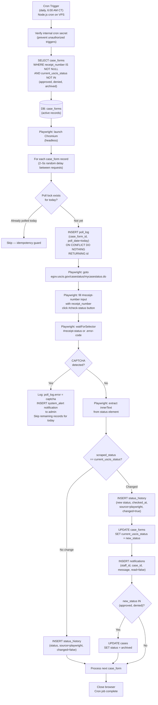
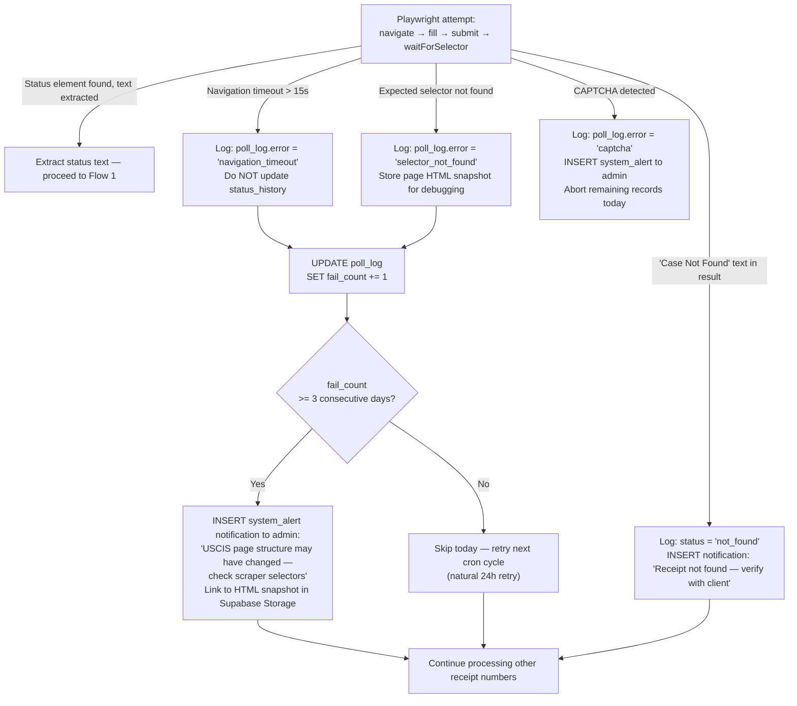
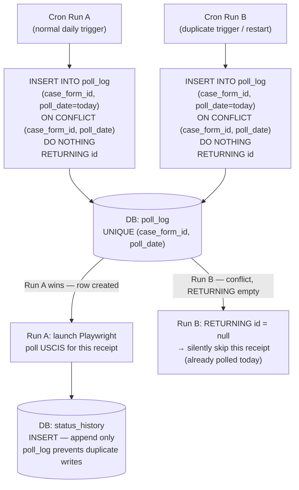
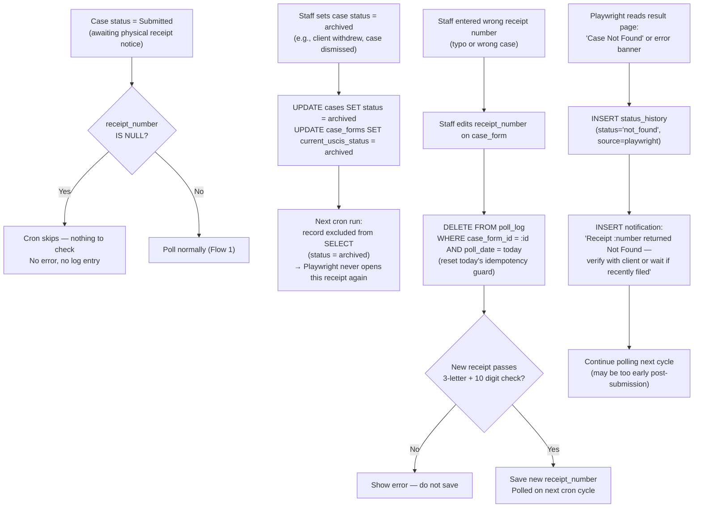

# USCIS Case Status Tracker — L4 Technical Workflows

**Feature:** Daily USCIS polling — Playwright browser automation bot
**Parent PRD:** `2026-04-09-mos-internal-staff-app-prd.md`
**Date:** April 9, 2026

L4 is required because this feature contains:
- Async / background processing (daily cron job on dedicated VPS)
- External service with failure modes (USCIS website — UI may change, CAPTCHA risk)
- Multi-step state machine (`case_forms.current_uscis_status` transitions)
- Idempotency requirement (same receipt number must not log duplicate status entries for the same poll cycle)

**Implementation:** Playwright (Node.js) bot on a ~$5/mo DigitalOcean VPS with a static IP. Navigates `egov.uscis.gov/casestatus/mycasestatus.do`, fills in each receipt number, scrapes the status text from the result page. All scraping logic lives behind a `USCISClient` interface so the official Torch API can be swapped in as a drop-in replacement later.

---

## Flow 1 — Happy Path

Normal execution: cron fires, Playwright opens USCIS site, checks each receipt number, logs any status changes, notifies staff.

---

## Flow 2 — Error & Retry

Playwright failure handling: USCIS page changes, network errors, CAPTCHA, unexpected page content.

**Retry strategy:** No same-day retry. The cron fires once daily. Transient failures self-heal on the next cycle. After 3 consecutive failures on the same receipt number, admin is alerted with an HTML snapshot to diagnose whether the USCIS page structure changed. CAPTCHA aborts the entire run immediately (all records safe — no partial state).

---

## Flow 3 — Idempotency & Concurrency

Prevents duplicate status log entries if the cron fires twice, or if a VPS restart causes the job to re-run mid-execution.

**Natural key:** `(case_form_id, poll_date)` in `poll_log`.
**Mechanism:** PostgreSQL `ON CONFLICT DO NOTHING` — atomic at the DB level, no application-level lock needed. Works correctly even if the VPS restarts mid-run.

---

## Flow 4 — Edge Cases

User-initiated changes that affect in-flight polling: no receipt yet, manual archive, corrected receipt number, USCIS page returning unexpected states.

---

*Manna One Solution — One Stop, All Solutions.*
