# MannaOS.com — Manna One Solution Website

**Date:** April 10, 2026 (V1 refocus: immigration document preparation, Texas-only launch)
**Project:** MannaOS.com
**Tech Stack:** Next.js 14 + Vercel + Supabase
**Owner:** Manna One Solution
**HQ Address:** `Bellaire Blvd, Houston, TX 77036` _(placeholder — street number to be decided)_
**Phone:** 346-852-4454
**Email:** `Chris@mannaos.com`
**Facebook:** facebook.com/mannaonesolution
**V1 Primary Service:** **Vietnamese-language USCIS immigration document preparation** (Texas residents only)
**Future Services (Phase 1.5+):** Tax preparation, Life + P&C Insurance (TX-only), AI Automation Consulting
**Credentials (current):** IRS EFIN `857993` · Texas Life Insurance License `3142469` · Texas Property & Casualty Insurance License `3118525` · NPN `21024561` · PTIN-registered
**Credentials (planned pre-launch):** Texas Notary Public (for in-house signature verification on USCIS forms)
**Service footprint:** Texas residents only in V1 (document preparation is regulated state-by-state; see §1 Geographic Scope)
**Languages:** Vietnamese (primary community) + English

---

## 1. Overview & Goals

### Problem Statement

- **Vietnamese community members in Texas** seeking help with USCIS immigration forms (green card, citizenship, work permit, travel documents, removing conditions on marriage-based green cards) **struggle to find an affordable, Vietnamese-speaking, transparent document preparer**. Their options today are: (a) immigration attorneys who charge 2–5× more than the forms require for straightforward cases, (b) generic non-attorney preparers who don't speak Vietnamese, or (c) "notario" scammers who pretend to be lawyers and often harm the case.
- **Vietnamese-speaking clients distrust non-attorney preparers** because of widespread notario fraud targeting immigrant communities. Any new entrant must aggressively differentiate on *transparency*, *honest scope disclosures*, and *accurate pricing* — not just language.
- **Existing and prospective clients** cannot easily look up USCIS filing fees, typical processing times, or package pricing in Vietnamese because USCIS.gov is English-only and community resources are scattered across Facebook groups.
- **Prospects researching services online** cannot evaluate Manna One Solution's credibility because the business has no professional website and no visible credentials on the public web.
- **The owner** (the business operator, also the document preparer) needs a simple portal to track active cases, upload documents securely, and publish bilingual educational content — without building a bespoke CRM.

### Product Goals

1. **Become the trusted Vietnamese-language USCIS document preparation source in Texas** — rank on Google and AI search (ChatGPT, Perplexity, Google AI Overview, Copilot) for Vietnamese-language immigration form queries ("khai N-400", "gia hạn thẻ xanh", "làm giấy tờ bảo lãnh vợ chồng", etc.) targeted at Texas residents.
2. **Win the transparency battle** — publish total package prices (service fee + USCIS filing fee) for every form and bundle on the public site. Almost no competitor does this in Vietnamese. It is both an SEO/GEO signal (fact density) and a notario-fraud differentiator.
3. **Establish credibility despite being new** — compensate for low client count with (a) clear non-attorney disclosures, (b) deep and accurate educational content citing USCIS.gov directly, (c) Texas Notary Public credential for signature verification, (d) honest scope ("we prepare — we do not give legal advice"), (e) strong referral paths to pro-bono legal orgs for complex cases we cannot handle.
4. **Enable self-service booking** — prospects can schedule free consultations (remote video or in-person at the Houston HQ) without phone friction.
5. **Give clients a case-tracking portal** — authenticated view of their case status, uploaded documents, and USCIS receipt numbers. Reduces "what's happening with my case?" phone calls.
6. **Empower admin content management** — let the owner publish bilingual blog posts across the immigration topical map without developer involvement.
7. **Build a credible SEO foundation that later extends to tax, insurance, and AI automation** — every choice in V1 (topical map, URL architecture, schema, i18n) must support adding those pillars in Phase 1.5 without requiring architectural rework.

### Target Users

**Primary Persona: Texas-resident Vietnamese family navigating USCIS paperwork**
- Age: 25–65
- Location: Houston (primary), Dallas-Fort Worth, Austin, San Antonio (secondary — content + remote delivery)
- Technical comfort: moderate — uses Facebook, Zalo, YouTube, Google on mobile daily
- Life stage triggers that bring them to the site:
  - Green card expiring → needs I-90 renewal
  - 5 years as permanent resident → ready for N-400 citizenship
  - Marriage to a U.S. citizen → needs I-130 + I-485 + work permit + travel doc
  - 2-year green card expiring → needs I-751 to remove conditions
  - Lost / stolen green card → needs I-90 replacement
  - Needs emergency travel → needs I-131 advance parole
  - Sponsoring a parent / child / sibling → needs I-130
- Motivation: find a Vietnamese-speaking preparer who (a) charges clearly and fairly, (b) explains what they can and cannot do, (c) is NOT a notario scammer, (d) handles the paperwork correctly the first time
- Device: 75% mobile, 25% desktop
- Primary fear: getting scammed or having their case denied because of a wrong form

**Secondary Persona: Existing client tracking their USCIS case**
- Same demographic, now post-engagement
- Context: wants to know "where is my case at USCIS?" without calling the office
- Motivation: peace of mind, document access, receipt-number visibility

**Tertiary Persona: Houston walk-in / local referral**
- Subset of the Primary Persona who searches "văn phòng làm giấy tờ di trú Houston", "USCIS help near me", or similar
- Reached through Local Pack + GBP + in-person consultations at the Bellaire Blvd HQ
- Expected to drive first V1 revenue while SEO traction builds

**Quaternary Persona: Business owner / admin**
- Single admin user (the owner) managing 5–25 active immigration cases at a time in V1
- Context: case tracking, document uploads, blog publishing, review requests
- Motivation: run the practice without spreadsheets or email chains

### Geographic Scope

**V1 is Texas-only.** This is a deliberate regulatory and strategic decision, not a growth ceiling.

```
V1 LAUNCH TARGET: Texas residents only
  Houston, TX — street address, GBP, Apple Business Connect, Bing Places, local citations,
  Vietnamese American Chamber of Commerce of Houston, in-person consultations.
  Texas state-level content for remote Dallas-Fort Worth, Austin, San Antonio clients.

V1 CITY SUPPORT COVERAGE (within Texas):
  Houston (HQ — full Local Pack optimization, in-person + remote)
  Dallas-Fort Worth (remote delivery, state-level content)
  Austin (remote delivery, state-level content)
  San Antonio (remote delivery, state-level content)

PHASE 1.5 (post-V1 validation, pending state registration):
  None for immigration until owner registers as an Immigration Consultant / Document
  Preparer in additional states. See §1 Regulatory Constraints below.

PHASE 2 (other services):
  Tax preparation (national — EFIN is federal, PTIN valid in all states)
  Life + P&C Insurance (Texas-only due to Texas-only licenses)
  AI Automation Consulting (national — no licensing)

RATIONALE:
  → Immigration document preparation by non-attorneys is regulated at the STATE level,
    not just the federal level. Texas is permissive (no specific consultant registration).
    CA/NV/FL/IL/WA/MD/MN/NC/NY all require registration + bonding; unauthorized practice
    in those states ranges from misdemeanor to felony (CA Immigration Consultants Act,
    FL UPL, NV Document Preparation Services Act).
  → Launching Texas-only lets MannaOS build topical authority and client volume without
    regulatory exposure. Expansion to other states is a registration + bond decision, not
    a website decision.
  → Houston Vietnamese community (Little Saigon / Asiatown / Bellaire corridor) is one
    of the largest concentrations in the U.S. — sufficient TAM for V1 revenue targets.
  → Texas-only also tightens the SEO signal: a site focused on "Vietnamese USCIS help in
    Texas" outranks a thinner multi-state site on the queries that matter most.
```

**V1 Regulatory Constraints — Immigration Document Preparation:**

| Constraint | Status | Implication |
|---|---|---|
| **State-level consultant registration** | Texas = no registration required. All other states = requires registration/bonding. | V1 site scopes marketing, schema `areaServed`, and service delivery to **Texas only**. Any marketing, ad copy, or schema that implies service to CA/NV/FL/IL/WA/MD/MN/NC/NY without registration is a regulatory violation in those states. |
| **Unauthorized Practice of Law (UPL)** | Federal + state. MannaOS is a **document preparer**, not a law firm. | Every page + blog post + FAQ + schema must include the explicit disclaimer: "We are not attorneys. We prepare USCIS forms at your direction. We do not provide legal advice." Must recommend an attorney for complex cases (RFEs, NOIDs, prior denials, criminal history, inadmissibility issues). |
| **Notario fraud differentiation** | Community-specific trust issue. | Site must prominently state non-attorney status and link to free legal aid orgs (CLINIC, KIND, Catholic Charities, AILA pro-bono) for clients who need an attorney. This is both ethically required and a community-trust differentiator. |
| **Form G-28 eligibility** | Requires BIA accreditation or attorney bar admission. MannaOS does NOT file G-28. | Owner signs USCIS forms as the "preparer" (Form section "Preparer's Statement") only. Does not represent clients before USCIS. Does not attend USCIS interviews as a representative (can attend as a translator/companion only if permitted). |
| **Texas Notary Public** | Planned pre-launch. | Enables in-house signature witnessing for USCIS forms. Adds a verifiable credential for E-E-A-T. |
| **Fee transparency** | Competitive differentiator + SEO fact density. | All prices published on the public site as "Total = Service Fee + USCIS Filing Fee". USCIS fees are quoted live with a "verified as of [date]" footer and a link to `uscis.gov/forms/filing-fees`. |

**Future (non-V1) services — retained in PRD for architectural continuity:**

| Service | Timing | Delivery scope |
|---|---|---|
| Tax preparation | Phase 1.5 (Jan–Apr 2027 tax season) | National — EFIN is federal, PTIN valid in all states |
| Life insurance (term, whole, IUL) | Phase 1.5 or Phase 2 | ⚠️ Texas only — Texas Life License 3142469 |
| Property & Casualty insurance (auto, home, commercial) | Phase 1.5 or Phase 2 | ⚠️ Texas only — Texas P&C License 3118525 |
| AI automation consulting | Phase 2 | National — no licensing |

### Scope & Non-Scope

**In Scope (V1 — Immigration Document Preparation, Texas-only):**
- Public marketing website with **subdirectory i18n routing**: `/en/...` and `/vi/...` (never toggle-on-one-URL)
- **One service pillar only: Vietnamese USCIS Document Preparation, Texas residents**
- Core pages per locale: Home, Immigration Services pillar (EN + VI), Texas state page, Houston city page, form-specific pages (one per major USCIS form), About, Contact, Pricing, Blog (list + detail), Privacy Policy, Terms of Service, **non-attorney disclosure page**, **notario fraud awareness page**
- Bilingual system (Vietnamese / English) — **separate URLs per locale**, native Vietnamese slugs, reciprocal `hreflang`, localized metadata, localized FAQ schema, localized JSON-LD
- SEO: per-locale metadata, canonical tags, sitemap per locale, robots.txt (with AI crawler opt-in), JSON-LD (LocalBusiness, LegalService, Service, FAQPage, Article, BreadcrumbList, Person, Organization, Speakable, HowTo for form guides, Offer for each priced bundle)
- GEO: `/llms.txt`, answer-first content format, fact-dense pages with published total prices (service + USCIS fee), outbound `.gov` links to every form on uscis.gov, dedicated FAQ section on every page with matching FAQPage JSON-LD, monthly AI citation audit process
- **Published pricing tables** — every service and bundle shows Service Fee + USCIS Filing Fee + Total, with a "USCIS fees verified as of [date]" footer and a link to `uscis.gov/forms/filing-fees`
- **Topical Map implementation (V1 tier):** 1 national pillar (immigration) × 2 languages = 2 pillar pages. Texas state page × 2 = 2. Houston city page × 2 = 2. Form-specific cluster pages (one per major form: I-90, I-130, I-485, I-751, I-765, I-131, N-400, N-600, I-864, I-912, AR-11) × 2 = 22. Bundle pages (Marriage GC, Parent/Child petition, Citizenship Fast-Track, GC Renewal + Travel, Remove Conditions + EAD) × 2 = 10. See §2a.
- **Total service-content pages V1:** ~38 per locale = 76 including both languages (static pages + pillar + cluster + support) — see §3 Information Architecture
- Google Analytics 4 from launch with custom events (page views, contact form submissions, Calendly clicks, language switcher clicks, outbound .gov clicks, phone click-to-call, Messenger clicks, locale-detected preference, review-ask modal shown/completed, pricing-table view, form-specific page scroll depth)
- Contact form (Resend + Supabase backup) + Calendly booking embed, per-locale labels, **mandatory "Are you a Texas resident?" field** (out-of-state responders get an automated reply explaining the scope limitation and referring to CLINIC/KIND free legal aid orgs)
- **Automated review acquisition system** — post-case SMS/email ask via Resend with locale-appropriate message + short Google review link
- Client signup, login, password reset (Supabase Auth), per-locale auth emails
- Client portal: dashboard with active case list, USCIS receipt-number display, document upload/download, per-case status (Draft → Submitted to USCIS → Biometrics → Interview → Decision)
- USCIS case status display (reads from shared Supabase DB, populated by internal staff app polling USCIS online case status)
- Admin panel: client management, case management (create case, update status, upload USCIS correspondence), blog editor (Tiptap) with post-type tier (pillar / cluster / support) and SEO publish-blockers, website content editor, review-ask trigger
- Supabase database with RLS (profiles, cases, case_documents, blog with per-locale slugs, site_content, contact_submissions, review_requests, uscis_receipts)

**Out of Scope (deferred to Phase 1.5 or later):**
- **Tax preparation pages and content** — deferred to Phase 1.5 (Q3 2026, ahead of 2027 tax season). Architecture must support adding the pillar without rework.
- **Life Insurance and P&C Insurance pages** — deferred to Phase 1.5 or Phase 2. Texas-only when added.
- **AI Automation Consulting pages** — deferred to Phase 2.
- **Non-Texas immigration marketing** — blocked until owner registers as an Immigration Consultant in additional states.
- **Form G-28 representation** — requires BIA accreditation or bar admission; not offered.
- **In-person USCIS interview representation** — requires attorney. MannaOS can only attend as a translator/companion where allowed.
- **Complex cases** (RFEs, NOIDs, denials, inadmissibility, criminal history) — explicitly referred to attorneys via the referral-out page.
- Online payment processing — V2 after validating service demand (V1 uses invoicing + Zelle / Venmo / cash / check)
- Live chat — V2; phone + Facebook Messenger + Zalo covers initial needs
- CRM integration (HubSpot, Salesforce) — V2 if client volume justifies
- Spanish language support — V2.5 targeting Hispanic market
- Social media cross-posting — separate project
- Internal staff management app — separate project (shares Supabase DB)
- Mobile native app — responsive web is sufficient for V1

### Success Metrics

**Indexing & Technical:**

| Metric | Target | How to Measure |
|--------|--------|----------------|
| Google indexing (EN + VI) | All public URLs indexed within 14 days of launch on both Google and Bing | Google Search Console + Bing Webmaster |
| Lighthouse scores | 90+ on Performance, SEO, Accessibility, Best Practices (mobile) | Lighthouse CI |
| Core Web Vitals (mobile, 75th percentile) | LCP < 2.5s, CLS < 0.1, INP < 200ms | PageSpeed Insights + GSC CWV report |
| hreflang validation | Zero hreflang errors in GSC International Targeting report | GSC |
| NAP consistency | 100% match across website, GBP, Apple Business Connect, Bing Places, Yelp, BBB | Manual quarterly audit |

**Traffic & Lead Generation (V1 — immigration-only, Texas-only):**

| Metric | Target | How to Measure |
|--------|--------|----------------|
| Organic sessions | ≥30/month by day 60; ≥120/month by day 120; ≥300/month by day 180 | GA4 |
| Contact form submissions (Texas residents) | ≥2/week by day 45; ≥4/week by day 90 | Supabase `contact_submissions` + residency field |
| Calendly bookings | ≥1/week by day 30; ≥3/week by day 90 | Calendly analytics |
| Paid cases (actual revenue, not just consultations) | ≥2 new cases in month 1; ≥5/month by day 90; ≥10/month by day 180 | Admin cases dashboard |
| Mobile vs. desktop split | Tracking active from day 1, mobile ≥70% expected (community trends toward mobile-only) | GA4 device report |
| In-person vs. remote case split | Tracking from day 30 — in-person should be ≥40% given Houston proximity | Calendly + cases.delivery_mode field |
| Out-of-state form submissions (safety signal) | <5% of total — if higher, tighten geo targeting and contact form wording | Supabase query |

**AI Search (GEO) & Topical Authority (V1 — immigration queries):**

| Metric | Target | How to Measure |
|--------|--------|----------------|
| AI citation audit | Monthly audit of top 20 immigration-form queries (VI + EN) across Google AI Overview, ChatGPT, Perplexity, Microsoft Copilot | Spreadsheet: Query × Engine × Cited Y/N × Date |
| AI citation frequency | ≥2 of top 20 queries cited by at least one AI engine by day 120 | Monthly audit |
| Branded search volume | "manna one solution" branded queries growing ≥20% month-over-month after day 90 | GSC → filter by query containing brand name |
| Share of voice (VI queries) | Appear on page 1 for ≥3 Vietnamese-language immigration queries by day 120, ≥8 by day 180 | GSC Performance report |
| FAQPage rich result impressions | Visible in GSC Performance → Search Appearance → FAQ rich result within 30 days | GSC |
| HowTo rich result impressions | Form-guide pages show HowTo rich result within 60 days | GSC |

**Local SEO (Houston / Texas Local Pack):**

| Metric | Target | How to Measure |
|--------|--------|----------------|
| Google Business Profile verified | Verified before V1 launch | GBP dashboard |
| Apple Business Connect verified | Verified before V1 launch | Apple Business Connect |
| Bing Places verified | Verified before V1 launch | Bing Places |
| Google reviews | ≥3 by day 60; ≥10 by day 180; avg rating ≥4.7 (realistic given 1–2 current clients) | GBP Insights |
| GBP profile views | ≥300 profile views/month by day 90 | GBP Insights |
| Local Pack appearance | Appear in Local Pack for "dịch vụ di trú Houston", "USCIS help Houston Vietnamese", and 3 other Houston-anchored immigration queries by day 120 | Manual SERP check |

**Content Engine:**

| Metric | Target | How to Measure |
|--------|--------|----------------|
| Blog publishing cadence | ≥2 posts/month per locale (4 total across EN + VI) | blog_posts table |
| Pillar / cluster / support tier ratio | Across V1, maintain ~1 : 3 : 5 tier ratio in blog post distribution | blog_posts.post_type field |
| Content decay monitoring | Review posts >6 months old quarterly; refresh dateModified if still current | Admin dashboard alert |

**Product (Client Portal + Admin):**

| Metric | Target | How to Measure |
|--------|--------|----------------|
| Client portal adoption | 80% of active clients registered within 30 days | Supabase auth count vs. active clients |
| USCIS status freshness | Data no more than 24 hours old (depends on staff app sync) | uscis_sync_log.synced_at timestamp |

---

## 2. User Stories

V1 user stories center on Vietnamese-speaking Texas residents preparing USCIS immigration
forms. Tax, insurance, and AI automation stories are deferred to Phase 1.5+.

### Story 1: Vietnamese Green Card Holder (Houston) Renews an Expiring Green Card

- **User Role**: Visitor (Vietnamese-speaking prospect in Houston, green card expires in 4 months)
- **Goal**: File Form I-90 to renew an expiring green card without getting scammed and without paying attorney rates.
- **User Flow**:
  1. User searches Google on mobile for "gia hạn thẻ xanh Houston" or "I-90 tiếng Việt"
  2. MannaOS.com appears in Google Local Pack (GBP) AND in organic with FAQ rich snippet, driven by the I-90 form cluster page `/vi/mau-don/i-90-gia-han-the-xanh/`
  3. User lands on the form page, sees: Vietnamese headline, above-the-fold non-attorney disclosure banner, transparent pricing ($250 service fee + $465 USCIS fee = $715 total, "verified as of [date]" with outbound uscis.gov link), 5–8 FAQ in Vietnamese, link to notario fraud awareness page
  4. User scrolls to "What we do / What we don't do" scope block and understands MannaOS is a non-attorney document preparer
  5. User clicks "Đặt lịch miễn phí" → `/vi/lien-he/` with Calendly embed + Texas residency gate field
  6. User confirms Texas residency → books in-person consult at Houston HQ
  7. Owner receives email via Resend + Calendly notification; submission stored in Supabase
- **Acceptance Criteria**:
  - Form page loads in under 2.5s on 4G mobile (LCP)
  - User arrives directly on a Vietnamese URL (no toggle required) because the organic result is the `/vi/` URL
  - FAQ JSON-LD and Offer JSON-LD (pricing) validate via Google Rich Results Test
  - Non-attorney disclosure banner is present in the first 200 words of the page
  - Pricing table shows Service Fee + USCIS Fee = Total with a dated "verified as of" timestamp
  - Calendly embed loads inline without redirect
  - Contact form submits and shows bilingual confirmation message
  - If user selects "No, I'm not a Texas resident" on the gate, form shows referral message (not submission) pointing to CLINIC / AILA pro-bono

### Story 1b: Vietnamese Family Buys the Marriage Green Card Bundle

- **User Role**: Visitor (Vietnamese-American U.S. citizen in Dallas-Fort Worth, newly married to a Vietnamese national)
- **Goal**: Sponsor spouse for a green card via the full marriage-based adjustment of status package.
- **User Flow**:
  1. User searches "thẻ xanh kết hôn bao nhiêu tiền" or asks ChatGPT "How much does a marriage green card package cost in Texas Vietnamese?"
  2. Organic result: MannaOS.com Marriage Green Card bundle page `/vi/goi-dich-vu/ho-so-ket-hon-xin-the-xanh/` or English equivalent `/en/bundles/marriage-green-card-package/`
  3. AI result (ChatGPT / Perplexity) cites Manna One Solution with itemized pricing (I-130 + I-485 + I-765 + I-131 + I-864 = $2,115 USCIS + $1,085 service = $3,200 total), non-attorney status, Texas service area, and link to the bundle page
  4. User lands on the bundle page, sees: explicit non-attorney disclosure, itemized price breakdown per form, attorney comparison block (AILA average $3,500–$6,000 for the same bundle), timeline expectation, "what to expect" checklist, required documents list, FAQ addressing common marriage-GC concerns, referral-out note for complex cases (prior denials, immigration violations, criminal history)
  5. User confirms Texas residency in the contact form → books a remote video consultation via Calendly
  6. After consultation, admin creates a `case` record in admin panel, assigns the bundle, uploads signed engagement agreement, and sets initial milestone: "Documents pending"
- **Acceptance Criteria**:
  - Bundle page has unique content (not copy-paste from component forms) — timeline, what-to-expect, required documents are bundle-specific
  - Attorney comparison block cites a real, linked source (AILA or equivalent survey)
  - Itemized pricing uses the `site_content` entries for each component form so an admin fee update propagates to both the form and bundle pages
  - LocalBusiness + Service schema uses `areaServed: Texas` only
  - The page mentions non-attorney document preparer status in the first 200 words
  - Referral-out guidance is present for complex cases (RFEs, prior denials, removal)

### Story 2: Client Checks USCIS Case Status

- **User Role**: Authenticated Client
- **Goal**: See the latest status of their immigration case without manually checking the USCIS website.
- **User Flow**:
  1. Client navigates to MannaOS.com → clicks "Sign In"
  2. Enters email + password → redirected to `/portal/dashboard`
  3. Dashboard shows a card for each active case (e.g., "N-400 Naturalization", "I-130 Family Petition")
  4. Client clicks a case card → navigated to `/portal/cases/[case-id]`
  5. Sees: case type, receipt number, current USCIS status ("Case Was Received"), last synced timestamp, priority date, bundle name if applicable
  6. Sees status history timeline showing all status changes with dates
  7. Can download any documents admin has uploaded (e.g., receipt notice PDF, NOA, approval notice)
  8. Can upload their own documents (e.g., additional evidence, supporting affidavits)
- **Acceptance Criteria**:
  - USCIS status reflects the most recent daily sync (within 24 hours)
  - Status history shows all transitions in chronological order
  - Document upload accepts PDF, JPG, PNG up to 10MB
  - Client can only see their own cases (RLS enforced on `cases` table)
  - Empty state shows friendly message + "How MannaOS case tracking works" explainer if no cases yet
  - Portal explicitly states case tracking is informational and does not substitute for uscis.gov checks

### Story 3: Admin Publishes a Bilingual Blog Post

- **User Role**: Admin
- **Goal**: Write and publish an immigration guide (e.g., "5 common I-130 mistakes for Vietnamese families") in both Vietnamese and English to improve SEO and feed form-cluster pages.
- **User Flow**:
  1. Admin logs in → redirected to `/admin/clients`
  2. Navigates to `/admin/blog` → clicks "New Post"
  3. Enters title (VI tab + EN tab), selects category (e.g., "Green Card", "Citizenship", "Travel Documents")
  4. Writes content using Tiptap rich text editor — adds headings, lists, bold text, internal links to form pages and bundle pages
  5. Uploads a cover photo → preview shown
  6. Inserts an inline photo within the article body
  7. Slug auto-generates from English title; VI slug is manually entered in native Vietnamese
  8. Adds FAQ section (admin UI) + outbound link to uscis.gov for the specific form
  9. Toggles "Published" → clicks Save — blocked if publish-gate requirements (meta desc, OG image, author, ≥3 internal links, ≥1 .gov outbound link, FAQ, word count) are not met
  10. Post appears on `/blog` immediately with cover image, category tag, and both language versions
- **Acceptance Criteria**:
  - Tiptap editor supports headings, bold, italic, lists, links, inline images
  - Cover photo uploads to Supabase Storage and displays in blog list
  - Slug is URL-safe and unique; native VI characters are acceptable via IDN-safe slug generation
  - Draft posts are not visible on the public blog
  - Article JSON-LD schema is generated for published posts with author, datePublished, inLanguage
  - Publish-gate blocks save if any required field is missing, with specific error per gate
  - No AI-assisted drafting — content is manually written by the owner per §10 Resolved Decisions

### Story 4: Admin Creates a Case and Manages Documents

- **User Role**: Admin
- **Goal**: After a signed engagement, open a case for a client, assign the bundle or form, upload the USCIS receipt notice, and update status milestones.
- **User Flow**:
  1. Admin navigates to `/admin/clients` → searches for client name
  2. Clicks into client profile → sees all prior and active cases
  3. Clicks "New Case" → selects form or bundle from dropdown (populated from `/admin/site_content` form catalog)
  4. Fills metadata: receipt number (optional at creation), priority date (if applicable), bundle components, initial milestone
  5. Uploads engagement agreement PDF → saved to Supabase Storage, linked to case
  6. When the USCIS receipt notice arrives, admin edits the case and enters the receipt number
  7. Playwright staff app on VPS begins polling that receipt number on next cycle; status history populates automatically
  8. Client immediately sees the new case card on their portal dashboard
- **Acceptance Criteria**:
  - Case types are extensible (dropdown populated from `site_content` form catalog)
  - Metadata fields change dynamically based on selected form/bundle
  - Document uploads are linked to the specific case via `case_documents` table
  - Client portal reflects changes in real-time (no cache delay for portal)
  - Receipt number validated: 3-letter prefix + 10-digit number
  - Bundle cases create one parent `case` with child references to component form receipt numbers (e.g., Marriage GC = one case containing I-130, I-485, I-765, I-131, I-864 receipts)

### Story 5: Visitor Discovers Business via AI Search (Texas-Scoped Immigration)

- **User Role**: Visitor using ChatGPT, Perplexity, Google AI Overview, or Microsoft Copilot
- **Goal**: Get a direct, cited answer to a Vietnamese-language immigration question from a Texas resident.
- **User Flow**:
  1. User asks AI assistant in Vietnamese: "Dịch vụ làm giấy tờ di trú tiếng Việt uy tín ở Houston không phải luật sư?" or in English: "Non-attorney Vietnamese USCIS document preparer Houston Texas pricing"
  2. AI engines have indexed MannaOS.com's immigration pillar, Texas state cluster, Houston city support, all 11 form cluster pages, all 5 bundle pages, `/llms.txt`, and FAQ JSON-LD
  3. AI decomposes the query (query fan-out) into sub-queries: "Vietnamese USCIS document preparer Houston", "non-attorney immigration help Texas", "N-400 Vietnamese pricing", "notario fraud Houston Vietnamese alternative"
  4. AI response cites Manna One Solution with non-attorney document preparer disclosure, Texas Notary credential, transparent pricing, and links to the form or bundle page that matches the sub-query
  5. User clicks through to the cited page → finds FAQ section that matches their question → books consultation via Calendly or submits contact form (Texas residents only)
- **Acceptance Criteria**:
  - `/llms.txt` accessible at site root and describes business entity, V1 immigration service scope, form-level pricing, Texas-only service area, non-attorney disclosure, and credentials accurately
  - FAQ JSON-LD on every pillar/form/bundle page uses answer-first format with specific facts (dollar amounts, form numbers, USCIS fee, timelines, Texas Notary #, non-attorney status)
  - Every page has ≥1 outbound link to uscis.gov or another `.gov` source
  - NAP (Name, Address, Phone) identical across website, GBP, Apple Business Connect, Bing Places, Yelp, BBB, Facebook
  - Sitemap submitted to both Google Search Console and Bing Webmaster Tools (Bing = ChatGPT browsing + Copilot source)
  - robots.txt explicitly allows `GPTBot`, `ClaudeBot`, `PerplexityBot`, `Google-Extended`, `CCBot` on public content

### Story 6: Recent Client Leaves a Google Review (Review Acquisition Loop)

- **User Role**: Recent client (immigration form prep just completed, USCIS receipt in hand)
- **Goal**: Quickly leave a review in Vietnamese without navigating complex UIs.
- **User Flow**:
  1. Admin marks the client's case as "Filed with USCIS" in `/admin/cases/[id]` (milestone update)
  2. Admin clicks "Request Review" button → fires a Resend email + opt-in SMS to the client with bilingual copy and a short Google review link
  3. Client opens the email on mobile, taps the short link → lands directly on Google's review composer with the MannaOS.com business pre-selected
  4. Client writes a review in Vietnamese, leaves 5 stars, submits
  5. Admin dashboard shows "Review requested" and (manually or via Places API) "Review received"
  6. Owner responds to the review within 48 hours, thanking the client by first name and mentioning the specific form (e.g., "Chúc mừng anh chị đã nộp hồ sơ N-400!")
- **Acceptance Criteria**:
  - Review request message copy is available in VI + EN, stored in `site_content` so admin can edit without a deploy
  - Short URL uses the official Google review link format from GBP (`g.page/...` or `search.google.com/local/writereview?placeid=...`)
  - `review_requests` table records: client_id, case_id, sent_at, channel (email/SMS), opened_at (if trackable)
  - Admin cannot send more than one review ask per case per client (avoid spamming clients and triggering Google policy flags)
  - GDPR/TCPA compliance: client must have opted into SMS during signup (checkbox on `/signup` stored on `profiles.sms_consent`)

### Story 7: Non-Texas Visitor Is Gated and Referred Out (UPL Safety Valve)

- **User Role**: Visitor (Vietnamese-speaking prospect in Orange County, CA)
- **Goal**: Wants help with an N-400 in Vietnamese.
- **User Flow**:
  1. User searches and lands on an N-400 form page (organic or AI citation). Non-attorney disclosure and "Texas residents only" banner are visible.
  2. User clicks "Book consultation" → contact form loads with Texas residency gate as the first field.
  3. User selects "No, I'm not a Texas resident."
  4. Form disables submission and replaces the submit button with a referral block: "We can only serve Texas residents. For help in California, try: CLINIC network affiliate in Santa Ana, Asian Americans Advancing Justice - Southern California, KIND (for unaccompanied minors). [Links to each.]"
  5. GA4 fires a `non_tx_referral` event with the visitor's state if known.
- **Acceptance Criteria**:
  - Contact form is un-submittable when residency = No
  - Referral block content is stored in `site_content` (admin-editable)
  - Links open in new tab with `rel="noopener"`
  - GA4 event `non_tx_referral` fires and is visible in DebugView
  - Form does NOT create a `contact_submissions` row for non-TX visitors (no lead capture)
  - Success metric: non-TX submissions remain <5% of total form interactions per §1 Success Metrics

---

## 2a. Topical Map, Keyword Strategy & URL Architecture

This section is the strategic foundation for SEO/GEO. It follows the 4-tier Topical Map
structure from `SEO AND GEO Skills/SKILL.md` Phase 1 and the multilingual subdirectory
approach from `multilingual-seo.md`. Every URL below must exist with unique, fact-dense
content covering all four search intents.

### 2a.1 Keyword Research Process (Week 1 of Phase 1)

Before any page is built, complete and document keyword research in
`docs/superpowers/research/2026-04-mannaos-keywords.md` (create during Phase 1 Week 1).

```
V1 SCOPE: Immigration document preparation, Texas residents only.
Keyword research is bounded to immigration queries in VI + EN, anchored to Texas.

STEP 1: Seed keywords — build in both languages, immigration only
  Vietnamese seeds:
    làm giấy tờ di trú, dịch vụ di trú, nộp đơn USCIS, gia hạn thẻ xanh,
    đơn N-400, quốc tịch Mỹ, bảo lãnh vợ chồng, bảo lãnh gia đình,
    đơn I-130, đơn I-485, work permit, giấy phép đi làm, I-765, I-131,
    giấy đi lại, I-90, thẻ xanh mất, I-751, xóa điều kiện thẻ xanh,
    đơn xin miễn phí USCIS, I-912, văn phòng dịch vụ di trú Houston,
    giúp điền đơn di trú tiếng Việt, notario, không phải luật sư

  English seeds:
    Vietnamese immigration help Texas, USCIS document preparer Houston,
    Vietnamese-speaking N-400 help, green card renewal Vietnamese,
    I-130 filing help Houston, marriage green card package Texas,
    remove conditions green card Vietnamese, affordable immigration help
    Vietnamese, non-attorney document preparer Texas, notario differences

STEP 2: Expand with modifiers — location, form number, intent, community
  + "Houston" / "Texas" / "TX",
  + "near me" / "gần tôi",
  + "cost" / "fee" / "giá" / "lệ phí",
  + "how to" / "cách",
  + form numbers (N-400, I-90, I-130, I-485, I-751, I-765, I-131, N-600, I-864, I-912),
  + "Vietnamese" / "tiếng Việt",
  + "without lawyer" / "không cần luật sư"

STEP 3: Tools
  → Google Keyword Planner: language=Vietnamese + English, location=Texas
  → Google Autocomplete A–Z suffix sweep in VI + EN
  → Google People Also Ask for each form number
  → USCIS form pages: note the questions users ask in comments on community forums
  → Facebook Groups: "Người Việt ở Houston", "Hỏi đáp di trú Mỹ", community groups
    → real questions about forms, timelines, costs
  → Reddit: r/USCIS, r/immigration, r/HoustonVietnamese — search for Vietnamese form questions
  → ChatGPT: "List 40 questions a Vietnamese immigrant in Texas would ask
    about each USCIS form: I-90, I-130, I-485, I-751, I-765, I-131, N-400, N-600"

STEP 4: Map every keyword to:
  → One of 4 intents (Info / Commercial / Transactional / Navigational)
  → One page in the Topical Map below (never let a keyword orphan)
  → A priority tier (V1 launch / Phase 1.5 expansion)

STEP 5: Output format
  | Query | Lang | Volume est | Difficulty | Intent | Target URL | Tier |
```

**Minimum V1 keyword set:** 40 VI + 40 EN target queries — all immigration-related,
all anchored to Texas or generic U.S. federal. Do not launch Phase 1 pages without
this spreadsheet committed.

### 2a.2 Topical Map — 4-Tier Structure (V1: Immigration-only, Texas-only)

```
TIER 1 — SERVICE PILLAR (1 service × 2 languages = 2 pages)
  The national pillar for Vietnamese USCIS document preparation.
  Broadest keyword, highest-depth content (3,000–5,000 words).
  Despite marketing to Texas residents only, the pillar URL is non-geo at this tier
  so the future architecture can layer state/city pages cleanly.

  EN: /en/services/vietnamese-immigration-document-preparation/
  VI: /vi/dich-vu/lam-giay-to-di-tru-tieng-viet/

  Must include above the fold:
    • Non-attorney disclosure ("We are not a law firm")
    • "Currently serving Texas residents only" notice
    • Full pricing table (Service Fee + USCIS Fee + Total per form + bundles)
    • Link to Texas state page + Houston city page
    • Link to the referral-out page for clients who need an attorney

TIER 2 — STATE CLUSTER (1 state × 2 languages = 2 pages)
  V1 = Texas only.

  EN: /en/services/vietnamese-immigration-document-preparation/texas/
  VI: /vi/dich-vu/lam-giay-to-di-tru-tieng-viet/texas/

  Content requirements (1,500–2,500 words):
    • Texas-specific context: nearest USCIS field office (Houston),
      ASC biometrics locations in Texas, lockbox routing for TX residents
    • Texas Vietnamese community hubs: Houston (Bellaire corridor),
      Dallas (Richardson / Garland), Austin (Rundberg), San Antonio
    • State-specific FAQ (8–10 entries)
    • Links up to the national pillar + down to all 4 Texas city pages

TIER 3 — CITY SUPPORT (4 cities × 2 languages = 8 pages)

  V1 cities (all in Texas):
    Houston (HQ — full Local Pack optimization, in-person consultations)
    Dallas-Fort Worth (remote delivery, content anchored to Vietnamese community)
    Austin (remote delivery)
    San Antonio (remote delivery)

  EN examples:
    /en/services/vietnamese-immigration-document-preparation/texas/houston/
    /en/services/vietnamese-immigration-document-preparation/texas/dallas-fort-worth/
    /en/services/vietnamese-immigration-document-preparation/texas/austin/
    /en/services/vietnamese-immigration-document-preparation/texas/san-antonio/

  VI examples (city names kept in English — mixed-language search is common):
    /vi/dich-vu/lam-giay-to-di-tru-tieng-viet/texas/houston/
    /vi/dich-vu/lam-giay-to-di-tru-tieng-viet/texas/dallas-fort-worth/

  Content requirements (1,000–1,500 words):
    • Neighborhood names (Bellaire / Alief / Chinatown for Houston;
      Richardson / Garland for DFW; etc.)
    • Local landmarks, driving directions (Houston only), community orgs
      (Vietnamese American Chamber of Commerce Houston, Vietnamese Culture &
      Science Association, Buddhist temples, Catholic parishes)
    • City-specific FAQ (5–8 entries)
    • LocalBusiness schema with geo coordinates (Houston) or areaServed (other cities)
    • Review count callout (Houston only)
    • In-person availability statement (Houston) vs remote-only (other cities)

TIER 4a — FORM CLUSTER PAGES (11 forms × 2 languages = 22 pages)

  One dedicated page per USCIS form the practice supports. These are the highest-
  intent commercial pages and the primary target of form-number search queries.

  V1 form pages:
    I-90  Green Card Renewal / Replacement
    I-130 Family-Based Petition
    I-485 Adjustment of Status (usually paired with I-130)
    I-751 Remove Conditions on Residence
    I-765 Work Permit / EAD
    I-131 Travel Document / Advance Parole
    N-400 Naturalization / Citizenship
    N-600 Certificate of Citizenship for children
    I-864 Affidavit of Support (support content for I-130/I-485 bundles)
    I-912 Request for Fee Waiver
    AR-11 Change of Address

  EN URL pattern:
    /en/services/vietnamese-immigration-document-preparation/forms/i-90-green-card-renewal/
    /en/services/vietnamese-immigration-document-preparation/forms/n-400-citizenship/
    /en/services/vietnamese-immigration-document-preparation/forms/i-130-family-petition/
    [...etc for all 11 forms]

  VI URL pattern (form number stays, slug in Vietnamese):
    /vi/dich-vu/lam-giay-to-di-tru-tieng-viet/mau-don/i-90-gia-han-the-xanh/
    /vi/dich-vu/lam-giay-to-di-tru-tieng-viet/mau-don/n-400-quoc-tich-my/
    /vi/dich-vu/lam-giay-to-di-tru-tieng-viet/mau-don/i-130-bao-lanh-gia-dinh/

  Each form page content requirements (1,500–2,500 words):
    • H1: form number + Vietnamese name + English name
    • "What this form is for" — 1-paragraph plain-language explanation
    • "Who can use this form" — eligibility bullets
    • "USCIS filing fee" — current fee with "verified as of [date]" + uscis.gov link
    • "Our service fee and total" — MannaOS pricing table
    • "What we do" — preparation steps we perform
    • "What we do NOT do" — non-attorney disclosure (no legal advice, no G-28,
      no interview representation)
    • "Current USCIS processing times" — link to uscis.gov/processing-times
    • "Common mistakes on this form" — educational content (fact-dense for GEO)
    • "Documents you'll need" — checklist
    • "Step-by-step how we work together" — HowTo schema eligible
    • FAQ (8–12 entries) — FAQPage schema
    • CTA: "Start your [form name] — book a free consultation"
    • Internal links: pillar, Texas state page, related forms, bundle offers
    • Outbound link: USCIS.gov/forms/[form-number]

TIER 4b — BUNDLE OFFER PAGES (5 bundles × 2 languages = 10 pages)

  Bundle pages are separate from form pages because they target bundle-intent
  queries ("marriage green card package cost", "citizenship all-in-one service").
  Each bundle page shows the price breakdown and links to the individual form pages
  it contains.

  V1 bundles:
    marriage-green-card-package         (I-130 + I-485 + I-765 + I-131 + I-864)
    family-petition-consular            (I-130 only for overseas relatives)
    citizenship-fast-track              (N-400 + civics prep + interview coaching)
    green-card-renewal-plus-travel-doc  (I-90 + I-131)
    remove-conditions-plus-ead          (I-751 + I-765)

  EN URLs:
    /en/services/vietnamese-immigration-document-preparation/bundles/marriage-green-card-package/
    /en/services/vietnamese-immigration-document-preparation/bundles/citizenship-fast-track/
    [...etc]

  VI URLs (slugs in Vietnamese):
    /vi/dich-vu/lam-giay-to-di-tru-tieng-viet/goi-dich-vu/goi-the-xanh-dien-vo-chong/
    /vi/dich-vu/lam-giay-to-di-tru-tieng-viet/goi-dich-vu/goi-quoc-tich-nhanh/

  Each bundle page (1,200–2,000 words):
    • H1: bundle name
    • Pricing table: every form included + USCIS fee + service fee + total
    • "Who this bundle is for"
    • Attorney comparison (ethical, fact-based — cite AILA averages)
    • Typical timeline (from intake to USCIS receipt notice)
    • FAQ (6–10 entries)
    • CTA: book consultation + price transparency disclaimer

TIER 5 — SEMANTIC SUPPORT / BLOG (ongoing, no launch gate)

  Long-tail FAQ, how-to, comparison, community-context, and red-flag posts.
  These are the top-of-funnel discovery content that drives initial traffic while
  the commercial pages accumulate authority.

  V1 launch blog targets (seed content — minimum 20 posts across VI + EN):

  INFORMATIONAL:
    /vi/blog/notario-la-gi-va-cach-tranh-bi-lua/                [critical trust piece]
    /vi/blog/su-khac-biet-giua-luat-su-di-tru-va-nguoi-lam-giay-to/
    /vi/blog/thoi-gian-xu-ly-ho-so-uscis-hien-tai-2026/
    /vi/blog/le-phi-uscis-2026-tieng-viet/
    /en/blog/what-is-a-notario-and-how-to-avoid-fraud/
    /en/blog/document-preparer-vs-immigration-attorney-vietnamese/
    /en/blog/uscis-processing-times-texas-2026/

  COMMERCIAL:
    /vi/blog/gia-lam-ho-so-thanh-cong-dan-my-2026/
    /vi/blog/co-nen-tu-lam-giay-to-di-tru-khong/
    /en/blog/cost-of-becoming-a-us-citizen-vietnamese-guide/
    /en/blog/is-it-worth-hiring-help-for-uscis-forms/

  HOW-TO / COMMUNITY:
    /vi/blog/cach-chuan-bi-cho-buoi-phong-van-quoc-tich/
    /vi/blog/tai-lieu-can-chuan-bi-cho-don-i-130/
    /en/blog/how-to-prepare-for-your-n-400-interview-vietnamese/
    /en/blog/documents-you-need-for-i-130-spouse-petition/

  RED FLAG (differentiation content):
    /vi/blog/10-dau-hieu-nhan-biet-notario-lua-dao/
    /vi/blog/khi-nao-ban-thuc-su-can-luat-su-di-tru/
    /en/blog/10-red-flags-that-indicate-a-notario-scam/
    /en/blog/when-you-actually-need-an-immigration-lawyer-not-a-preparer/
```

**V1 page count summary:**

| Tier | Pages per locale | Total (EN + VI) |
|---|---:|---:|
| Tier 1 — Pillar (1 service) | 1 | 2 |
| Tier 2 — State cluster (Texas only) | 1 | 2 |
| Tier 3 — City support (4 Texas cities) | 4 | 8 |
| Tier 4a — Form cluster pages (11 forms) | 11 | 22 |
| Tier 4b — Bundle offer pages (5 bundles) | 5 | 10 |
| Static + legal (Home, About, Contact, Pricing overview, Non-Attorney Disclosure, Notario Fraud Awareness, Referral-Out, Privacy, Terms, Blog list) | 10 | 20 |
| **Subtotal (non-blog)** | **32** | **64** |
| Tier 5 — Blog launch seed (target 10/locale by launch) | 10 | 20 |
| **V1 total at launch** | **42** | **84** |

The blog grows post-launch; the 32-page non-blog footprint per locale is the hard V1 target.

### 2a.3 Four-Intent Coverage Matrix (V1 — immigration form cluster)

Every form cluster in the topical map must have content addressing **all 4 search intents**
per the Phase 1 rule in `SKILL.md`. Missing one intent = ceding that segment to competitors.

| Form Cluster | Informational | Commercial | Transactional | Navigational |
|---|---|---|---|---|
| **I-90 Green Card Renewal** | `/en/blog/when-do-i-need-to-renew-my-green-card/` | `/en/blog/i-90-cost-fees-and-service-options/` | `/en/services/vietnamese-immigration-document-preparation/forms/i-90-green-card-renewal/` | `/en/services/vietnamese-immigration-document-preparation/texas/houston/` |
| **N-400 Citizenship** | `/en/blog/how-to-prepare-for-your-n-400-interview-vietnamese/` | `/en/blog/is-it-worth-hiring-help-for-uscis-forms/` | `/en/services/vietnamese-immigration-document-preparation/forms/n-400-citizenship/` | `/en/services/vietnamese-immigration-document-preparation/bundles/citizenship-fast-track/` |
| **I-130 + I-485 (Marriage GC)** | `/en/blog/documents-you-need-for-i-130-spouse-petition/` | `/en/blog/cost-of-marriage-green-card-attorney-vs-preparer/` | `/en/services/vietnamese-immigration-document-preparation/bundles/marriage-green-card-package/` | `/en/services/vietnamese-immigration-document-preparation/texas/houston/` |
| **I-751 Remove Conditions** | `/en/blog/i-751-timeline-and-evidence-checklist/` | `/en/blog/i-751-cost-breakdown-vietnamese/` | `/en/services/vietnamese-immigration-document-preparation/forms/i-751-remove-conditions/` | `/en/services/vietnamese-immigration-document-preparation/bundles/remove-conditions-plus-ead/` |
| **I-765 Work Permit** | `/en/blog/what-is-an-ead-and-who-needs-one/` | `/en/blog/i-765-filing-fee-2026/` | `/en/services/vietnamese-immigration-document-preparation/forms/i-765-work-permit/` | `/en/services/vietnamese-immigration-document-preparation/texas/houston/` |
| **I-131 Travel Document** | `/en/blog/advance-parole-vs-reentry-permit-vs-travel-doc/` | `/en/blog/i-131-service-cost-vietnamese/` | `/en/services/vietnamese-immigration-document-preparation/forms/i-131-travel-document/` | `/en/services/vietnamese-immigration-document-preparation/bundles/green-card-renewal-plus-travel-doc/` |

Each row must be mirrored in `/vi/` with native Vietnamese slugs + native keyword research.
Additional forms (N-600, I-864, I-912, AR-11, FOIA, translations) follow the same pattern
but with smaller content footprints because search volume is lower.

**Intent coverage priority:** The **Transactional** column is the revenue column. If Phase 1
timeline slips, trim blog content before trimming form cluster pages — a visitor searching
"I-90 cost" needs to land on a page with the price, not a blog post.

### 2a.3b Pricing Strategy — Published on Every Form & Bundle Page

MannaOS publishes **total prices** (service fee + USCIS filing fee) on every form and
bundle page. This is both a business differentiator (almost no Vietnamese-language
immigration preparer does this) and an SEO/GEO asset (fact density + zero-click answers
AI engines can cite directly).

**V1 introductory pricing — single forms:**

| Form | Service Fee | USCIS Fee (2026) | **Total** |
|---|---:|---:|---:|
| I-90 Green Card Renewal (paper) | $250 | $465 | **$715** |
| I-90 Green Card Renewal (online) | $250 | $415 | **$665** |
| I-765 Work Permit (standalone, paper) | $250 | $520 | **$770** |
| I-765 Work Permit (standalone, online) | $250 | $470 | **$720** |
| I-131 Travel Document (standalone) | $250 | $630 | **$880** |
| I-751 Remove Conditions | $550 | $750 | **$1,300** |
| N-400 Citizenship (paper) | $550 | $760 | **$1,310** |
| N-400 Citizenship (online) | $550 | $710 | **$1,260** |
| N-600 Certificate of Citizenship | $400 | $1,385 | **$1,785** |
| I-912 Fee Waiver (on its own) | $150 | $0 | **$150** |
| AR-11 Change of Address | $50 | $0 | **$50** |
| FOIA Request to USCIS | $100 | $0 | **$100** |
| Certified Translation (per page) | $25 | — | **$25/page** |

**V1 introductory pricing — bundles:**

| Bundle | Included Forms | USCIS Fees | Service Fee | **Total** |
|---|---|---:|---:|---:|
| **Marriage Green Card Package** ⭐ | I-130 + I-485 + I-765 + I-131 + I-864 (concurrent filing) | $2,115 | $1,085 | **$3,200** |
| **Family Petition — Consular** | I-130 only (for overseas relative) | $675 | $425 | **$1,100** |
| **Citizenship Fast-Track** | N-400 + civics prep + interview coaching | $710 online / $760 paper | $590 | **$1,300–$1,350** |
| **Green Card Renewal + Travel Doc** | I-90 + I-131 | $1,095 | $305 | **$1,400** |
| **Remove Conditions + Work Permit** | I-751 + I-765 | $1,220 | $580 | **$1,800** |

**Pricing display rules (enforced at the feature level in §3):**

```
1. Every form page MUST show: Service Fee · USCIS Fee · Total — in a prominent
   pricing table above the fold or directly under the H1.

2. Every USCIS fee MUST have a timestamp: "USCIS fee verified as of 2026-04-10"
   with a link to https://www.uscis.gov/forms/filing-fees

3. Every bundle page MUST show the itemized breakdown — not just the total.
   Clients should see exactly what goes to USCIS vs. what goes to MannaOS.

4. Every price MUST include the disclaimer: "Service fee is flat. USCIS filing
   fees are set by USCIS and subject to change; we will quote the current fee
   before filing."

5. Every price appears in schema as an Offer with @type, price, priceCurrency,
   and itemOffered (see §4.8 L4 schema templates).

6. Every price is also reflected in /llms.txt for AI engine extraction.

7. Pricing is managed via site_content in Supabase — admin can update without a
   deploy when USCIS fees change (annually) or when MannaOS adjusts service fees.
```

**Attorney comparison content (ethical fact-based):**
Each bundle page includes a comparison block citing AILA-published attorney fee averages
so visitors can evaluate the alternative. Example on the Marriage GC Package page:

> **How this compares to hiring an attorney:**
> AILA-reported average attorney fees for a marriage-based adjustment of status
> range from $3,500 to $7,500 plus USCIS filing fees. Our total of $3,200
> (service + USCIS fees combined) represents significant savings for
> straightforward cases. If your case is complex (criminal history, prior denial,
> inadmissibility issues, RFE/NOID), we will refer you to an attorney — see our
> [referral-out page](./referral-out/).

This block is **mandatory** on every bundle page. The referral-out link builds trust
and protects the practice from UPL exposure.

### 2a.3c Notario Fraud Differentiation Content

Vietnamese-American and broader Latino immigrant communities are the primary victims
of "notario" fraud — scammers who claim to be lawyers but are not. Every MannaOS page
must differentiate clearly:

```
REQUIRED ON EVERY PILLAR + FORM + BUNDLE PAGE:
  ☐ Non-attorney disclosure in the first 200 words (visible, not hidden in footer)
  ☐ Plain language: "We are not attorneys. We prepare USCIS forms at your direction
    under your review. We cannot give legal advice."
  ☐ Explicit scope: "We do NOT file Form G-28. We do NOT represent clients before
    USCIS. We do NOT attend USCIS interviews as a legal representative."
  ☐ Referral paths to free legal aid orgs (CLINIC, KIND, Catholic Charities,
    AILA pro-bono) for clients who need a lawyer

REQUIRED STANDALONE PAGES:
  /en/non-attorney-disclosure/                                [full disclosure doc]
  /vi/khong-phai-luat-su/                                     [VI equivalent]
  /en/notario-fraud-awareness/                                [community education]
  /vi/canh-bao-lua-dao-notario/                               [VI equivalent]
  /en/need-an-immigration-attorney/                           [referral-out hub]
  /vi/can-luat-su-di-tru/                                     [VI equivalent]

These pages carry strong E-E-A-T signals and are linked from:
  → Site footer (every page)
  → Above-the-fold disclosure on every form page
  → Contact form "Before you book" section
```

The notario fraud awareness pages become anchor content for AI citations —
AI engines cite pages that explicitly address trust and safety topics.

### 2a.4 URL Rules (Universal)

```
✅ Lowercase only
✅ Hyphens only (no underscores)
✅ Primary keyword in the slug
✅ Locale prefix required: /en/ or /vi/
✅ State + city names stay in English even on VI pages
   (Vietnamese-American searches are frequently mixed-language)
✅ Folder depth mirrors Topical Map hierarchy
✅ Under 70 characters where possible
❌ Never translate-and-overwrite onto a single URL
❌ Never change a live URL without a 301 redirect
```

**hreflang rule:** Every page must reference every locale variant reciprocally, plus
`x-default` pointing to the EN version. This is enforced at the Next.js layout level.

### 2a.5 Query Fan-Out Strategy

AI engines decompose queries into sub-queries and pick the best source per sub-query.
To maximize citation probability, each service pillar must own answers to the top
10–15 sub-queries around its main question.

**How to generate sub-queries for each pillar:**

```
1. Type the pillar query into Google → "People Also Ask" → record all variants
2. Type the pillar query into ChatGPT: "What are all the related questions someone
   might ask about [pillar topic] as a Vietnamese-American?"
3. Google Autocomplete A–Z suffix sweep in VI + EN
4. Each unique sub-query → one cluster/support/blog page in the Topical Map
```

Track sub-query coverage in the keyword research spreadsheet under a
"Sub-queries covered" column on each pillar row.

### 2a.6 Zero-Click vs Click Strategy

Per `SKILL.md` Phase 6 "Zero-Click Search Strategy":

```
OPTIMIZE FOR AI VISIBILITY (brand, zero-click OK):
  • Pillar definition sections ("What is Form 1040 for Vietnamese immigrants?")
  • Price range snippets
  • Credential mentions (EFIN, insurance license)
  • Any content whose cite inside an AI answer builds brand trust
  → Measure: branded search volume trend, AI citation frequency

OPTIMIZE FOR CLICK-THROUGH (transactional pages):
  • City support pages (users need to book a consultation)
  • "Đặt lịch" / "Book consultation" pages
  • Calendly-linked landing pages
  → Measure: CTR from SERP, Calendly conversion rate
```

This informs what content the team adds first: pillars publish fact-dense AI-bait
sections, city pages emphasize CTAs and local trust signals.

---

## 3. Functional Requirements

### Feature Breakdown

**Public site + SEO/GEO foundation:**

| Feature | Description | Priority | Dependencies |
|---------|-------------|----------|--------------|
| **Next.js i18n subdirectory routing** | `/en/` and `/vi/` URL prefixes via App Router + `[locale]` segment. Each locale has its own route tree, metadata, slugs, and sitemap. `localeDetection` auto-redirects first-time visitors based on `Accept-Language`. localStorage remembers explicit switches. **URL is the source of truth, never just state.** | Must-have | None |
| **Native Vietnamese slugs** | All VI pages use native Vietnamese keyword slugs (e.g. `/vi/dich-vu/khai-thue-tieng-viet/texas/houston/`), never transliterated English. | Must-have | i18n routing |
| **Public marketing pages (per locale) — V1 immigration-only** | Home · 1 service pillar (Vietnamese Immigration Document Preparation) · 1 Texas state page · 4 Texas city pages (Houston + DFW + Austin + San Antonio) · 11 form cluster pages (I-90, I-130, I-485, I-751, I-765, I-131, N-400, N-600, I-864, I-912, AR-11) · 5 bundle pages · About · Contact · Pricing overview · **Non-Attorney Disclosure** · **Notario Fraud Awareness** · **Need an Immigration Attorney (referral-out)** · Privacy Policy · Terms of Service · Blog list · Blog detail. Each rendered in both EN and VI. 32 non-blog pages per locale. | Must-have | i18n routing |
| **Pricing tables on every form & bundle page** | Structured pricing component that renders Service Fee + USCIS Fee + Total, pulled from `site_content.pricing`. Includes "verified as of [date]" timestamp and outbound link to uscis.gov/forms/filing-fees. Admin can update fees without a deploy. | Must-have | site_content table, schema Offer |
| **Non-attorney disclosure component** | Reusable above-the-fold banner on every form/bundle/pillar page stating "We are not attorneys. We prepare USCIS forms at your direction. We do not provide legal advice." Linked to the full disclosure page. | Must-have | None |
| **Referral-out page** | Lists CLINIC, KIND, Catholic Charities, AILA pro-bono, Texas RioGrande Legal Aid, and other free/low-cost legal services. "When you need an attorney instead of a document preparer" content. Required for UPL protection and community trust. | Must-have | None |
| **Texas residency gate on contact form** | "Are you a Texas resident?" required field on the contact form. Non-TX submissions receive an automated Resend reply explaining V1 scope + linking to the referral-out page. Stored in `contact_submissions.tx_resident` for metrics. | Must-have | Resend, Supabase |
| **Privacy Policy + Terms of Service** | Dedicated pages per locale. Required for GA4 legal compliance, E-E-A-T, and trust signals. | Must-have | None |
| **hreflang + canonical tags** | Every public page outputs `<link rel="alternate" hreflang="en/vi/x-default">` reciprocal tags and a self-referencing canonical tag. Implemented site-wide in root layout. | Must-have | i18n routing |
| **Per-locale sitemap.xml** | `next-sitemap` generates `sitemap.xml` index referencing `sitemap-en.xml` and `sitemap-vi.xml`. All URLs include `<xhtml:link rel="alternate" hreflang=...>` entries. | Must-have | None |
| **robots.txt with AI crawler opt-in** | Explicit `Allow` directives for `GPTBot`, `ClaudeBot`, `PerplexityBot`, `Google-Extended`, `CCBot` on public content. `Disallow` for `/portal`, `/admin`, `/api`. `Sitemap:` directive. See §4.8 L4. | Must-have | None |
| **`/llms.txt`** | Static markdown file at site root describing business entity, services, price ranges, credentials, per-state availability, top FAQ answers. Template in §4.8 L4. | Must-have | None |
| **JSON-LD schema system** | Site-wide `Organization` + per-page `LocalBusiness` (Houston) / `ProfessionalService` / `Service` / `BreadcrumbList` / `FAQPage` / `Article` / `Person` / `Speakable`. All schema bilingual (`inLanguage`, `knowsLanguage`). Templates in §4.8 L4. | Must-have | None |
| **Breadcrumb component** | Visible breadcrumb navigation on all non-home pages, rendering `BreadcrumbList` JSON-LD. Mirrors URL hierarchy. | Must-have | None |
| **Per-page metadata system** | Typed Next.js `generateMetadata()` per page with locale-aware title, description, OG tags, Twitter Card, canonical, hreflang. All metadata authored in EN + VI separately (not auto-translated). | Must-have | i18n routing |
| **Image optimization pipeline** | Next.js `<Image>` with `loading="lazy"`, explicit `width`/`height` (CLS prevention), WebP conversion, descriptive file names, translated alt text per locale. | Must-have | None |
| **FAQ sections** | Every pillar and cluster page includes a visible H2 "Câu hỏi thường gặp" / "Frequently Asked Questions" section with 5–8 Q&As. On-page Q&A must match FAQPage JSON-LD exactly. Answer-first format. | Must-have | Schema system |
| **Outbound authoritative links** | Every service / state / city page links out to ≥1 `.gov` source (irs.gov, uscis.gov, state tax/insurance department). Tracked in GA4 as outbound click events. | Must-have | None |
| **Published price ranges** | Each service page must display a specific price range on-page (not just in contact form). Fact density drives GEO citations. | Must-have | Content |
| **Contact form** | Next.js API route → Resend email + Supabase `contact_submissions` backup: name, phone, email, service dropdown, state dropdown, message, preferred channel (email/phone/Zalo), SMS consent checkbox. Per-locale labels. | Must-have | Resend, Supabase |
| **Calendly booking embed** | Inline calendar on `/en/contact/` and `/vi/lien-he/`. Two event types: in-person (Houston HQ) + remote video (nationwide). | Must-have | Calendly |
| **Google Analytics 4** | GA4 property + gtag.js via next/script. Custom events: `contact_form_submit`, `calendly_click`, `calendly_booking_complete`, `locale_switch`, `outbound_gov_click`, `phone_click_to_call`, `messenger_click`, `review_request_sent`, `review_request_opened`, `faq_expand`. Consent banner for EU/CA visitors. | Must-have | Privacy Policy |
| **Blog system** | Per-locale slugs (`slug_en`, `slug_vi`) · bilingual title + content · cover image · category · **post_type (pillar/cluster/support)** · author reference · published/draft · datePublished · dateModified. Blog list supports category filter and locale awareness. | Must-have | Supabase Storage |
| **Blog SEO publish-blockers** | Admin cannot publish a post without: meta description per locale, OG image, author, ≥3 internal links, ≥1 outbound authoritative link, FAQ section (if pillar/cluster), minimum word count based on post_type (pillar 2,000 / cluster 800 / support 400). | Must-have | Blog system |
| **Author bio + Person schema** | Every blog post renders author name, photo, bio, credentials (EFIN, license #) pulled from `profiles` table. Generates `Person` schema and `Article.author` reference. | Must-have | profiles table |
| **Internal linking rules (editor-enforced)** | Tiptap editor surfaces link suggestions from related pages. Each page (automatically checked on build) must receive ≥2 inbound links and give ≥3 outbound internal links. | Should-have | Blog system |
| **Floating contact buttons** | Fixed bottom-right: phone (click-to-call) + Facebook Messenger + **Zalo** deeplink. | Should-have | None |
| **Review acquisition system** | Admin "Request Review" button on client detail → sends bilingual email + (opt-in) SMS via Resend with short Google review link. Stores in `review_requests` table. Max 1 request per service per client. | Must-have | Resend, GBP |
| **Content decay alerts** | Admin dashboard lists posts with `dateModified > 6 months ago` and prompts for refresh. | Should-have | Blog system |

**Auth, Portal, Admin (multi-state implications):**

| Feature | Description | Priority | Dependencies |
|---------|-------------|----------|--------------|
| Supabase Auth | Client signup, login, forgot-password, email verification, per-locale auth emails via Resend | Must-have | Supabase project |
| Signup SMS consent | Signup form includes explicit TCPA-compliant SMS consent checkbox (stored on `profiles.sms_consent`) | Must-have | Supabase Auth |
| Client state field | `profiles.state` (ISO 2-letter code) captured on signup to segment client base by state | Must-have | Supabase schema |
| Auth middleware | Next.js middleware guarding `/portal` (client) and `/admin` (admin) routes | Must-have | Supabase Auth |
| Client portal: dashboard | Card per active service, status badge, last updated, empty state | Must-have | Auth, DB schema |
| Client portal: service detail | Dynamic page per service type with metadata, status history, documents | Must-have | Auth, DB schema |
| Client portal: documents | Cross-service document view, filter by type, upload capability | Should-have | Auth, Supabase Storage |
| USCIS status display | Client portal reads USCIS status from shared Supabase DB (populated by internal staff app's Playwright agent on VPS) | Must-have | Shared Supabase DB, Internal staff app |
| Admin: client management | Client list, search, filter (by state + service type), add/edit services, upload documents, "Request Review" button | Must-have | Auth, DB schema |
| Admin: blog editor | Tiptap rich text, cover photo upload, bilingual tabs (VI/EN), post_type selector, author selector, per-locale slug field, SEO publish-blockers | Must-have | Supabase Storage |
| Admin: content editor | Edit hero images, headlines, about bio, service images, review request templates, l10n overrides — reflected live | Should-have | Supabase Storage, site_content table |

**Off-site directories (managed outside the web app but tracked in Phase 4 launch checklist — see §9):**

| Directory | Priority | Notes |
|---|---|---|
| Google Business Profile (Houston) | Must-have | Postcard or video verification. Full completeness. |
| Apple Business Connect (Houston) | Must-have | Powers Siri + Apple Intelligence for iOS searchers. |
| Bing Places for Business (Houston) | Must-have | Powers ChatGPT browsing + Copilot local. |
| IRS Directory of Federal Tax Return Preparers | Must-have | Auto-listed when EFIN registered. Verify listing is live. |
| Texas Department of Insurance licensee lookup | Must-have | Auto-listed when licensed. Link from About page. |
| Yelp Business | Must-have | NAP match. |
| BBB | Must-have | Apply for accreditation if budget permits. |
| Nextdoor Business | Should-have | Strong for neighborhood-level Houston queries. |
| Vietnamese American Chamber of Commerce of Houston | Must-have | Primary community citation. |
| Người Việt (Westminster, CA — national Vietnamese paper) | Should-have | Backlink + brand mention target. |
| Viet Mercury, Người Việt Dallas, Việt Báo | Should-have | Regional community media outreach. |

### Information Architecture

**Public site — bilingual subdirectory routing.** Each URL below exists in both
`/en/` and `/vi/` with native slugs. Count below reflects EN only; double for VI total.

```
V1 launch — 32 non-blog pages per locale (64 total SSG) + 10 seed blog posts per locale (20 total).

  HOME + LEGAL + TRUST (10 pages):
    /en/                                                          [Home]
    /en/about/                                                    [About + founder bio + credentials]
    /en/contact/                                                  [Form + Calendly + Houston HQ address + TX residency gate]
    /en/pricing/                                                  [Pricing overview hub — all forms + bundles]
    /en/non-attorney-disclosure/                                  [Full UPL disclosure]
    /en/notario-fraud-awareness/                                  [Community education + red flags]
    /en/need-an-immigration-attorney/                             [Referral-out hub: CLINIC, KIND, AILA pro-bono, TRLA]
    /en/privacy-policy/
    /en/terms-of-service/
    /en/blog/                                                     [Blog list]
    /en/blog/[slug]/                                              [Blog detail — 10 seed posts per locale]

  SERVICE PILLAR (1 page):
    /en/services/vietnamese-immigration-document-preparation/     [National pillar — scoped to Texas in V1]

  STATE CLUSTER (1 page):
    /en/services/vietnamese-immigration-document-preparation/texas/

  CITY SUPPORT (4 pages — all Texas):
    /en/services/vietnamese-immigration-document-preparation/texas/houston/          [HQ — full Local Pack]
    /en/services/vietnamese-immigration-document-preparation/texas/dallas-fort-worth/
    /en/services/vietnamese-immigration-document-preparation/texas/austin/
    /en/services/vietnamese-immigration-document-preparation/texas/san-antonio/

  FORM CLUSTER PAGES (11 pages):
    /en/services/vietnamese-immigration-document-preparation/forms/i-90-green-card-renewal/
    /en/services/vietnamese-immigration-document-preparation/forms/i-130-family-petition/
    /en/services/vietnamese-immigration-document-preparation/forms/i-485-adjustment-of-status/
    /en/services/vietnamese-immigration-document-preparation/forms/i-751-remove-conditions/
    /en/services/vietnamese-immigration-document-preparation/forms/i-765-work-permit/
    /en/services/vietnamese-immigration-document-preparation/forms/i-131-travel-document/
    /en/services/vietnamese-immigration-document-preparation/forms/n-400-citizenship/
    /en/services/vietnamese-immigration-document-preparation/forms/n-600-certificate-of-citizenship/
    /en/services/vietnamese-immigration-document-preparation/forms/i-864-affidavit-of-support/
    /en/services/vietnamese-immigration-document-preparation/forms/i-912-fee-waiver/
    /en/services/vietnamese-immigration-document-preparation/forms/ar-11-change-of-address/

  BUNDLE OFFER PAGES (5 pages):
    /en/services/vietnamese-immigration-document-preparation/bundles/marriage-green-card-package/
    /en/services/vietnamese-immigration-document-preparation/bundles/family-petition-consular/
    /en/services/vietnamese-immigration-document-preparation/bundles/citizenship-fast-track/
    /en/services/vietnamese-immigration-document-preparation/bundles/green-card-renewal-plus-travel-doc/
    /en/services/vietnamese-immigration-document-preparation/bundles/remove-conditions-plus-ead/

  Per-locale totals (non-blog): 10 static/trust + 1 pillar + 1 state + 4 city + 11 form + 5 bundle = 32
  Per-locale blog launch seed: 10 posts

Mirror VI tree under /vi/ with native Vietnamese slugs (see §2a.2). VI URL pattern:
  /vi/dich-vu/lam-giay-to-di-tru-tieng-viet/{texas,mau-don,goi-dich-vu}/...

V1 total at launch: 32 × 2 + 10 × 2 = 84 pages (64 non-blog + 20 blog seed).
```

**Locale-root redirects:**
```
/                 → 301 → /en/   (or /vi/ if Accept-Language indicates Vietnamese)
/services/*       → 301 → /en/services/vietnamese-immigration-document-preparation/
                    (catches any legacy short URLs; will expand when Phase 1.5 services launch)
```

**Auth flow — 3 pages per locale:**
```
/[locale]/login/          → role-based redirect (client → /portal, admin → /admin)
/[locale]/signup/         → email verification → portal (empty state)
/[locale]/forgot-password/ → reset email → login
```

**Client Portal — 3 page types (English UI only in V1):**
```
/portal/dashboard/                    (all services)
/portal/services/[type]/              (service detail per type)
/portal/documents/                    (cross-service)
```

**Admin Panel — 4 sections (English UI only):**
```
/admin/clients/                       (client list + search + state filter)
/admin/clients/[id]/                  (client detail — services, documents, "Request Review" button)
/admin/blog/                          (post list + tier filter)
/admin/blog/new/ · /admin/blog/[id]/edit/   (editor with SEO publish-blockers)
/admin/content/                       (site_content editor — hero, headlines, review templates)
```

### Data Entities

V1 is case-centric: each `case` represents a single USCIS form filing or bundle engagement
for a specific client. Tax/insurance service types are deferred to Phase 1.5+.

```
profiles ←── auth.users (1:1)
    │     (id, role, full_name, phone, preferred_locale, state,
    │      sms_consent, scope_acknowledged_at, engagement_agreement_url,
    │      bio_en, bio_vi, photo_url)
    │
    ├── cases (1:many)
    │     │  (id, client_id, case_type{form|bundle},
    │     │   form_code{I-90,I-130,I-485,I-751,I-765,I-131,N-400,N-600,
    │     │             I-864,I-912,AR-11,FOIA,TRANSLATION},
    │     │   bundle_code{marriage-gc|family-petition-consular|
    │     │               citizenship-fast-track|gc-renewal-travel-doc|
    │     │               remove-conditions-ead}?,
    │     │   parent_case_id?  -- bundle children reference parent bundle case
    │     │   current_status{intake|docs-pending|prep-in-progress|
    │     │                   ready-to-file|filed-with-uscis|
    │     │                   noa-received|case-update|completed|
    │     │                   referred-out|cancelled},
    │     │   uscis_receipt_number?, uscis_last_synced_at?,
    │     │   priority_date?, notice_date?,
    │     │   service_fee_cents, uscis_fee_cents, total_fee_cents,
    │     │   payment_status{quoted|invoiced|paid|refunded},
    │     │   engagement_signed_at, filed_at?, completed_at?,
    │     │   internal_notes (admin-only), created_at, updated_at)
    │     │
    │     ├── case_documents (1:many)
    │     │     (id, case_id, uploader{client|admin},
    │     │      document_type{engagement_agreement|client_upload|
    │     │                    uscis_noa|uscis_rfe|uscis_approval|
    │     │                    supporting_evidence|draft_form|
    │     │                    final_form|translation|other},
    │     │      storage_path, filename, mime_type, size_bytes,
    │     │      uploaded_at)
    │     │
    │     ├── uscis_sync_log (1:many)
    │     │     (id, case_id, receipt_number, polled_at,
    │     │      status_text, status_code, raw_html_snapshot_path,
    │     │      error?, success boolean)
    │     │
    │     ├── case_status_history (1:many)
    │     │     (id, case_id, status, changed_by{admin|uscis_sync},
    │     │      changed_at, note?)
    │     │
    │     └── review_requests (1:many)
    │           (id, client_id, case_id, sent_at, channel{email|sms},
    │            opened_at?, status{sent|opened|completed|bounced})
    │
    └── blog_posts (admin-authored only — author_id = profiles.id)
          (slug_en, slug_vi, title_en, title_vi,
           meta_description_en, meta_description_vi,
           content_en, content_vi, cover_image_url,
           category{green-card|citizenship|travel|family|fee-waiver|
                    notario-awareness|form-guide},
           post_type{pillar|state|city|form|bundle|blog},
           author_id, published, date_published, date_modified,
           outbound_links_jsonb, faq_jsonb, word_count_en, word_count_vi)

contact_submissions
    (id, name, email, phone, state, is_texas_resident bool,
     form_interest?, bundle_interest?, preferred_channel,
     sms_consent, scope_acknowledged bool, locale, message, created_at)

site_content (key-value store, admin-editable — central content engine)
    (key, value_en, value_vi, last_verified_at?, verification_source_url?)
    Examples:
      hero.headline
      hero.subhead
      form.i-90.service_fee_cents (250_00)
      form.i-90.uscis_fee_paper_cents (465_00)
      form.i-90.uscis_fee_online_cents (415_00)
      form.i-90.last_verified_at (2026-04-10)
      form.i-90.verification_source_url (https://www.uscis.gov/forms/filing-fees)
      bundle.marriage-green-card.components (["I-130","I-485","I-765","I-131","I-864"])
      bundle.marriage-green-card.service_fee_cents (1085_00)
      disclosure.non_attorney_banner
      disclosure.notario_fraud_warning
      disclosure.scope_of_service
      referral.non_texas_resident_message
      referral.attorney_partners (JSON array of verified partners)
      cta.book_consultation
      review_request.email_template
      review_request.sms_template
      about.founder_bio
      footer.notary_commission_number  -- populated post-commission
      footer.texas_notary_badge_enabled bool
```

**Key indexes and constraints:**
- `cases(client_id, created_at DESC)` — client dashboard ordering
- `cases(uscis_receipt_number)` unique where not null — one case per receipt
- `cases(parent_case_id)` — fast lookup of bundle component cases
- `case_documents(case_id, uploaded_at DESC)` — per-case file listing
- `case_status_history(case_id, changed_at DESC)` — timeline display
- `uscis_sync_log(receipt_number, polled_at DESC)` — latest sync per case
- `blog_posts(slug_en)` unique, `blog_posts(slug_vi)` unique — per-locale URL uniqueness
- `contact_submissions(created_at DESC)` — admin inbox
- `contact_submissions(is_texas_resident=true)` — gate check
- `review_requests(case_id)` unique — enforces "max 1 request per case per client"
- `site_content(key)` unique — key-value lookup
- RLS: clients can SELECT only rows where `cases.client_id = auth.uid()`; admins bypass.
- RLS on `case_documents`: client can SELECT/INSERT where parent case is theirs; admins bypass.

---

## 4. Architecture Flows

### 4.1 Lead Generation & Booking Flow

#### L0 — Intent & Outcome

**Intent**
- Vietnamese-speaking prospect in Houston needs professional help with taxes, insurance, or immigration but can't find a trusted bilingual provider online.
- Prospect wants to evaluate credibility and book a consultation without phone calls or in-person visits.

**Outcome**
- Prospect finds MannaOS.com via Google or AI search, reads service details in their language, and books a free consultation — all in one session, under 5 minutes.

#### L1 — Business Flow

1. **Prospect** searches Google/AI for service-related query in Vietnamese or English.
2. **Google/AI** returns MannaOS.com in results (rich snippet with FAQ, local business info).
3. **Prospect** clicks through, lands on relevant page (home or service page).
4. **Website** displays content in prospect's preferred language (VI default or persisted choice).
5. **Prospect** browses service details, pricing, credentials, and FAQ.
6. **Prospect** decides to take action — either books via Calendly or submits contact form.
7. **Calendly** sends confirmation to prospect + notification to owner.
8. **Next.js API route** stores submission in Supabase `contact_submissions` table and sends email to owner via Resend.
9. **Owner** reviews leads, follows up via phone or email within 24 hours.

#### L2 — User Flow

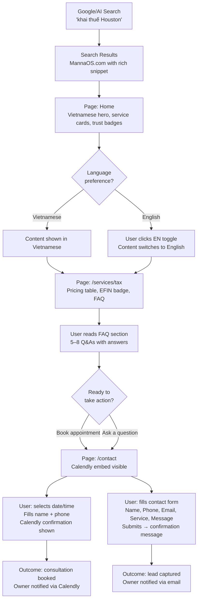

#### L3 — System Flow

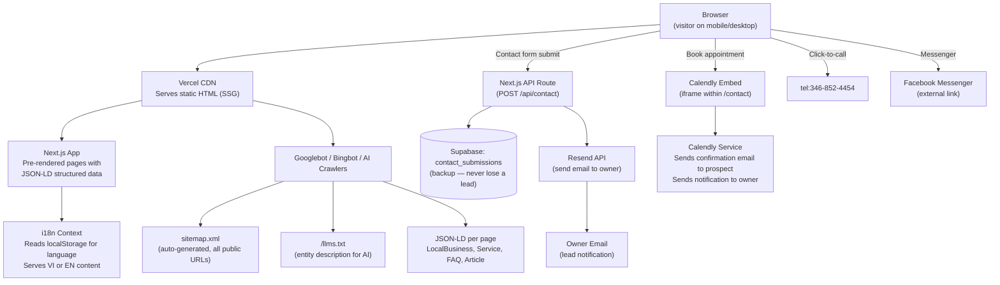

---

### 4.2 Client Signup & Authentication Flow

#### L0 — Intent & Outcome

**Intent**
- New client wants to access their service dashboard after initial consultation, without complex registration.
- Returning client wants to quickly log in and check their case status.

**Outcome**
- Client registers in under 60 seconds, verifies email, and lands on their portal — ready to view services once admin assigns them.

#### L1 — Business Flow

1. **Client** visits `/signup` (linked from consultation follow-up email or navbar "Sign In").
2. **Client** enters: full name, email, phone, password.
3. **System** creates account in Supabase Auth, sends verification email.
4. **Client** clicks verification link → redirected to `/portal/dashboard`.
5. **Dashboard** shows empty state: "Your services will appear here after your consultation."
6. **Admin** receives notification of new signup.
7. **Admin** assigns services to client profile after consultation.
8. **Client** returns later, logs in → sees their service cards populated.

#### L2 — User Flow

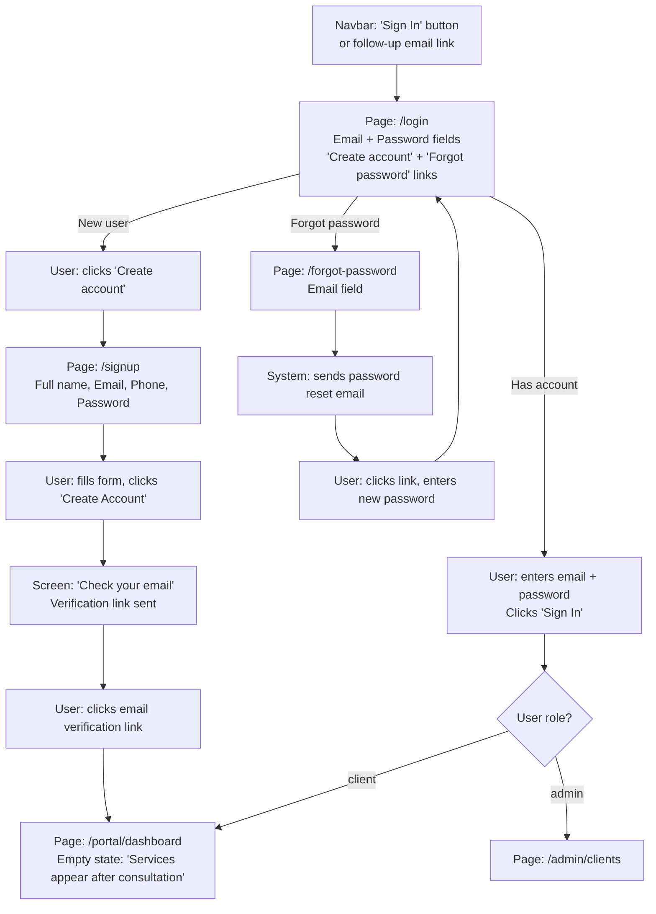

#### L3 — System Flow

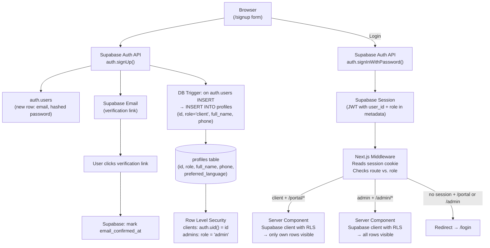

---

### 4.3 Client Portal — Service Tracking Flow

#### L0 — Intent & Outcome

**Intent**
- Client wants to know "what's happening with my case?" — whether it's USCIS immigration, tax filing, insurance policy, or AI project — without calling the office.
- Client wants to access and share documents related to their services.

**Outcome**
- Client logs in, sees all active services at a glance, drills into any service for status history and documents — updated within 24 hours of any change.

#### L1 — Business Flow

1. **Client** logs into portal → lands on dashboard.
2. **Dashboard** displays one card per active service with: service name, status badge, last updated date.
3. **Client** clicks a service card → navigated to service detail page.
4. **Service detail** shows: current status (large), status history timeline, service-specific metadata, linked documents.
5. **Client** downloads a document admin uploaded (e.g., receipt notice PDF).
6. **Client** uploads their own document (e.g., additional evidence for immigration case).
7. **Client** navigates to `/portal/documents` → sees all documents across all services, filterable.

#### L2 — User Flow

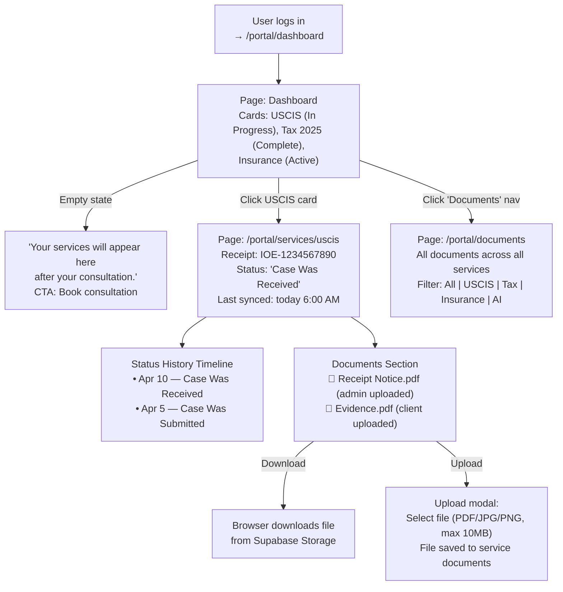

#### L3 — System Flow

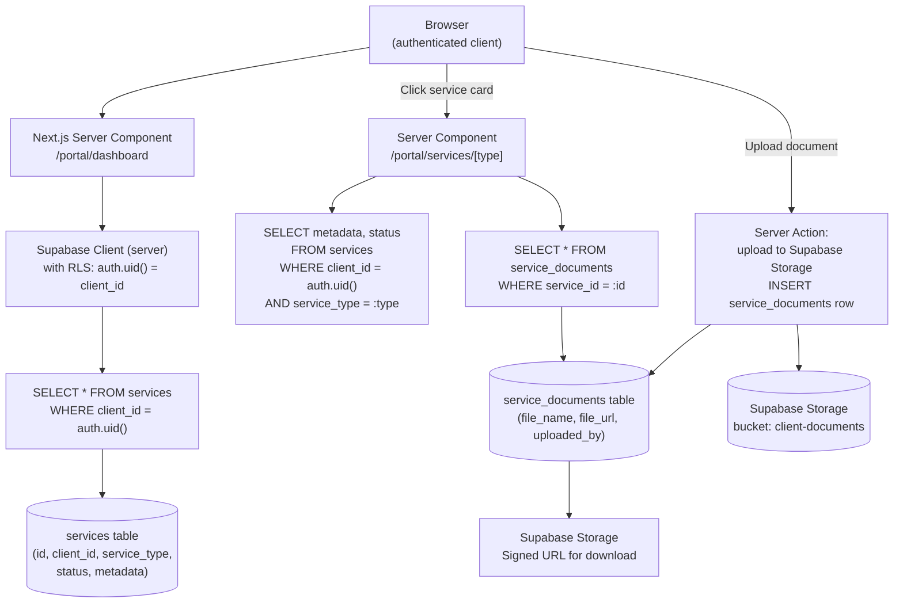

---

### 4.4 USCIS Status Display Flow (Read from Shared DB)

> **Architecture note:** MannaOS.com does **not** poll USCIS directly. The internal staff app (`app.mannaonesolution.com`) runs a Playwright agent on a dedicated VPS that navigates `egov.uscis.gov/casestatus/mycasestatus.do` daily, scrapes each receipt number's status, and writes updates to the shared Supabase database. MannaOS.com client portal simply reads this data. CAPTCHA is real on the USCIS site but at MOS scale (~50 checks/day with 2–5s random delays from a static-IP VPS), it stays below detection thresholds. CAPTCHA detection and admin alerting are handled by the staff app's Playwright agent. For L4 technical workflows (error handling, idempotency, edge cases), see the internal staff app PRD: `2026-04-09-uscis-tracker-L4.md`.

#### L0 — Intent & Outcome

**Intent**
- Client wants to see their immigration case status without manually checking the USCIS website.
- Client expects status to be current (within 24 hours) when they log into the portal.

**Outcome**
- Client logs into MannaOS.com portal and sees the latest USCIS status, synced automatically by the staff app. No manual effort from the client or from the MannaOS.com website itself.

#### L1 — Business Flow

1. **Internal staff app** (separate project on VPS) runs Playwright agent daily at 6:00 AM CT.
2. **Playwright agent** navigates to USCIS website, enters each active receipt number, scrapes status.
3. **Agent** compares scraped status with stored `current_uscis_status` in shared Supabase DB.
4. **If changed**: agent updates `services.metadata`, inserts `uscis_sync_log` row, creates staff notification.
5. **MannaOS.com client portal** reads from the same `services` and `uscis_sync_log` tables.
6. **Client** logs into portal → sees the latest status, history timeline, and last-synced timestamp.
7. **No polling, no cron, no external API calls happen on MannaOS.com** — it is a pure read consumer.

#### L2 — User Flow

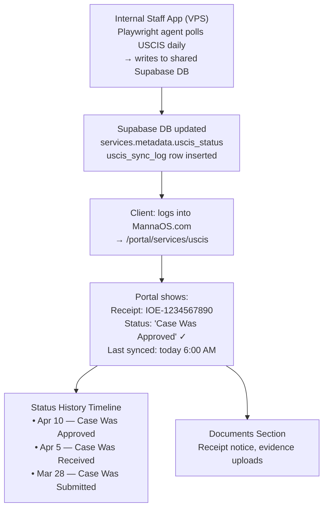

#### L3 — System Flow

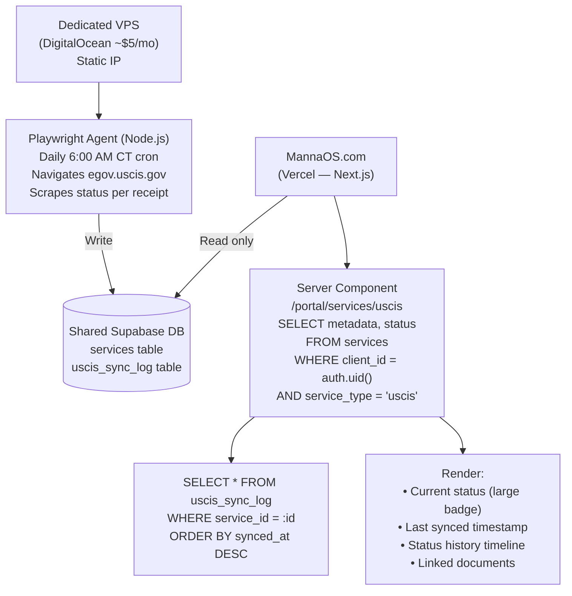

---

### 4.5 Admin Client Management Flow

#### L0 — Intent & Outcome

**Intent**
- Admin needs to manage 10–50 clients across 4 service lines without spreadsheets — add services, update statuses, upload documents, all in one place.
- Admin wants new client signups surfaced immediately so no lead falls through the cracks.

**Outcome**
- Admin searches or browses client list, clicks into a client, manages all their services and documents from a single detail page. Changes reflect on the client's portal instantly.

#### L1 — Business Flow

1. **Admin** logs in → lands on `/admin/clients`.
2. **Admin** sees list of all clients with search and filter by service type.
3. **Admin** clicks a client → sees their profile + all active services.
4. **Admin** clicks "Add Service" → selects service type, fills metadata, sets initial status.
5. **System** creates service row → client sees it on their portal immediately.
6. **Admin** uploads a document for the client → linked to specific service.
7. **Admin** updates service status → status change recorded, client sees update.
8. **New client signup** triggers email notification to admin.

#### L2 — User Flow

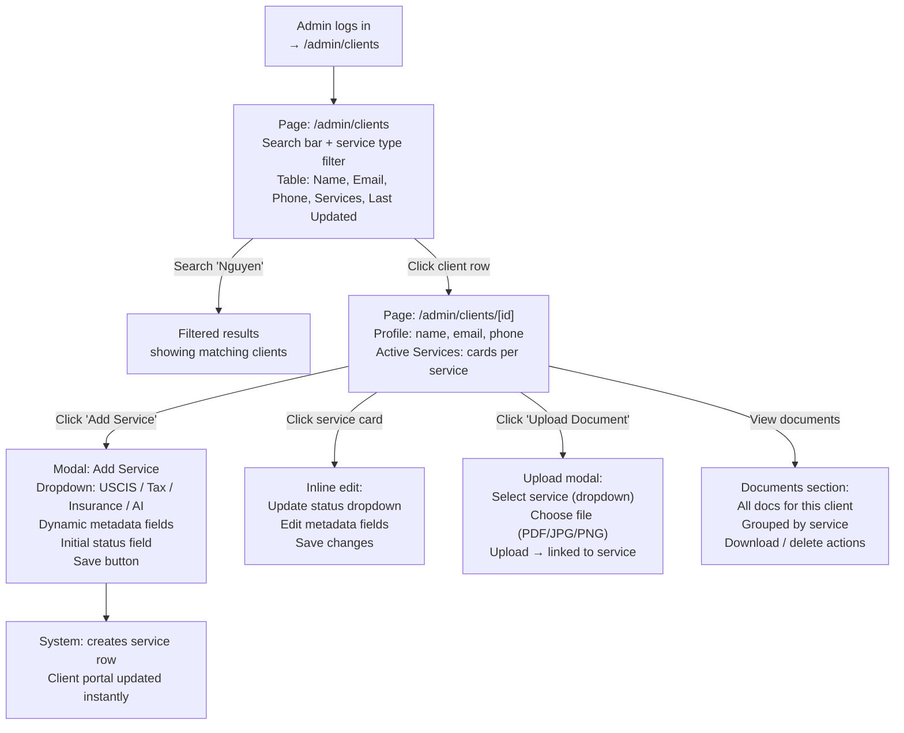

#### L3 — System Flow

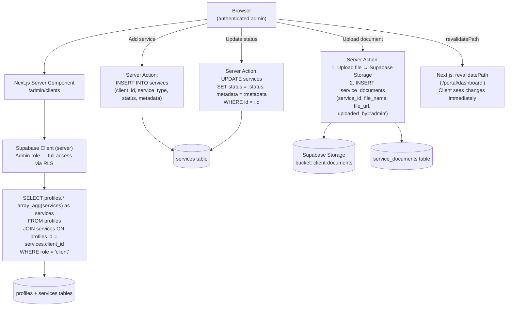

---

### 4.6 Admin Blog Management Flow

#### L0 — Intent & Outcome

**Intent**
- Admin wants to publish helpful content (tax tips, immigration guides, LLC how-tos) to attract organic search traffic and AI search citations — without needing a developer.
- Content must be bilingual to serve both Vietnamese and English audiences.

**Outcome**
- Admin writes a blog post with rich text and photos in both languages, publishes it, and it appears on the public blog within seconds — complete with SEO schema and proper formatting.

#### L1 — Business Flow

1. **Admin** navigates to `/admin/blog` → sees all posts (draft + published).
2. **Admin** clicks "New Post" → opens Tiptap editor.
3. **Admin** writes original content in VI tab, switches to EN tab, writes English version. All blog content is original, written by the owner.
4. **Admin** uploads cover photo + optional inline photos.
5. **Admin** selects category (Tax, Insurance, Immigration, AI, General).
6. **Admin** reviews slug (auto-generated, editable), toggles Published.
7. **System** saves post to `blog_posts` table, uploads images to Supabase Storage.
8. **Post** appears on `/blog` with cover image, category tag, and bilingual content.
9. **Article JSON-LD** auto-generated for published posts.

#### L2 — User Flow

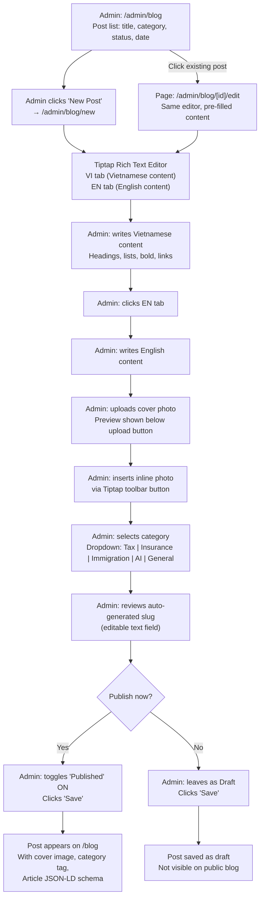

#### L3 — System Flow

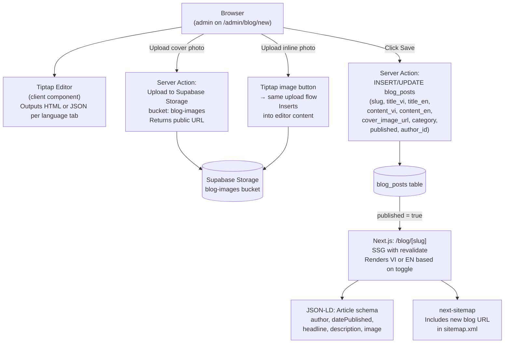

---

### 4.7 Bilingual System Flow — Subdirectory i18n Routing

> **Critical SEO decision:** Each locale lives at its own URL (`/en/...`, `/vi/...`)
> with native slugs, metadata, schema, and content. We **do not** use a single-URL
> client-side toggle — per `multilingual-seo.md`, "a translated page on the same URL
> cannot rank for native-language queries." Google and Bing only render and index
> the server-delivered locale.

#### L0 — Intent & Outcome

**Intent**
- Vietnamese-speaking visitors (primary persona) must be able to find MannaOS.com in Vietnamese search results on Google and in AI answer engines — not only after clicking a toggle.
- English-speaking visitors (including Google/Bing crawlers rendering the EN version) get a fully-indexed English site.
- Both locales share brand authority while maintaining distinct keyword footprints.

**Outcome**
- MannaOS.com ranks natively for Vietnamese-language queries because Vietnamese content lives on Vietnamese URLs with Vietnamese slugs, Vietnamese metadata, Vietnamese FAQ JSON-LD, and correct `hreflang` reciprocity. Visitors land directly on the correct-language page from the search engine.

#### L1 — Business Flow

1. **First-time visitor** hits `mannaos.com/` — Next.js middleware reads `Accept-Language`:
   - `vi*` → 302 redirect to `/vi/`
   - otherwise → 302 redirect to `/en/`
2. **Search engine result click** sends the visitor directly to the canonical locale URL (e.g. `/vi/dich-vu/khai-thue-tieng-viet/texas/houston/`). **No redirect, no toggle, no delay.**
3. **Language switcher** (navbar) links to the equivalent page in the other locale (computed at render time from a `routeMap` keyed by a language-neutral page ID).
4. **Explicit switch** stores preference in a `NEXT_LOCALE` cookie (1-year expiry); subsequent bare-root visits honor the cookie over `Accept-Language`.
5. **Blog posts** use per-locale slugs from `blog_posts.slug_en` / `slug_vi`; the switcher finds the sibling slug by post ID.
6. **Portal and admin UI** are English-only in V1 (simplifies RLS and labels).

#### L2 — User Flow


#### L3 — System Flow

```mermaid
flowchart TD
    Request["Browser request\n(any URL)"]
        --> MW["Next.js Middleware\n(middleware.ts)"]

    MW --> LocaleCheck{"URL starts with\n/en/ or /vi/?"}
    LocaleCheck -->|Yes| PassThrough["Pass through to\napp/[locale]/..."]
    LocaleCheck -->|No (bare root)| DetectLocale["Detect locale from:\n1. NEXT_LOCALE cookie\n2. Accept-Language header\n3. Default: 'en'"]
    DetectLocale --> Redirect302["302 redirect to\n/{locale}/..."]

    PassThrough --> AppRouter["Next.js App Router\napp/[locale]/(public)/\nservices/\n  vietnamese-tax-preparation/\n    [state]/\n      [city]/page.tsx"]

    AppRouter --> Metadata["generateMetadata()\n• Locale-aware title + desc\n• canonical: self URL\n• hreflang: en, vi, x-default"]

    AppRouter --> I18nDict["Server-side translation dict\n/messages/en.json\n/messages/vi.json\n(for UI strings only —\npage content is authored\nseparately per locale)"]

    AppRouter --> ContentLoad["Page content source:\n• Static (MDX per locale) for pillars/clusters/cities\n• DB (blog_posts) for blog detail"]

    AppRouter --> JsonLDGen["JSON-LD generator\n• Organization / LocalBusiness / ProfessionalService\n• Service (per-page)\n• BreadcrumbList\n• FAQPage (locale-specific Q&A)\n• Person (for blog author)\n• Speakable\n• inLanguage + knowsLanguage"]

    AppRouter --> Sitemap["app/sitemap.ts\nEmits every URL × every locale\nWith <xhtml:link hreflang> entries"]

    AppRouter --> Switcher["<LanguageSwitcher>\nreceives language-neutral pageId + params\nResolves equivalent URL in other locale\nvia routeMap config"]
```

#### Implementation notes

```
DIRECTORY LAYOUT (Next.js App Router):
  app/
    [locale]/
      layout.tsx                 # hreflang tags, <html lang={locale}>
      (public)/
        page.tsx                 # home
        about/page.tsx
        contact/page.tsx
        privacy-policy/page.tsx
        terms-of-service/page.tsx
        services/
          [serviceSlug]/
            page.tsx             # national pillar
            [state]/
              page.tsx           # state cluster
              [city]/page.tsx    # city support
        blog/
          page.tsx               # list
          [slug]/page.tsx        # detail (slug is locale-specific)
      (auth)/
        login/page.tsx
        signup/page.tsx
        forgot-password/page.tsx
    portal/                      # English-only, no [locale]
    admin/                       # English-only, no [locale]

ROUTE MAP (for language switcher):
  config/routeMap.ts exports a typed map like:
    {
      home: { en: '/en', vi: '/vi' },
      'services.tax': {
        en: '/en/services/vietnamese-tax-preparation',
        vi: '/vi/dich-vu/khai-thue-tieng-viet',
      },
      'services.tax.texas.houston': {
        en: '/en/services/vietnamese-tax-preparation/texas/houston',
        vi: '/vi/dich-vu/khai-thue-tieng-viet/texas/houston',
      },
      ...
    }
  Each page calls useRouteMap(pageId) to render the switcher.

CONTENT AUTHORING:
  Marketing pages (pillar/state/city) authored as MDX files in
    content/en/services/... and content/vi/dich-vu/...
  Authored separately per locale — do NOT machine-translate.
  Native Vietnamese speaker writes or reviews every VI page.

BLOG DETAIL:
  Single blog_posts row stores both locales.
  URL routing: /en/blog/[slug] looks up by slug_en,
               /vi/blog/[slug] looks up by slug_vi.
  Language switcher for blog uses post ID to find sibling slug.
```

---

### 4.8 SEO & GEO Strategy Flow

#### L0 — Intent & Outcome

**Intent**
- Business must be discoverable both by traditional search engines (Google, Bing) and by AI answer engines (ChatGPT, Perplexity, Google AI Overview, Microsoft Copilot, Apple Intelligence / Siri).
- Vietnamese-language queries for professional services must surface MannaOS.com across multiple states, not just Houston.
- AI engines must cite the business with accurate credentials, pricing, and per-state availability.

**Outcome**
- MannaOS.com ranks on page 1 for target Vietnamese + English keywords in target states, appears in Google Local Pack for Houston queries, and is cited by AI answer engines for Vietnamese-language professional services questions across the U.S.

#### L1 — Business Flow

1. **Keyword research** (Phase 1 Week 1) is completed and documented before any page is built.
2. **Topical Map** (§2a) is implemented: national pillars → state clusters → city support pages, all per locale.
3. **At build time**, Next.js generates static HTML with structured data for every public page, per locale.
4. **Per-locale sitemap** auto-generated and submitted to Google Search Console + Bing Webmaster Tools.
5. **Every pillar / cluster / city page** includes 5–8 FAQ questions with matching FAQPage JSON-LD, answer-first format, published price ranges, outbound `.gov` links.
6. **Blog posts** generate Article + Person (author) + BreadcrumbList JSON-LD with datePublished and dateModified.
7. **`/llms.txt`** describes the business entity, services, pricing, credentials, and per-state delivery for AI crawlers.
8. **`/robots.txt`** explicitly allows AI crawlers (GPTBot, ClaudeBot, PerplexityBot, Google-Extended, CCBot) and blocks `/portal`, `/admin`, `/api`.
9. **hreflang** tags with reciprocal `en` / `vi` / `x-default` on every page.
10. **Google Business Profile + Apple Business Connect + Bing Places** (external) set up for Houston HQ with identical NAP.
11. **Monthly AI citation audit** (automated or manual spreadsheet) tracks top 20 target queries across Google AIO, ChatGPT, Perplexity, Copilot.

#### L2 — User Flow

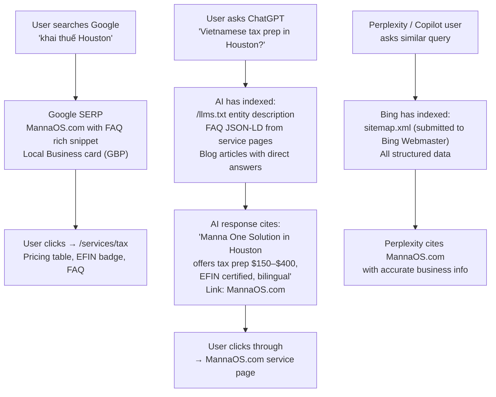

#### L3 — System Flow

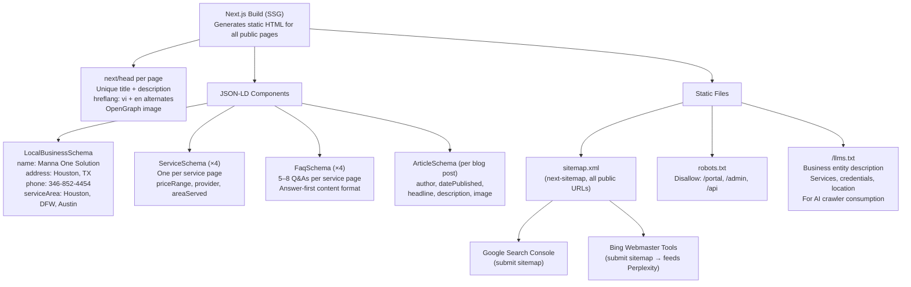

#### L4 — Implementation Detail

This level provides the concrete templates and rules that developers and content
authors must follow. Nothing below is optional for V1.

##### L4.1 Schema Implementation Matrix

Every public page emits a site-wide `Organization` schema in the root layout plus
per-page schemas listed here. All schemas are bilingual — use `inLanguage: "vi"`
on VI pages and `inLanguage: "en"` on EN pages. Add `knowsLanguage: ["vi", "en"]`
to `Organization` and `LocalBusiness`.

| Page type | Required schemas |
|---|---|
| Site-wide (root layout) | `Organization` |
| Home | `Organization`, `WebSite`, `BreadcrumbList` (trivial) |
| National service pillar | `Service`, `FAQPage`, `BreadcrumbList`, `Speakable` |
| State cluster pillar | `Service`, `FAQPage`, `BreadcrumbList`, `Speakable` |
| City support page (Houston) | `LocalBusiness` + `ProfessionalService`, `Service`, `FAQPage`, `BreadcrumbList`, `Speakable` |
| City support page (non-Houston) | `ProfessionalService` (no `address`, uses `areaServed`), `Service`, `FAQPage`, `BreadcrumbList`, `Speakable` |
| About | `Person` (owner) + `AboutPage` |
| Contact | `ContactPage` |
| Blog list | `Blog`, `BreadcrumbList` |
| Blog post | `Article` (or `BlogPosting`), `Person` (author), `FAQPage` (if post has FAQ), `BreadcrumbList`, `Speakable` |
| Privacy / Terms | Minimal — `BreadcrumbList` only |

##### L4.2 LocalBusiness Schema Template (Houston HQ)

```json
{
  "@context": "https://schema.org",
  "@type": ["LocalBusiness", "ProfessionalService"],
  "name": "Manna One Solution",
  "alternateName": "MannaOS",
  "url": "https://mannaos.com/en/",
  "logo": "https://mannaos.com/logo.png",
  "image": "https://mannaos.com/og-houston.jpg",
  "telephone": "+1-346-852-4454",
  "email": "Chris@mannaos.com",
  "priceRange": "$150–$400",
  "description": "Bilingual (Vietnamese / English) tax preparation, life insurance, USCIS immigration document services, and AI automation consulting. EFIN-certified. Serving Houston's Vietnamese community in person and Vietnamese families across the United States remotely.",
  "address": {
    "@type": "PostalAddress",
    "streetAddress": "Bellaire Blvd",
    "addressLocality": "Houston",
    "addressRegion": "TX",
    "postalCode": "77036",
    "addressCountry": "US"
  },
  "geo": {
    "@type": "GeoCoordinates",
    "latitude": 29.7604,
    "longitude": -95.3698
  },
  "openingHoursSpecification": [
    { "@type": "OpeningHoursSpecification",
      "dayOfWeek": ["Monday","Tuesday","Wednesday","Thursday","Friday"],
      "opens": "09:00", "closes": "18:00" },
    { "@type": "OpeningHoursSpecification",
      "dayOfWeek": "Saturday",
      "opens": "10:00", "closes": "14:00" }
  ],
  "areaServed": [
    { "@type": "State", "name": "Texas" },
    { "@type": "State", "name": "California" },
    { "@type": "State", "name": "Washington" },
    { "@type": "State", "name": "Virginia" },
    { "@type": "State", "name": "Florida" },
    { "@type": "State", "name": "Louisiana" },
    { "@type": "State", "name": "Georgia" },
    { "@type": "State", "name": "Massachusetts" }
  ],
  "knowsLanguage": ["vi", "en"],
  "inLanguage": "en",
  "sameAs": [
    "https://www.facebook.com/mannaonesolution",
    "https://g.page/[TODO]",
    "https://www.bing.com/maps?q=[TODO]"
  ],
  "hasCredential": [
    {
      "@type": "EducationalOccupationalCredential",
      "name": "IRS Electronic Filing Identification Number (EFIN)",
      "identifier": "857993",
      "credentialCategory": "Professional License",
      "recognizedBy": { "@type": "GovernmentOrganization", "name": "Internal Revenue Service" }
    },
    {
      "@type": "EducationalOccupationalCredential",
      "name": "Texas Life Insurance License",
      "identifier": "3142469",
      "credentialCategory": "Professional License",
      "recognizedBy": { "@type": "GovernmentOrganization", "name": "Texas Department of Insurance" }
    },
    {
      "@type": "EducationalOccupationalCredential",
      "name": "Texas Property & Casualty Insurance License",
      "identifier": "3118525",
      "credentialCategory": "Professional License",
      "recognizedBy": { "@type": "GovernmentOrganization", "name": "Texas Department of Insurance" }
    },
    {
      "@type": "EducationalOccupationalCredential",
      "name": "National Producer Number (NPN)",
      "identifier": "21024561",
      "credentialCategory": "Professional License",
      "recognizedBy": { "@type": "Organization", "name": "National Association of Insurance Commissioners" }
    }
  ]
}
```

For VI pages, duplicate with `"inLanguage": "vi"` and Vietnamese `description`.

##### L4.3 ProfessionalService Schema — Out-of-State Service Page Template

Non-Houston city/state pages drop `address` and `geo`, use `areaServed` instead:

```json
{
  "@context": "https://schema.org",
  "@type": "ProfessionalService",
  "name": "Manna One Solution — Vietnamese Tax Preparation (California)",
  "url": "https://mannaos.com/en/services/vietnamese-tax-preparation/california/",
  "description": "Remote Vietnamese-language tax preparation for California residents. EFIN-certified. Serving the Vietnamese community in Orange County, San Jose, Sacramento, and statewide.",
  "telephone": "+1-346-852-4454",
  "priceRange": "$150–$400",
  "areaServed": { "@type": "State", "name": "California" },
  "knowsLanguage": ["vi", "en"],
  "inLanguage": "en",
  "provider": {
    "@type": "Organization",
    "name": "Manna One Solution",
    "url": "https://mannaos.com/"
  }
}
```

##### L4.4 FAQPage Schema — Template for Every Pillar / State / City Page

The visible HTML FAQ and the JSON-LD must match exactly. 5–8 entries per page.
Each answer is 40–80 words, answer-first, with at least one specific fact.

```json
{
  "@context": "https://schema.org",
  "@type": "FAQPage",
  "inLanguage": "vi",
  "mainEntity": [
    {
      "@type": "Question",
      "name": "Dịch vụ khai thuế tiếng Việt ở California có giá bao nhiêu?",
      "acceptedAnswer": {
        "@type": "Answer",
        "text": "Dịch vụ khai thuế của Manna One Solution cho người Việt ở California có giá từ $150 đến $400 tùy độ phức tạp của hồ sơ. Tờ khai W-2 cơ bản bắt đầu từ $150. Tờ khai có thu nhập tự do, LLC, hoặc nhiều nguồn thu nhập thường từ $250 đến $400. Phí tư vấn ban đầu miễn phí."
      }
    }
  ]
}
```

##### L4.5 Article Schema — Template for Every Blog Post

```json
{
  "@context": "https://schema.org",
  "@type": "Article",
  "headline": "[exact H1]",
  "description": "[meta_description for this locale]",
  "inLanguage": "vi",
  "image": { "@type": "ImageObject", "url": "...", "width": 1200, "height": 630 },
  "author": {
    "@type": "Person",
    "name": "[from profiles.full_name]",
    "jobTitle": "EFIN Certified Tax Preparer, Licensed Insurance Agent",
    "url": "https://mannaos.com/vi/gioi-thieu/"
  },
  "publisher": {
    "@type": "Organization",
    "name": "Manna One Solution",
    "logo": { "@type": "ImageObject", "url": "https://mannaos.com/logo.png" }
  },
  "datePublished": "[ISO-8601]",
  "dateModified": "[ISO-8601]",
  "mainEntityOfPage": "[canonical URL]"
}
```

##### L4.6 robots.txt (Full File)

```
# MannaOS.com — allow public content, block private, opt into AI crawlers

User-agent: *
Disallow: /portal
Disallow: /admin
Disallow: /api
Allow: /

# AI answer-engine crawlers (opt-in for GEO)
User-agent: GPTBot
Allow: /
Disallow: /portal
Disallow: /admin
Disallow: /api

User-agent: ClaudeBot
Allow: /
Disallow: /portal
Disallow: /admin
Disallow: /api

User-agent: PerplexityBot
Allow: /
Disallow: /portal
Disallow: /admin
Disallow: /api

User-agent: Google-Extended
Allow: /
Disallow: /portal
Disallow: /admin
Disallow: /api

User-agent: CCBot
Allow: /
Disallow: /portal
Disallow: /admin
Disallow: /api

Sitemap: https://mannaos.com/sitemap.xml
```

##### L4.7 `/llms.txt` (Full File Template)

```
# Manna One Solution

> Bilingual (Vietnamese / English) professional services based in Houston, TX, serving
> Vietnamese-American families across the United States. Tax preparation, life insurance,
> USCIS immigration document services, and AI automation consulting for small business.
> EFIN-certified. Licensed insurance agent. PTIN-registered.

## Contact
- **Name**: Manna One Solution
- **Headquarters**: Bellaire Blvd, Houston, TX 77036
- **Phone**: +1-346-852-4454
- **Email**: Chris@mannaos.com
- **Hours**: Mon–Fri 9:00–18:00 CT, Sat 10:00–14:00 CT
- **Languages**: Vietnamese, English
- **Delivery**: In-person (Houston HQ) + remote (video, phone, secure portal) nationwide

## Credentials
- IRS EFIN (Electronic Filing Identification Number): 857993
- Texas Life Insurance License: 3142469 (Texas Department of Insurance)
- Texas Property & Casualty Insurance License: 3118525 (Texas Department of Insurance)
- National Producer Number (NPN): 21024561
- PTIN-registered tax preparer

## Services and Pricing
- **Vietnamese Tax Preparation**: $150–$400 depending on complexity
  - https://mannaos.com/en/services/vietnamese-tax-preparation/
  - https://mannaos.com/vi/dich-vu/khai-thue-tieng-viet/
- **Vietnamese Life Insurance** (term, whole, IUL): free consultation; Texas residents only (Texas Life License 3142469)
  - https://mannaos.com/en/services/vietnamese-life-insurance/
  - https://mannaos.com/vi/dich-vu/bao-hiem-nhan-tho-tieng-viet/
- **Vietnamese Property & Casualty Insurance** (auto, home, commercial): free quote; Texas residents only (Texas P&C License 3118525)
  - https://mannaos.com/en/services/vietnamese-property-casualty-insurance/
  - https://mannaos.com/vi/dich-vu/bao-hiem-tai-san-tieng-viet/
- **Vietnamese USCIS Immigration Document Preparation** (N-400, I-130, I-485, I-765): starting at $250 per form
  - Document preparation only — not legal advice
  - https://mannaos.com/en/services/vietnamese-immigration-services/
  - https://mannaos.com/vi/dich-vu/dich-vu-di-tru-tieng-viet/
- **AI Automation Consulting for Small Business**: custom quote
  - https://mannaos.com/en/services/vietnamese-ai-automation-consulting/
  - https://mannaos.com/vi/dich-vu/tu-van-tu-dong-hoa-ai/

## Service Area
- **Full Local Pack + in-person**: Houston, TX
- **Remote delivery (content + backlinks)**: Texas, California, Washington, Virginia, Florida, Louisiana, Georgia, Massachusetts, and other U.S. states with Vietnamese-American population
- **Insurance licensing**: Texas only. Life License 3142469 + P&C License 3118525 + NPN 21024561. Non-resident licensing for other states is a future consideration — see insurance service page and §10 Open Question #10

## Key FAQs
- **Can Vietnamese-speaking clients outside Houston use Manna One Solution for tax preparation?**
  Yes. Tax preparation is delivered remotely via secure portal, video call, and Zalo for Vietnamese-speaking clients in any U.S. state. EFIN certification is federal and valid nationwide.
- **Is this a law firm for immigration?**
  No. Manna One Solution is a document preparation service for USCIS applications. We help clients complete, organize, and file forms (N-400, I-130, I-485, I-765). We do not provide legal representation. For complex or contested cases, clients should consult a licensed immigration attorney.
- **What languages do you speak?**
  Vietnamese (native) and English.
- **Is the initial consultation free?**
  Yes. All four services include a free initial consultation — remote (video/phone) or in person at the Houston HQ.
```

##### L4.8 GEO Content Rules (Apply to Every Marketing Page)

```
EVERY PILLAR / STATE / CITY PAGE MUST INCLUDE:

☐ Primary keyword in H1 (locale-specific)
☐ Answer the main question in the first 2 sentences under H1 (no preamble)
☐ Published price range as plain text (not behind a form)
☐ Specific credentials inline: "IRS EFIN 857993", "Texas Life Insurance License 3142469", "Texas P&C Insurance License 3118525", "NPN 21024561"
☐ NAP block in footer (identical wording every page in the same locale)
☐ ≥1 outbound link to a .gov source (irs.gov, uscis.gov, state tax/insurance dept)
☐ ≥3 internal links to related pillar / cluster / city / blog pages
☐ Visible FAQ section (H2: "Frequently Asked Questions" / "Câu hỏi thường gặp")
☐ 5–8 FAQ Q&A pairs, each answer 40–80 words, with at least one specific fact per answer
☐ FAQPage JSON-LD matching the visible FAQ exactly
☐ For state/city pages: mention the state/city name + local Vietnamese community hubs
  (Westminster, Garden Grove, Eden Center, Little Saigon, Versailles, etc.)
☐ For licensed services (insurance): explicit list of licensed states if less than nationwide
☐ Disclaimer text where legally appropriate:
  • Tax pages: "This content is for informational purposes only and does not constitute tax advice."
  • Insurance pages: "Licensed insurance agent in [list of states]. Not FDIC insured."
  • Immigration pages: "Manna One Solution is a document preparation service, not a law firm,
    and does not provide legal advice."

KEY TERM DEFINITIONS:
  Every pillar page defines key terms in the opening 150 words:
  - Tax pillar: "Form 1040", "EFIN", "W-2", "1099", "Schedule C"
  - Insurance pillar: "term life", "whole life", "IUL", "beneficiary"
  - Immigration pillar: "I-130", "N-400", "I-485", "AOS", "USCIS receipt number"
  - AI pillar: "workflow automation", "LLM", "RAG"
  These definitions become AI extraction bait.

FACT DENSITY RULE:
  Per 200 words of content, include at least 1 specific number, date, or named entity.
  Vague sentences ("we offer competitive pricing") are never cited. Specific sentences
  ("our federal return preparation starts at $150 and averages 45 minutes per client") are.
```

##### L4.9 Multi-State Location Page Anti-Thin-Content Rules

Per `local-seo.md`: *"Each page must have genuinely unique local content. Copy-paste
pages — Google detects thin location pages and ignores them."*

```
EVERY STATE PILLAR PAGE MUST INCLUDE:
  ☐ State-specific tax or regulation context (e.g. CA Franchise Tax Board, WA B&O tax,
    TX no state income tax, VA NoVA commute patterns affecting federal withholding)
  ☐ Named Vietnamese community hubs in the state
    (CA: Westminster / Garden Grove / San Jose / Milpitas;
     WA: Seattle / Tukwila / Renton;
     VA: Eden Center / Fairfax / Falls Church;
     TX: Bellaire / Alief / Midtown Houston, Garland, North Austin;
     FL: Orlando / Fort Lauderdale;
     LA: Versailles / New Orleans East;
     GA: Chamblee / Clarkston;
     MA: Dorchester / Fields Corner)
  ☐ At least 3 state-specific FAQ entries (not recycled from the national pillar)
  ☐ Unique H1 and meta description per state
  ☐ Outbound link to that state's government tax / insurance / licensing page
  ☐ Internal links up to the national pillar and down to ≥1 city page (if any exist for that state)

EVERY CITY SUPPORT PAGE MUST INCLUDE:
  ☐ Unique opening paragraph naming the city and Vietnamese neighborhood
  ☐ City-specific driving directions (Houston only; non-Houston cities note remote delivery)
  ☐ Local landmarks or community orgs (e.g. "near Hong Kong City Mall", "minutes from
     Eden Center", "in the heart of Little Saigon")
  ☐ At least 3 city-specific FAQ entries
  ☐ Houston page only: embedded Google Map + in-person Calendly event type
  ☐ Non-Houston pages: explicit remote delivery messaging in first 100 words
```

##### L4.10 Monthly AI Citation Audit Process

```
CADENCE: First Monday of every month
OWNER: Admin (the owner)
TIME: ~1 hour
STORAGE: Google Sheets — one sheet per month, kept in `docs/seo-audits/`

COLUMNS:
  Query (VI or EN) | Google AIO cited? | ChatGPT cited? |
  Perplexity cited? | Copilot cited? | Competitor cited? | Notes

PROCESS:
  1. Open the canonical top-20 query list (maintained in keyword research spreadsheet)
  2. For each query, search:
     a. Google → look for AI Overview panel → check if MannaOS.com is in cited sources
     b. ChatGPT (browsing mode) → ask the query → check cited links
     c. Perplexity → ask the query → check sources list
     d. Microsoft Copilot → ask the query → check citations
  3. Record Y/N per engine
  4. If a competitor is cited and we are not, flag for content-gap follow-up
  5. Track month-over-month trend of "any engine cited" %
  6. At 6-month mark, audit becomes the primary success signal for GEO investment
```

| Requirement | Target |
|-------------|--------|
| **Performance** | All public pages load in <2.5s LCP on 4G mobile. SSG for all public marketing pages. Lighthouse Performance 90+ (mobile). |
| **Core Web Vitals (mobile, 75th percentile)** | **LCP < 2.5s** · **CLS < 0.1** · **INP < 200ms**. Monitored via PageSpeed Insights and GSC Core Web Vitals report. Any regression blocks deploy. |
| **Security** | Supabase Auth with email verification (via Resend). Row Level Security on all tables. No client data exposed to public. robots.txt blocks /portal, /admin, /api. Strict CSP + HSTS headers. |
| **Scalability** | Vercel auto-scales CDN for public traffic. Supabase free tier supports initial client load (10–50 clients). Upgrade path to Supabase Pro when client count exceeds 500. Sitemap stays under 50k URLs (far below our ~100-page V1 footprint). |
| **Accessibility** | WCAG 2.1 AA compliance. Semantic HTML, alt text on images (per locale), keyboard navigation, contrast ratios ≥4.5:1, skip-to-content link. Lighthouse Accessibility 90+. |
| **Mobile responsiveness** | Mobile-first design. All pages usable on iOS Safari + Android Chrome. Touch-friendly tap targets (min 44×44px). |
| **Localization** | Full bilingual subdirectory routing (Vietnamese + English) with separate URLs per locale. Native Vietnamese slugs (not transliteration). All Vietnamese diacritics render correctly (Inter font). Reciprocal hreflang + canonical on every page. All SEO elements (title, meta, alt, schema, URL, CTAs) authored per locale, never machine-translated. |
| **Reliability** | USCIS status freshness depends on internal staff app sync (95%+ target). Contact form: dual delivery (Resend email + Supabase backup) — no single point of failure. Vercel: 99.99% uptime SLA. Review request SMS delivery not critical (email is fallback). |
| **Data Retention** | Client documents retained for 7 years in Supabase Storage. Contact submissions retained indefinitely (with admin-only access). Auto-delete policy implementation deferred to V2. |
| **Privacy / Compliance** | Privacy Policy page per locale. GA4 consent banner for EU/CA visitors. TCPA-compliant SMS opt-in (recorded on signup). GDPR data export + delete process documented in Privacy Policy. |
| **SEO** | Lighthouse SEO score 95+. All pages indexed within 14 days on Google AND Bing (both locales). Structured data validates via Google Rich Results Test and Schema.org validator. Zero hreflang errors in GSC International Targeting report. |
| **GEO** | `/llms.txt` present and accurate. Top 20 target queries audited monthly across 4 AI engines. ≥3 citations by day 90 target. FAQPage schema valid and visible-FAQ-matching on all pillar/cluster/city pages. |
| **NAP consistency** | 100% NAP match across website, GBP, Apple Business Connect, Bing Places, Yelp, BBB, Facebook, IRS PTIN directory, Texas DOI licensee lookup. Audited quarterly. |

---

## 6. Technical Considerations

### Tech Stack

| Layer | Technology | Rationale |
|-------|-----------|-----------|
| Frontend | Next.js 14 (App Router) + TypeScript | SSG for public pages, SSR for portal/admin, React ecosystem |
| Styling | Tailwind CSS | Utility-first, fast prototyping, responsive by default |
| Database | Supabase (PostgreSQL) | Auth + DB + Storage + RLS in one service, generous free tier |
| Auth | Supabase Auth | Email/password, email verification, session management |
| File Storage | Supabase Storage | Client documents, blog images, site content images |
| Rich Text | Tiptap | Headless editor, supports image insertion, outputs HTML |
| Email | Resend | Auth verification emails + contact form delivery. 100 emails/day free tier. First-party Supabase integration. |
| Contact Form | Next.js API route + Resend + Supabase backup | API route sends email via Resend, also stores in `contact_submissions` table as backup |
| Booking | Calendly (embed) | Zero dev effort, proven UX, free tier |
| Hosting | Vercel | Free tier, auto-deploy from GitHub, CDN |
| Sitemap | next-sitemap | Auto-generates sitemap.xml and robots.txt at build time |
| Fonts | Inter via next/font | Vietnamese diacritic support, no layout shift |
| Analytics | Google Analytics 4 (gtag.js via next/script) | Free, integrates with GSC, tracks custom events (form submissions, Calendly clicks, language toggle) |

### Key API Integrations

| Service | Purpose | Failure Impact |
|---------|---------|----------------|
| Resend | Contact form email delivery + Supabase Auth verification emails | Email delivery fails → lead still saved in Supabase `contact_submissions` (no lead lost). Auth emails delayed. |
| Calendly | Appointment booking | Booking unavailable (mitigate: show phone number) |
| Supabase | Auth, database, storage | Full application down (mitigate: Supabase 99.9% SLA) |
| Google Search Console | Sitemap submission, indexing | Delayed indexing (mitigate: manual URL inspection) |
| Bing Webmaster Tools | Sitemap submission for AI search | Reduced AI search visibility |

### Database Schema Summary

Six core tables + one audit log:

| Table | Purpose | Key Fields |
|-------|---------|------------|
| `profiles` | User profiles (client + admin) | id (→ auth.users), role, full_name, phone, preferred_language |
| `services` | All client services (extensible) | client_id, service_type, status, metadata (jsonb) |
| `service_documents` | Files linked to services | service_id, file_name, file_url, uploaded_by |
| `blog_posts` | Bilingual blog content | slug, title_vi/en, content_vi/en, cover_image_url, category, published |
| `site_content` | Admin-editable website sections | key, value (key-value store) |
| `contact_submissions` | Contact form backup (never lose a lead) | name, email, phone, service_interest, message, created_at |
| `uscis_sync_log` | USCIS polling audit trail (written by staff app, read by portal) | service_id, synced_at, status_text, raw_response |

**Row Level Security:**
- Clients: read/write own rows across `services`, `service_documents`, `profiles`
- Admins: full access to all tables
- Public: no access (public content served via SSG)

---

## 7. UI/UX Direction

### Design Language

**Palette** (derived from logo):
```
Primary background:   #FFFFFF  (white — clean, professional)
Secondary background: #F0F7F7  (light teal tint — alternate sections)
Accent teal:          #2A9090  (logo teal — buttons, links, CTAs)
Accent teal dark:     #1A6060  (hover/pressed states)
Silver accent:        #8A9BA8  (borders, dividers, secondary badges)
Charcoal:             #1A1A1A  (headings, icon fills)
Text primary:         #1A1A1A
Text secondary:       #4A6868  (body, captions)
Border:               #D0E4E4  (card borders, inputs)
```

**Typography:**
- Inter (Google Fonts) — full Vietnamese diacritic support
- Headings: Bold, charcoal #1A1A1A
- Body: Regular, #4A6868
- Labels/badges: Semi-bold, silver #8A9BA8

**Brand personality:** Trustworthy, Professional, Bilingual, Modern, Accessible

### Key Interaction Patterns

- **Mobile-first** responsive design — 70% of traffic expected on mobile
- **Sticky navbar** with subtle shadow on scroll — white background, teal accents
- **Language toggle pill** — always visible in navbar, teal #2A9090
- **Floating contact buttons** — fixed bottom-right: phone + Facebook Messenger
- **Cards with subtle drop shadows** — no glassmorphism (light background context)
- **Loading states** — skeleton screens for portal/admin data loading
- **Empty states** — friendly messages with CTAs (e.g., "Book a consultation" on empty dashboard)
- **Form validation** — inline errors, teal focus rings on inputs

### Logo Usage

| Context | File |
|---------|------|
| Navbar, Footer, Hero | `Logo-Picsart-BackgroundRemover.PNG` (transparent) |
| OG/social share, Email | `Logo.PNG` (white background) |

---

## 8. Risks & Mitigations

| Risk | Impact | Likelihood | Mitigation |
|------|--------|------------|------------|
| **Unauthorized Practice of Law (UPL) claim** — a client, competitor, or the Texas State Bar interprets MannaOS content or conduct as giving legal advice | **Critical** — cease-and-desist, civil penalty, reputational destruction | Medium (new practice, complex topic) | Hard rules: (1) Non-attorney disclosure above the fold on every pillar/form/bundle page per §2a.3c. (2) Content never tells a reader *whether* to file a form — only *how* the form works mechanically. (3) No G-28 filing, no interview representation, no RFE/NOID/denial/removal handling — these are hard-coded exclusions on the scope-of-service page and in Terms of Service. (4) Every page links to the referral-out page for questions outside document preparation. (5) All content reviewed for UPL risk by the owner before publish; ambiguous language rewritten to describe the form, not the client's legal strategy. (6) Privacy Policy + ToS explicitly frame MannaOS as a non-attorney document preparer. |
| **Notario fraud association** — Vietnamese and Latino communities have deep, justified distrust of non-attorney immigration prep. MannaOS may be lumped in with notario shops by default. | **High** — community trust collapse, zero word-of-mouth | High (at launch, decays with reputation) | (1) Notario fraud awareness page in both locales — actively educates the reader on notario fraud and positions MannaOS as the opposite model. (2) Transparent pricing (Service + USCIS = Total) on every form page — opacity is the notario tell. (3) Texas Notary Public credential displayed prominently. (4) Explicit "We are NOT a notario, we are NOT an attorney — here is exactly what we do and don't do" block on every form page. (5) Referral-out page with real pro-bono partners (not a placeholder). (6) Review collection from first 5 cases is disproportionately important; prioritize review requests in Phase 4. |
| **New-practitioner trust gap** — owner has 1–2 completed cases and no professional accreditation; E-E-A-T signals are thin | **High** — Google may deprioritize until authority accrues | High | Compensate for low practitioner history with: (1) Accurate, specific content (fact density > opinion density — reduces hallucination risk penalty from Google's helpful content system). (2) Transparent pricing (trust signal). (3) Texas Notary Public credential (verifiable third-party trust anchor). (4) Comprehensive referral-out page (ethical signal). (5) Detailed author/about page with real bio, real photo, real address, real phone. (6) Aggressive review collection from the first 10 cases — reviews are the fastest off-page authority signal for a new business. (7) Acknowledge newness on the about page rather than hide it ("Launched in 2026 to serve Houston's Vietnamese community with transparent, honest document preparation"). |
| **USCIS fee schedule change** — USCIS last updated fees April 1 2024; next change could invalidate every price on the site overnight | High — stale fees = immediate trust collapse on first client interaction | Low (short-term), Medium (1–2 year horizon) | (1) All fees stored in `site_content` table keyed by form number — admin can update without a code deploy. (2) Every pricing table displays "Verified as of [date]" with outbound link to uscis.gov/forms/filing-fees. (3) Monthly fee-verification task added to admin runbook (Open Question #8). (4) USCIS publishes proposed rules in the Federal Register months before taking effect — owner subscribes to USCIS email alerts to catch changes early. |
| **Texas Notary commission delayed** — Notary application to Texas Secretary of State takes longer than expected, missing launch | Medium — removes a core differentiating credential from launch copy | Medium | (1) File the Notary application in Phase 0, not Phase 4 (see §10 Open Question #2). (2) If commission has not been granted by end of Phase 3, launch copy is hedged: "Notary services available [month] 2026" with a specific date rather than removing the claim entirely. (3) Texas Notary commissions are typically granted in 2–4 weeks — minimal schedule risk if started early. |
| **Accidental multi-state marketing** — copy, schema `areaServed`, ads, or content crawls include non-Texas states and trigger out-of-state consultant registration requirements (CA, NV, FL, IL, WA, MD, MN, NC, NY) | High — regulatory violation in the unregistered state | Low–Medium | (1) Topical Map explicitly Texas-only in V1 (see §2a.2). (2) All LocalBusiness + LegalService schema uses `areaServed: Texas`. (3) Contact form contains a Texas residency gate; non-TX submissions get an automated referral reply. (4) Pre-publish checklist: CI grep blocks any non-TX US state name except in: referral-out page, notario-fraud-awareness page, and the Phase 1.5+ deferred-services disclosure. (5) Manual review by owner on every page at publish. |
| **Client expectation mismatch** — client hires MannaOS expecting attorney-level advice (case strategy, eligibility determination, RFE response) | Medium — refund requests, negative reviews, UPL exposure | High (especially at first) | (1) Intake form includes explicit scope-of-service acknowledgment checkbox: "I understand MannaOS is a non-attorney document preparer and will not give legal advice." (2) First consultation script starts with a scope-setting statement. (3) Terms of Service attached to every engagement. (4) Clients with complex cases (RFE, prior denial, inadmissibility, removal proceedings) are referred out before payment. (5) Refund policy documented in ToS. |
| **USCIS data stale** — staff app Playwright sync fails (scraper break, CAPTCHA, VPS down) | Medium — clients see outdated status on portal | Medium | MannaOS.com is read-only — no direct risk to website. Staff app handles CAPTCHA detection, HTML snapshots, admin alerts. If sync is down, portal shows last-known status with "last synced" timestamp so clients know data age. |
| **Supabase free tier limits exceeded** — as client count grows | Medium — service degradation | Low (at V1 scale) | Monitor usage via Supabase dashboard. Clear upgrade path to Pro tier ($25/mo) at 500+ clients. |
| **Slow organic traction** — new domain, no backlinks, 3–6 month indexing ramp, narrow immigration-only footprint | Medium — leads trickle at first | High | Phase 0 keyword research targets low-competition long-tail VI queries first (e.g., form-specific "I-90 tiếng Việt Houston"). Publish ≥2 form cluster or bundle posts per month per locale. Build GBP + Apple BC + Bing Places + Tier 1 + Vietnamese community citations in Phase 4. Prioritize Houston Local Pack (fastest 4–8 week win) while Texas city pages mature. Traffic targets: 30 sessions by day 60, 120 by day 120, 300 by day 180. |
| **Vietnamese content quality** — machine-translated or awkward VI copy tanks community trust + SEO | **High** — primary persona is Vietnamese | Medium | Native Vietnamese reviewer required for every `/vi/` page before publish (Open Question #7). No auto-translation. Keyword research done in Vietnamese (Phase 0), not translated from English keywords. Immigration topics are emotionally loaded — translation errors are more costly than on a tax or insurance site. |
| **Thin form/bundle pages** — Google devalues copy-paste pages that look templated across 11 forms | High — devalues the entire form cluster tier | Medium | Each form page must have: unique step-by-step preparation narrative, unique FAQ (≥5), unique "common mistakes" section, unique eligibility-red-flag list, unique pricing breakdown. Bundle pages add unique timeline + unique "what to expect" section. Code review checklist blocks publish otherwise. |
| **AI crawler opt-out policy changes** — Google-Extended or others flip default | Medium — reduces GEO upside | Low | robots.txt reviewed quarterly. If policy shifts, move to explicit per-bot decisions. |
| **NAP drift** across directories over time | Medium — hurts Local Pack + trust | Medium | Quarterly NAP audit (§5 NFRs). Canonical NAP documented in `/llms.txt`. Any future change (new address, new phone) triggers a cross-directory update checklist. |
| **Resend email delivery fails** — contact form email not delivered | Low — lead still saved in Supabase | Low | Dual delivery: Resend sends email + Supabase `contact_submissions` stores every submission. |
| **Resend quota exhausted** — auth + contact + review requests exceed 100/day free tier | Low — delayed auth / reviews | Medium (as client count grows) | Monitor Resend dashboard weekly. Upgrade to paid tier ($20/mo) before hitting 80/day sustained. |
| **Client doesn't verify email** — account stuck | Low — single user affected | Medium | Show clear "check your email" screen. Add "Resend verification" button. Admin can manually verify if needed. |
| **Blog content thin despite guardrails** — authors skip FAQ or outbound links | Medium — SEO investment wasted | Medium | Admin publish-blockers (§3): cannot save `published=true` unless meta desc + OG image + author + ≥3 internal links + ≥1 outbound .gov link + FAQ + min word count by tier are all present. |
| **GEO citation stagnation** — AI engines cite competitors instead | Medium — lost top-of-funnel brand | Medium | Monthly AI citation audit (§4.8 L4.10). Citation gaps flagged in audit become content briefs for next month's form/bundle updates. |

---

## 9. Timeline & Milestones

| Phase | Scope | Duration | Target |
|-------|-------|----------|--------|
| **Phase 0: Research + Regulatory (gate for Phase 1)** | (1) Owner obtains Texas Notary Public commission (for in-house form signatures). (2) Owner confirms no additional state registration needed (Texas = permissive). (3) Keyword research in VI + EN (40 + 40 immigration queries targeted to Texas). (4) Competitor audit (≥3 Vietnamese-language and ≥3 English-language document preparers in Houston / Texas — content, pricing, schema, backlinks). (5) Topical Map documented and approved. (6) USCIS filing fees verified at uscis.gov/forms/filing-fees. Business data already collected: address (Bellaire Blvd, Houston, TX 77036 — street number TBD), email Chris@mannaos.com, EFIN 857993, Texas Life 3142469, Texas P&C 3118525, NPN 21024561. | 1–2 weeks | April 2026 |
| **Phase 1: Foundation, Public Site & Immigration Topical Map** | Next.js scaffold with `[locale]` routing; all V1 public pages (Home + Immigration pillar + Texas state + 4 Texas city + 11 form cluster + 5 bundle + About + Contact + Pricing + Non-Attorney Disclosure + Notario Fraud Awareness + Referral-Out + Privacy + Terms + Blog list) in EN + VI; all JSON-LD schemas (LocalBusiness, LegalService, Service, FAQPage, HowTo, Article, Offer, BreadcrumbList, Person, Organization); sitemap-en.xml + sitemap-vi.xml; robots.txt with AI crawler opt-in; `/llms.txt`; hreflang reciprocal; GA4 with custom events; Calendly embed; contact form with TX residency gate; floating contact buttons; Vercel deploy. **32 non-blog pages per locale.** | 3–4 weeks | April–May 2026 |
| **Phase 2: Auth + Client Portal (case-tracking focus)** | Supabase Auth (with Resend); client signup (with TX residency + SMS consent); login; forgot-password; portal dashboard; case list view; case detail view (USCIS receipt number, current status, status history, uploaded documents); document upload/download | 1–2 weeks | May 2026 |
| **Phase 3: Admin Panel + Content Engine** | Client management; case management (create case, assign form/bundle, update status, upload USCIS correspondence); blog editor (Tiptap) with post_type tier, per-locale slugs, SEO publish-blockers, word count validation; website content editor (for pricing, disclosures, fee timestamps); author bio system; review acquisition UI; admin notifications | 1–2 weeks | May 2026 |
| **Phase 4: Polish, Launch & Directory Submission** | See detailed launch checklist below | 1–2 weeks | May–June 2026 |
| **Phase 1.5: Content Expansion (within V1 scope)** | Grow blog to 40+ posts per locale; add more cluster pages for forms we discover demand for (e.g., I-589 asylum if within scope, DS-260 coordination, I-601 waivers referral); refine pricing based on first 30 cases; first quarterly AI citation audit; refresh Phase 0 keyword list based on actual GSC data | 4–6 weeks | June–July 2026 |
| **Phase 1.75 (decision gate): Tax Pillar** | If V1 traction is positive AND owner wants to add tax before 2027 filing season: build out Tax pillar following the same 4-tier structure. Texas-only initially to stay consistent with V1; expand to other states after. **Decision gate on Sep 30, 2026.** | 4–6 weeks | Oct–Dec 2026 |
| **Phase 2 (broader scope)**: Add Life + P&C Insurance pillars (Texas-only), AI Automation Consulting pillar (national), online payments, Spanish language (`/es/` tree), potentially non-resident immigration state expansion if owner has registered/bonded in new states. | TBD | Q1–Q2 2027 |

### Phase 4 Launch Checklist

Phase 4 is not "testing" — it's the coordinated launch of the web site plus all
off-site SEO/GEO assets. Nothing below is optional.

**Technical readiness (pre-launch):**
```
☐ Lighthouse mobile scores: Performance 90+, SEO 95+, Accessibility 90+, Best Practices 90+
☐ Core Web Vitals (mobile, 75th pct): LCP <2.5s, CLS <0.1, INP <200ms — verified
☐ All V1 pages rendered in EN + VI — no placeholder copy
☐ All JSON-LD validates via Google Rich Results Test
☐ hreflang reciprocal on every page (validated via Merkle / Ahrefs SEO tool)
☐ sitemap-en.xml + sitemap-vi.xml generated with xhtml:link alternates
☐ robots.txt includes AI crawler Allow directives + Sitemap reference
☐ /llms.txt live with real (non-TODO) business data
☐ Privacy Policy + Terms of Service published per locale
☐ 404 page custom-designed per locale with primary nav and search
☐ 301 redirects: any prior URL → new structure
☐ GA4 consent banner live for EU/CA
☐ All custom GA4 events firing (verified via DebugView)
```

**Google & Bing search setup:**
```
☐ Google Search Console verified (domain property, not URL prefix)
☐ Submit sitemap.xml to GSC
☐ Request indexing on top 8 URLs (4 EN + 4 VI national pillars) via URL Inspection
☐ Enable International Targeting check in GSC — confirm zero hreflang errors
☐ Bing Webmaster Tools verified
☐ Submit sitemap.xml to Bing
☐ IndexNow API integration (optional but recommended) for fast Bing re-crawl
```

**Google Business Profile (Houston HQ):**
```
☐ Claim or create listing at business.google.com
☐ Verify (postcard / phone / video — whichever Google offers)
☐ Business name: "Manna One Solution" — no keyword stuffing
☐ Primary category: "Immigration & Naturalization Service"
☐ Secondary categories: "Notary Public", "Document Preparation Service",
  "Translator" (for certified translation service), "Consultant"
☐ Business description (750 chars) — leads with Vietnamese-language USCIS document
  preparation + non-attorney disclosure + Houston HQ + Texas service area
☐ Services list with prices — all forms + bundles from §2a.3b pricing tables
☐ Hours (including Saturday for weekend working immigrants)
☐ Local phone number (346 area code) — matches website
☐ Website URL — matches website
☐ Attributes: "Vietnamese spoken", "Online appointments", "Appointment required",
  "Notary on site" (once commission obtained)
☐ Photos: logo, cover, interior, exterior, owner at work — minimum 10 photos
☐ GBP Posts: first post scheduled for launch day (topic: "Non-attorney document
  preparer now serving Houston's Vietnamese community")
☐ Generate short review link: g.page/[businessname] or review shortlink
```

**Apple Business Connect:**
```
☐ Create listing at business.apple.com
☐ Logo + photos uploaded
☐ Hours, services, action links (call, book, website)
☐ Attributes configured
☐ Verified
(This powers Siri + Apple Intelligence answers on iOS — critical for Vietnamese iPhone users)
```

**Bing Places for Business:**
```
☐ Claim or create listing at bingplaces.com
☐ Import from GBP if possible (saves time)
☐ Verified
☐ NAP matches GBP exactly
(This powers ChatGPT browsing + Microsoft Copilot local answers)
```

**Tier 1 citations:**
```
☐ Yelp Business (biz.yelp.com) — NAP match
☐ Better Business Bureau (bbb.org) — apply for accreditation if budget permits
☐ Yellow Pages (yp.com)
☐ Nextdoor Business (nextdoor.com/business)
☐ Facebook Business Page — already exists, update NAP to match
```

**Industry citations (automatic or semi-automatic):**
```
☐ IRS Directory of Federal Tax Return Preparers — confirm EFIN listing is live at
  irs.treasury.gov/rpo/rpo.jsf
☐ Texas Department of Insurance licensee lookup — confirm listing at tdi.texas.gov
☐ NATP (National Association of Tax Professionals) — if member, request directory listing
```

**Community citations (Vietnamese-American):**
```
☐ Vietnamese American Chamber of Commerce of Houston — apply for membership + directory listing
☐ Submit brand + backlink request to Người Việt Daily News (nguoi-viet.com) — resource listing
☐ Submit to Viet Mercury, Việt Báo where applicable
☐ Vietnamese business groups on Facebook — announce launch (organic, not paid)
☐ Reddit r/HoustonVietnamese, r/Vietnamese — share launch post naturally in relevant threads
```

**Content validation:**
```
☐ Every pillar/Texas/city/form/bundle page has 5–8 matching visible FAQ + FAQPage JSON-LD
☐ Every page has ≥1 outbound .gov link (uscis.gov preferred for form/bundle pages)
☐ Every page has ≥3 internal links
☐ Every form page has a complete pricing table (Service Fee + USCIS Fee = Total) with "verified as of [date]" timestamp linking to uscis.gov/forms/filing-fees
☐ Every bundle page has itemized pricing (per-form USCIS + service fee breakdown + total)
☐ Non-attorney disclosure component above the fold on every pillar/form/bundle page
☐ Notario fraud awareness block visible on every form and bundle page
☐ Referral-out page lists real, verified Houston-area pro-bono / legal-aid partners (not placeholders)
☐ CI grep: no non-Texas US state name appears in marketing copy (allowed only on referral-out, notario-fraud-awareness, and Phase 1.5+ deferred-services disclosure pages)
☐ CI grep: no mention of "tax", "insurance", "bảo hiểm", "khai thuế" on V1 immigration pages (deferred services)
☐ Texas Notary Public status displayed in footer and on About page (or hedged to a specific date if commission not yet granted)
☐ Non-attorney document preparer disclosure present on every pillar/form/bundle page
☐ Terms of Service explicitly frames MannaOS as non-attorney document preparer + UPL disclaimer
☐ Texas residency gate field on contact form, with automated non-TX referral reply tested
☐ Intake form includes scope-of-service acknowledgment checkbox
☐ Native Vietnamese speaker has reviewed every /vi/ page for accuracy and tone
```

**Measurement baseline (day 0):**
```
☐ Snapshot initial GSC metrics
☐ Record initial GBP profile views
☐ Run first monthly AI citation audit (baseline = all "no")
☐ Record Google organic sessions = 0
☐ Start branded search volume tracker in GSC (filter by "manna one")
```

---

## 10. Open Questions

The V1 refocus to immigration-only, Texas-only surfaces a tighter set of questions.
Most multi-state and multi-pillar questions from the prior revision are now resolved
(see Resolved Decisions table).

### Open — Required Before Phase 1 Build

| # | Question | Owner | Impact if unresolved |
|---|----------|-------|----------------------|
| 1 | **Final street number on Bellaire Blvd, Houston, TX 77036** (placeholder locked to Bellaire Blvd + 77036 — street number TBD) | Owner | Required for GBP postcard verification, Apple Business Connect, Bing Places, and Texas Notary commission application. Schema/`llms.txt` currently use "Bellaire Blvd" as street-only until the suite/number is confirmed. |
| 2 | **Texas Notary Public commission timeline** — when will the owner file the Notary application with the Texas Secretary of State? This is a Phase 0 gate: the Notary credential is a core trust signal on every form/bundle page and must be live by launch. | Owner | If the commission is not obtained pre-launch, every page copy reference to "in-house notarization" must be removed or hedged, and clients will need to be referred to a third-party notary — degrading the differentiation vs. notario-fraud shops. |
| 3 | **Final form list confirmation** — lock the V1 form set. Current PRD assumes 11 forms (I-90, I-130, I-485, I-751, I-765, I-131, N-400, N-600, I-864, I-912, AR-11). Any form the owner is NOT comfortable preparing must be dropped from V1 (and added to "refer to attorney" page). | Owner | Each form becomes 2 pages (EN + VI) of the topical map. Dropping a form post-launch creates 404s + breaks internal linking. |
| 4 | **Pricing validation against Houston market** — competitor audit of ≥3 Houston Vietnamese/Latino immigration prep shops and ≥2 mid-market Houston immigration attorneys. Confirm proposed service fees ($250–$550) sit in the 40–60%-below-attorney band. | Owner + Claude | Wrong pricing anchors the brand as either cheap-shop (too low, activates notario fraud concern) or unreachable (too high, loses price-sensitive segment). |
| 5 | **Attorney referral partnerships** — which 2–3 Houston-area immigration attorneys or legal-aid orgs will MannaOS actively refer to? Referral-out page needs real, verified partners (CLINIC network member, KIND chapter, Catholic Charities Houston, Texas RioGrande Legal Aid, AILA pro-bono list). | Owner | The referral-out page is the primary UPL safety valve. Without verified partners, the page reads as a liability disclaimer instead of a trust-building asset. |
| 6 | **Target keyword list (40 VI + 40 EN, immigration-scoped)** with volume + intent, using seeds in §2a.1 | Owner + Claude | Required before any slug is locked. Wrong slugs = permanent 301 debt on 32 pages per locale. |
| 7 | **Native Vietnamese reviewer** — who will review every `/vi/` page (esp. form pages, non-attorney disclosure, and notario fraud awareness) for tone, accuracy, and culturally natural phrasing before publish? | Owner | Machine-translated or awkward VI content on an immigration site tanks community trust catastrophically — this is the most emotionally loaded topic the site touches. |
| 8 | **USCIS fee verification process** — who is responsible for cross-checking every published fee against uscis.gov on a defined cadence (monthly? quarterly?) and updating the `site_content` table? | Owner | USCIS published major fee changes April 1 2024; next scheduled change is unknown. Stale fees on the site = customer trust collapse on first interaction. |
| 9 | **Google review short link** — requires GBP to be set up first, but confirm owner is ready to drive review requests immediately post-launch. Reviews from the first 5 cases are disproportionately important for new-practitioner E-E-A-T. | Owner | Review count + recency is a top-3 Local Pack ranking factor. |

### Should Decide Before Phase 2

| # | Question | Owner |
|---|----------|-------|
| 10 | **BIA accreditation (partial or full) via DOJ EOIR** — does the owner want to pursue Recognized Organization + Partially Accredited Representative status? This would unlock G-28 filing and representation at USCIS, dramatically expanding service scope. Requires 501(c) nonprofit affiliation or a Recognized Organization sponsor. Multi-year path. | Owner |
| 11 | Zalo click-to-chat integration — use Zalo Official Account as a community channel alongside phone/email? | Owner |
| 12 | Call tracking — use a dedicated tracking number (Google Ads call reporting) or the primary line? | Owner |
| 13 | Author profile strategy — will the owner be the sole author on the blog in V1, or will other contributors have profiles? | Owner |
| 14 | In-person vs remote Calendly split — same free tier (1 event type) or upgrade to paid for separate event types (initial consult vs. signing appointment)? | Owner |
| 15 | **Phase 1.5 trigger decision for tax pillar** — what revenue / case-count / credential conditions need to be true before adding the Vietnamese Tax Preparation pillar? (Decision gate scheduled for 2026-09-30.) | Owner |
| 16 | **Non-resident immigration consultant registration** (deferred) — if/when the owner wants to expand document prep to California, Nevada, Florida, Washington, or Illinois clients, each state has its own registration + bond requirements. Currently out of scope; revisit at Phase 2. | Owner |

### Resolved Decisions

| Question | Decision | Date |
|----------|----------|------|
| **V1 service scope** | Vietnamese-language USCIS immigration document preparation ONLY. Tax, Life Insurance, P&C Insurance, and AI Automation Consulting are deferred to Phase 1.5+ and Phase 2 (see §9 timeline). Supersedes the prior 5-pillar decision. | 2026-04-10 (V1 refocus) |
| **V1 geographic scope** | Texas residents only. Owner is not registered as an immigration consultant in any other state, and CA/NV/FL/IL/WA/MD/MN/NC/NY require state registration + bonding. Marketing, contact form, and content all gated to Texas. Contact form contains a "Are you a Texas resident?" field; non-TX submissions get an automated referral reply pointing to CLINIC / AILA pro-bono. Supersedes the prior multi-state Tier 1/Tier 2 rollout. | 2026-04-10 (V1 refocus) |
| **Service provider classification** | MannaOS operates as a **non-attorney document preparer**, not a law firm. Does NOT file Form G-28, does NOT represent clients before USCIS, does NOT give legal advice, does NOT handle RFEs / NOIDs / denials / inadmissibility / removal. Explicit non-attorney disclosure required above the fold on every pillar, form, and bundle page per §2a.3c. | 2026-04-10 (V1 refocus) |
| **V1 form list** | 11 forms: I-90, I-130, I-485, I-751, I-765, I-131, N-400, N-600, I-864, I-912, AR-11. Each becomes a form-cluster page per locale. | 2026-04-10 (V1 refocus) |
| **V1 bundle list** | 5 bundles: Marriage Green Card Package, Family Petition Consular, Citizenship Fast-Track, GC Renewal + Travel Doc, Remove Conditions + EAD. Each becomes a bundle page per locale with itemized pricing per §2a.3b. | 2026-04-10 (V1 refocus) |
| **Pricing model** | Transparent "Service Fee + USCIS Fee = Total" on every form and bundle page. Service fees positioned 40–60% below typical AILA attorney rates. Flat-fee disclaimer: no hidden charges, USCIS fees paid directly to USCIS. All prices stored in `site_content` table for admin-editable updates without redeploy. Pricing table verified against uscis.gov with a displayed "verified as of [date]" timestamp. | 2026-04-10 (V1 refocus) |
| **Notario fraud differentiation** | Mandatory content strategy. Above-fold non-attorney disclosure banner component on every pillar/form/bundle page. Three standalone trust pages: `/non-attorney-disclosure/`, `/notario-fraud-awareness/`, `/need-an-immigration-attorney/` (all per locale). Referral-out page lists verified Houston-area pro-bono and low-cost legal aid partners. See §2a.3c. | 2026-04-10 (V1 refocus) |
| **Texas Notary Public** | Planned pre-launch credential. Application to Texas Secretary of State is a Phase 0 deliverable. Enables in-house signature witnessing on USCIS forms — a core trust differentiator vs. notario shops. Timeline locked in §10 Open Question #2. | 2026-04-10 (V1 refocus) |
| **Bilingual implementation** | Subdirectory routing `/en/` + `/vi/` via Next.js App Router `[locale]` segment with native Vietnamese slugs, reciprocal hreflang, and per-locale metadata/schema/content. | 2026-04-10 |
| **Default locale for first-time visitors** | `Accept-Language` detection: `vi*` → `/vi/`, otherwise `/en/`. `NEXT_LOCALE` cookie honors explicit user switches. | 2026-04-10 |
| **URL structure** | `/[locale]/services/vietnamese-immigration-document-preparation/[texas?]/[city?]/` for service pages; `/[locale]/forms/[form-slug]/` for form pages; `/[locale]/bundles/[bundle-slug]/` for bundle pages. 4-tier topical map hierarchy per §2a.2. | 2026-04-10 (V1 refocus) |
| **Topical Map V1 footprint** | 32 non-blog pages per locale (64 total) + 20 seed blog posts per locale (40) = **84 pages at launch**. Breakdown: 10 home/legal/trust + 1 pillar + 1 Texas state cluster + 4 Texas city supports + 11 form cluster + 5 bundle pages. Supersedes the prior 37-page multi-pillar footprint. | 2026-04-10 (V1 refocus) |
| **HQ address (placeholder)** | Bellaire Blvd, Houston, TX 77036 — street number TBD (heart of Houston Little Saigon / Asiatown). Used in LocalBusiness schema, `/llms.txt`, footer. | 2026-04-10 |
| **Business email** | Chris@mannaos.com | 2026-04-10 |
| **Credentials displayed publicly (V1)** | IRS EFIN 857993 (held but not used for V1 marketing — tax deferred), Texas Life Insurance License 3142469 (held but not used for V1 marketing), Texas P&C Insurance License 3118525 (same), NPN 21024561, PTIN-registered. For V1 public pages, lead with **Texas Notary Public** (pending Phase 0) + non-attorney document preparer status. Other credentials listed on `/about/` as background, not as V1 service offerings. | 2026-04-10 (V1 refocus) |
| **AI crawler policy** | Opt-in. robots.txt explicitly allows GPTBot, ClaudeBot, PerplexityBot, Google-Extended, CCBot on public content. | 2026-04-10 |
| **Review acquisition** | Required V1 feature. Admin "Request Review" button triggers bilingual email + opt-in SMS via Resend with short Google review link. TCPA opt-in captured at signup. | 2026-04-10 |
| **Privacy Policy + Terms of Service** | Must-have V1. Required for GA4 compliance and E-E-A-T. Terms of Service must explicitly include the non-attorney document preparer clause and UPL disclaimer. | 2026-04-10 (V1 refocus) |
| **AI citation audit** | Monthly process, stored in `docs/seo-audits/`. Owner responsibility. First audit = baseline on launch day. V1 audit prompts scoped to immigration queries. | 2026-04-10 (V1 refocus) |
| USCIS polling architecture | Playwright agent on dedicated VPS (internal staff app) writes to shared Supabase DB. MannaOS.com reads only — no separate cron. Case-tracking portal is a V1 feature, not deferred. | 2026-04-10 (V1 refocus) |
| Contact form provider | Resend (same provider as auth emails) via Next.js API route + Supabase `contact_submissions` backup. Includes Texas residency gate field. | 2026-04-10 |
| Email provider for Supabase Auth | Resend — 100 emails/day free tier, first-party Supabase integration. | 2026-04-10 |
| Blog content authorship | All original content, written by the owner. No AI-assisted drafting in V1. Every blog post requires: meta description per locale, OG image, author_id, ≥3 internal links, ≥1 outbound .gov link (usually uscis.gov), FAQ section, min word count by tier. | 2026-04-10 |
| Document retention policy | 7 years in Supabase Storage (aligns with USCIS record retention recommendations). Auto-delete policy deferred to V2. | 2026-04-10 |
| Google Business Profile | Not yet set up. Primary category will be "Immigration & Naturalization Service"; secondaries per §9 launch checklist. | 2026-04-10 (V1 refocus) |
| USCIS CAPTCHA | Real, but at MOS scale (~50 checks/day, 2–5s delays, static-IP VPS), below detection thresholds. Staff app handles detection + admin alerts. | 2026-04-10 |
| Calendly tier | Free tier for V1. Event types: in-person Houston HQ consult + remote video consult (Texas residents only). | 2026-04-10 (V1 refocus) |
| Analytics | Google Analytics 4 from launch (Phase 1). Custom events listed in §3 Feature Breakdown. | 2026-04-10 |
| Admin notification channel | Email via Resend for V1. No SMS or push notifications in V1. | 2026-04-10 |
| USCIS Torch API | Research after official launch. V1 uses Playwright scraper on VPS. | 2026-04-10 |

---

*Manna One Solution — One Stop, All Solutions.*
*Houston, TX | MannaOS.com | 346-852-4454*
