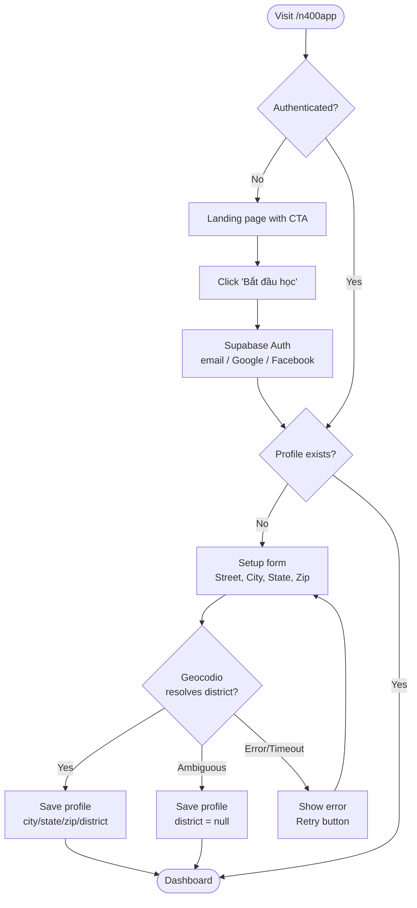
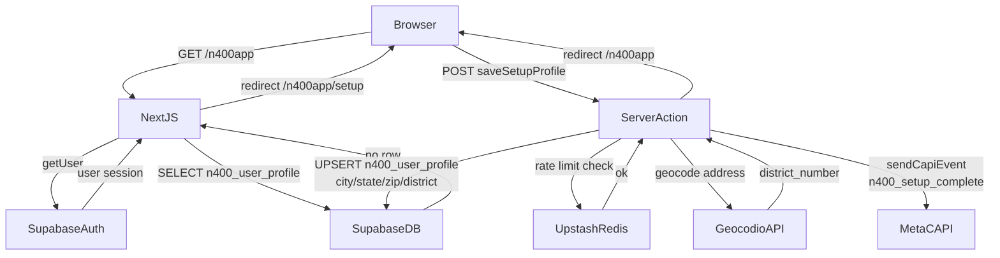
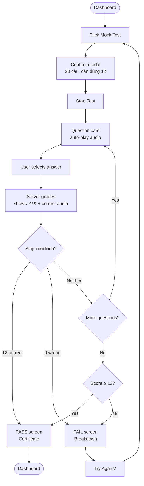
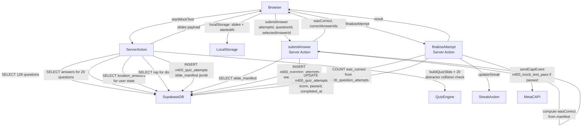
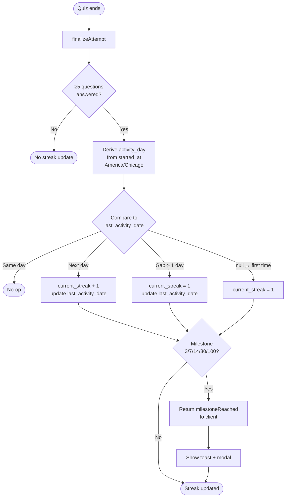
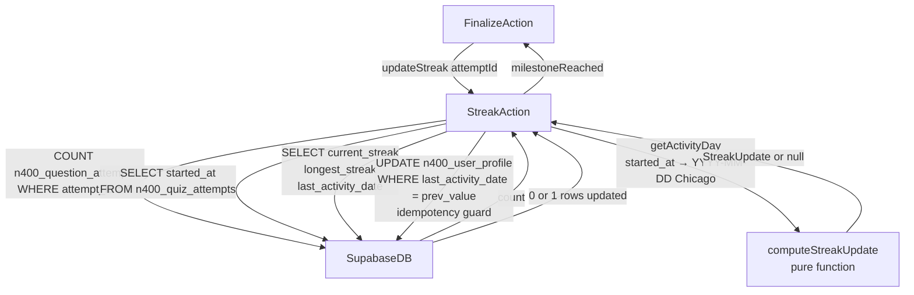
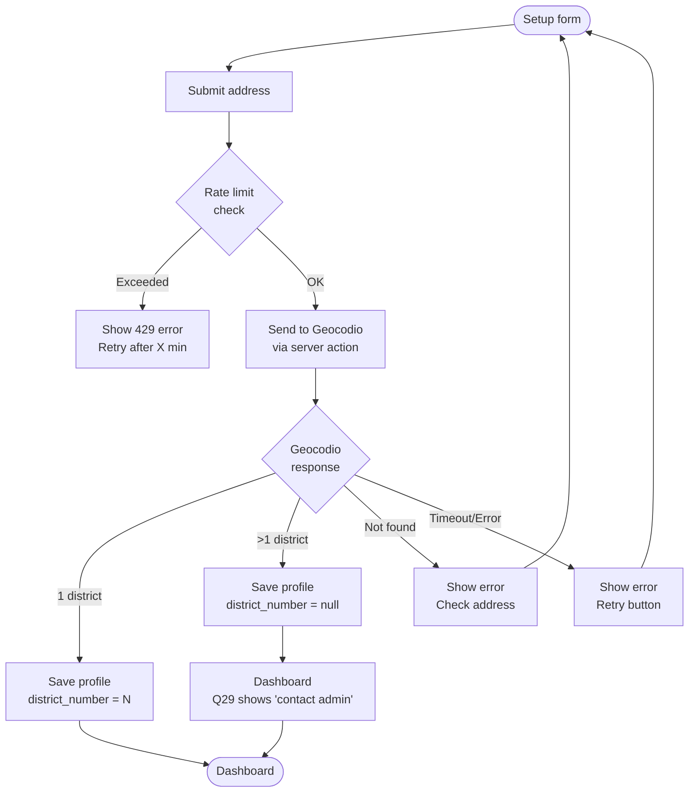
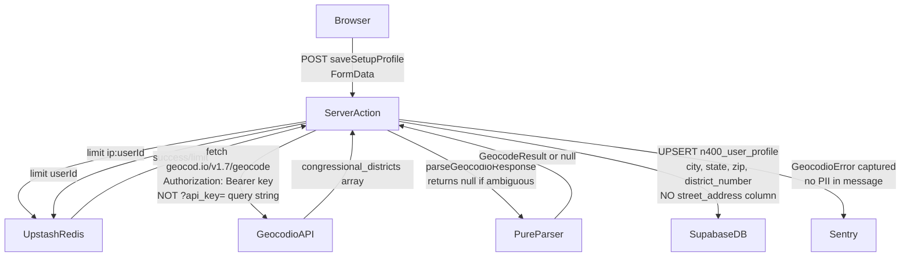

# N400 Civics Test App — PRD v2

**Date:** 2026-05-16
**Status:** Complete — ready for implementation
**Author:** PM/Eng review pass
**Base spec:** `docs/superpowers/specs/2026-05-13-n400app-design.md` (v2 approved)

> This document does NOT duplicate the full spec. It records: (1) bugs and gaps found in the phase plans, (2) L0–L3 architecture flows with Mermaid diagrams, (3) L4 trigger analysis, and (4) open items requiring resolution before implementation.

---

## 1. Bugs & Gaps Found in Phase Plans

### 1.1 Senator / Political Data — DEFERRED

Senator and governor data in `n400_02_state_data.sql` will be manually verified and updated by the owner before launch. The `ON CONFLICT DO UPDATE` clause in the seed SQL means corrections can be applied at any time by re-running the seed or running targeted UPDATE statements in the Supabase SQL Editor — no migration needed.

A comment has been noted for the seed file:

```sql
-- ⚠️ VERIFY AGAINST senate.gov BEFORE RUNNING — political data changes frequently.
-- Last verified: <date>
```

No implementation work required. Owner will handle data accuracy separately.

---

### 1.2 Flashcard `started_at` Bug (Phase 5, Task 2)

`saveFlashcardSession` in `flashcards/actions.ts` sets `started_at = new Date().toISOString()` at save time (when the user finishes), not at session start. This breaks the streak day-attribution rule in spec §4.7:

> "The streak day is the calendar date of `started_at` (in America/Chicago), not `completed_at`."

If a user starts flashcards at 11:55 PM and finishes at 12:05 AM, the current code attributes the session to the next day (wrong). The spec explicitly says this should count for the start day.

**Fix:** The flashcard page must capture `startedAt = new Date().toISOString()` when the component mounts (before the first card renders), and pass it to `saveFlashcardSession`. The server action must accept and use this value.

```typescript
// flashcards/page.tsx — capture on mount
const [startedAt] = useState(() => new Date().toISOString())

// flashcards/actions.ts — accept from client
export async function saveFlashcardSession(params: {
  questionIds: number[]
  markedKnew: number[]
  startedAt: string  // ← ADD THIS
}) {
  // Use params.startedAt for started_at, not new Date()
}
```

---

### 1.3 RLS Gap — Users Can UPDATE Their Own `passed` Field (Phase 1, Task 3)

The RLS policy on `n400_quiz_attempts`:

```sql
CREATE POLICY "n400 attempts own" ON public.n400_quiz_attempts FOR ALL
  USING (auth.uid() = user_id)
  WITH CHECK (auth.uid() = user_id);
```

`FOR ALL` includes UPDATE. A user can call `supabase.from('n400_quiz_attempts').update({ passed: true })` directly from the client and bypass server-side scoring entirely.

**Fix (Option B — RESOLVED):** Replace the `FOR ALL` policy with INSERT + SELECT only, and add a `SECURITY DEFINER` Postgres RPC for finalization. The RPC runs as the DB owner so it can UPDATE `passed` without a user UPDATE policy, while still verifying ownership via `auth.uid()`.

**RLS policy change (Phase 1 Task 3 migration):**

```sql
-- Replace the FOR ALL policy with:
CREATE POLICY "n400 attempts own insert" ON public.n400_quiz_attempts FOR INSERT
  WITH CHECK (auth.uid() = user_id);

CREATE POLICY "n400 attempts own select" ON public.n400_quiz_attempts FOR SELECT
  USING (auth.uid() = user_id);

-- No UPDATE policy for users — finalization goes through the RPC below.
```

**New migration (Phase 4, before Task 3):**

```sql
CREATE OR REPLACE FUNCTION finalize_mock_attempt(p_attempt_id uuid)
RETURNS jsonb
LANGUAGE plpgsql
SECURITY DEFINER
SET search_path = public
AS $$
DECLARE
  v_user_id uuid;
  v_score   int;
  v_total   int;
  v_passed  boolean;
BEGIN
  -- Verify caller owns this attempt
  SELECT user_id INTO v_user_id
  FROM n400_quiz_attempts WHERE id = p_attempt_id;
  IF v_user_id IS DISTINCT FROM auth.uid() THEN
    RAISE EXCEPTION 'Unauthorized';
  END IF;

  -- Server-side score from n400_question_attempts rows (client cannot influence)
  SELECT
    COUNT(*) FILTER (WHERE was_correct = true),
    COUNT(*)
  INTO v_score, v_total
  FROM n400_question_attempts
  WHERE attempt_id = p_attempt_id;

  v_passed := v_score >= 12;

  -- Idempotency: only update if not already finalized
  UPDATE n400_quiz_attempts
  SET score = v_score, total_questions = v_total,
      passed = v_passed, completed_at = NOW()
  WHERE id = p_attempt_id AND completed_at IS NULL;

  RETURN jsonb_build_object('score', v_score, 'total', v_total, 'passed', v_passed);
END;
$$;

-- Practice mode: same pattern, no passed field
CREATE OR REPLACE FUNCTION finalize_practice_attempt(p_attempt_id uuid)
RETURNS jsonb
LANGUAGE plpgsql
SECURITY DEFINER
SET search_path = public
AS $$
DECLARE
  v_user_id uuid;
  v_score   int;
  v_total   int;
BEGIN
  SELECT user_id INTO v_user_id
  FROM n400_quiz_attempts WHERE id = p_attempt_id;
  IF v_user_id IS DISTINCT FROM auth.uid() THEN
    RAISE EXCEPTION 'Unauthorized';
  END IF;

  SELECT
    COUNT(*) FILTER (WHERE was_correct = true),
    COUNT(*)
  INTO v_score, v_total
  FROM n400_question_attempts
  WHERE attempt_id = p_attempt_id;

  UPDATE n400_quiz_attempts
  SET score = v_score, total_questions = v_total, completed_at = NOW()
  WHERE id = p_attempt_id AND completed_at IS NULL;

  RETURN jsonb_build_object('score', v_score, 'total', v_total);
END;
$$;
```

**Server action change:** `finalizeAttempt` and `finalizePractice` call `supabase.rpc('finalize_mock_attempt', { p_attempt_id: attemptId })` instead of a direct `.update()`. The anon key (user session) is sufficient — the RPC's SECURITY DEFINER handles the privilege escalation safely.

---

### 1.4 Missing `n400_signup_complete` Analytics Event (Phase 8)

Spec §6.6 lists `n400_signup_complete` as a required GA4 event. Phase 8 implements `n400_setup_complete` (CAPI) and `n400_mock_test_start` (client) but never fires `n400_signup_complete`.

**Fix:** In the Supabase Auth callback handler (or the page the user lands on after email verification), fire:

```typescript
trackN400Event('n400_signup_complete')
```

This is a client-side GA4 event only (not a conversion — no CAPI needed). Wire it in the existing auth callback route or in the setup page's `useEffect` on first mount (check `searchParams.get('signup') === 'true'`).

---

### 1.5 Missing UX Safeguards (Spec §5.5 / §5.8)

Three spec requirements have no implementation in any phase plan:

| Requirement | Spec ref | Missing from |
|---|---|---|
| Confirm dialog before quitting quiz | §5.8 | Phase 4 mock-test page, Phase 5 practice page |
| Browser back mid-quiz → unload prompt | §5.5 | Phase 4 mock-test page |
| "Trợ giúp" link on every screen | §5.8 | Phase 3 layout |

**Fix for confirm-quit + back-button:** Add to `mock-test/[attemptId]/page.tsx` and `practice/page.tsx`:

```typescript
useEffect(() => {
  const handleBeforeUnload = (e: BeforeUnloadEvent) => {
    if (!state?.completed) {
      e.preventDefault()
      e.returnValue = ''
    }
  }
  window.addEventListener('beforeunload', handleBeforeUnload)
  return () => window.removeEventListener('beforeunload', handleBeforeUnload)
}, [state?.completed])
```

**Fix for "Trợ giúp" link:** Add to `N400Layout` footer:

```tsx
<a href="/n400app/help" className="text-blue-500 hover:underline">Trợ giúp / Help</a>
```

A minimal `/n400app/help` static page with contact info and FAQ is sufficient for v1.

---

### 1.6 Duplicate Commit Block in Phase 5

Phase 5 Task 2 has the Step 5 commit block duplicated (lines 659–676 are identical to lines 655–665). Minor — just delete the duplicate before executing.

---

### 1.7 `selectRandomQuestions` Type Alias Won't Compile

In `quiz-engine.ts`:

```typescript
export const selectRandomQuestions = pickRandomSubset<QuizQuestion>
```

TypeScript does not allow partial type application on a generic function this way. This will fail to compile.

**Fix:**

```typescript
export function selectRandomQuestions(questions: QuizQuestion[], count: number): QuizQuestion[] {
  return pickRandomSubset(questions, count)
}
```

---

### 1.8 `n400_question_attempts` RLS — Admin Read Policy Conflicts

The admin read policy uses `FOR SELECT` but the user policy uses `FOR ALL` (which includes SELECT). PostgreSQL evaluates policies with OR logic — the user policy already grants SELECT to the row owner, so the admin policy is redundant but harmless. However, the admin policy as written:

```sql
CREATE POLICY "n400 question attempts admin read" ON public.n400_question_attempts FOR SELECT USING (
  EXISTS (SELECT 1 FROM public.profiles WHERE id = auth.uid() AND role = 'admin')
);
```

...will never match for non-admin users because the user's own `FOR ALL` policy already covers their rows. This is fine. No fix needed — just documenting to avoid confusion during code review.

---

## 2. Architecture Flows (L0–L3)

### 2.1 First-Time User Onboarding

#### L0 — Intent & Outcome
A new user discovers the app, creates an account, tells us where they live, and lands on the dashboard ready to study. We know their congressional district so we can show the correct Representative answer.

#### L1 — Business Flow
1. User visits `mannaos.com/n400app`
2. User clicks "Bắt đầu học / Get Started"
3. User authenticates (email, Google, or Facebook)
4. System checks for existing profile — none found
5. System redirects to setup form
6. User enters street address, city, state, zipcode
7. System sends address to Geocodio (third-party, not stored)
8. Geocodio returns congressional district number
9. System saves profile (city, state, zip, district — no street)
10. System fires `n400_setup_complete` CAPI event
11. User lands on dashboard

#### L2 — User Flow



#### L3 — System Flow



---

### 2.2 Mock Test

#### L0 — Intent & Outcome
User takes a simulated USCIS interview: 20 random questions, stops early at 12 correct (pass) or 9 wrong (fail). Scoring is server-authoritative — client cannot inflate the score. Pass triggers a shareable certificate and a retargeting event.

#### L1 — Business Flow
1. User clicks Mock Test → confirms modal
2. Server selects 20 random questions, builds slide manifest (correct answer IDs per question)
3. Server persists manifest to DB — this is the grading source of truth
4. User answers each question; server grades each answer against the manifest
5. After each answer, server checks pass/fail thresholds
6. At 12 correct → PASS; at 9 wrong → FAIL; at 20 answered → whichever applies
7. Server finalizes attempt: computes score, sets `passed`, fires CAPI if pass
8. User sees result screen with certificate (pass) or breakdown (fail)

#### L2 — User Flow



#### L3 — System Flow



---

### 2.3 Streak System

#### L0 — Intent & Outcome
Users build a daily study habit. Completing any mode with ≥5 questions advances the streak by 1 day. The streak is idempotent — studying twice in one day counts once. Missing a day resets to 1.

#### L1 — Business Flow
1. User completes a quiz session (any mode)
2. Server counts question interactions in the attempt
3. If < 5 → no streak update
4. If ≥ 5 → derive the "activity day" from `started_at` in America/Chicago timezone
5. Compare activity day to `last_activity_date` in profile
6. Same day → no-op (already counted)
7. Next day → increment streak, update `last_activity_date`
8. Gap > 1 day → reset streak to 1
9. If new streak hits a milestone (3/7/14/30/100) → return milestone to client
10. Client shows toast + milestone modal

#### L2 — User Flow



#### L3 — System Flow



---

### 2.4 Geocodio District Lookup

#### L0 — Intent & Outcome
We need the user's congressional district to show the correct Representative answer for Q29. We ask for a full street address (zipcodes span multiple districts), send it to a third-party geocoding service, and store only the resolved district number — never the street address.

#### L1 — Business Flow
1. User submits setup form with street, city, state, zip
2. Server checks IP rate limit (5/hour) and user rate limit (10/day)
3. Server sends address to Geocodio via HTTPS with API key in Authorization header
4. Geocodio returns congressional district(s)
5. If 1 district → save district_number to profile
6. If >1 district (ambiguous) → save district_number = null; Q29 shows "contact admin"
7. If error/timeout → return error to user; street address discarded
8. Street address is never written to any database

#### L2 — User Flow



#### L3 — System Flow



---

## 3. L4 Trigger Analysis

Three flows require L4 technical workflow documents:

| Flow | Trigger | L4 file |
|---|---|---|
| Geocodio lookup | External service with failure modes (timeout, 404, ambiguous, rate limit) | `geocodio-L4.md` |
| Streak update | Idempotency + concurrent writes (multi-device same-day submit) | `streak-L4.md` |
| Meta CAPI conversion | External service + retry-safety + deduplication (deterministic event_id) | `capi-L4.md` |

These L4 files should be created before Phase 3 (Geocodio), Phase 6 (Streak), and Phase 8 (CAPI) implementation respectively.

---

## 4. Open Items

| # | Item | Owner | Status |
|---|---|---|---|
| 1 | ~~Verify all 50 senators + governors~~ | Owner | **DEFERRED** — owner will update data manually before launch |
| 2 | RLS fix for `finalizeAttempt` / `finalizePractice` | Architect | **RESOLVED** — Option B: Postgres RPC with SECURITY DEFINER (see §1.3) |
| 3 | Create L4 files for Geocodio, Streak, CAPI | Dev | **DONE** — `geocodio-L4.md`, `streak-L4.md`, `capi-L4.md` |
| 4 | `/n400app/help` static page | Dev | **RESOLVED** — stub with bilingual placeholder text in Phase 3; fill content pre-launch |
| 5 | TTS audio generation | Owner | **RESOLVED** — 128 question audio files already generated manually via Google TTS; owner will upload to Supabase Storage. Phase 2 script still needed for correct-answer + senator audio. |
| 6 | Geocodio v1.7 field name verification | Dev | **RESOLVED** — add as Phase 3 Task 4 pre-step: run a test call against Geocodio with a known Houston address and confirm `congressional_districts` field path before writing the parser |

---

## 5. Success Metrics (KPIs)

### Activation
| Metric | Target (30 days post-launch) |
|---|---|
| Signup → setup complete rate | ≥ 70% |
| Setup → first mock test start rate | ≥ 60% |
| Time to first mock test (from signup) | ≤ 10 minutes median |

### Engagement
| Metric | Target |
|---|---|
| D7 retention (users active on day 7) | ≥ 30% |
| D30 retention | ≥ 15% |
| Sessions per active user per week | ≥ 3 |
| Users with streak ≥ 7 days | ≥ 20% of active users |

### Learning Outcomes
| Metric | Target |
|---|---|
| Mock test pass rate (first attempt) | ≥ 50% |
| Mock test pass rate (after 3+ attempts) | ≥ 80% |
| Average accuracy improvement (attempt 1 vs attempt 5) | ≥ +20 percentage points |

### Lead Generation (MOS Business Goal)
| Metric | Target |
|---|---|
| `n400_setup_complete` CAPI events / month | ≥ 100 |
| `n400_mock_test_pass` CAPI events / month | ≥ 50 |
| N400 app → MOS N-400 filing inquiry conversion | ≥ 5% of pass events |

### Technical Health
| Metric | Target |
|---|---|
| Geocodio district resolution success rate | ≥ 90% of setup attempts |
| Audio load failure rate | ≤ 2% |
| Lighthouse mobile score (`/n400app`) | ≥ 80 |
| First Contentful Paint (4G throttle) | ≤ 2.5s |

---


No phase order changes needed. The fixes below slot into existing phases:

- **Phase 1 Task 3:** Fix RLS — split `FOR ALL` on `n400_quiz_attempts` into INSERT + SELECT only (see §1.3)
- **Phase 2:** Question audio (128 files) already generated by owner — skip that portion of the TTS script. Phase 2 script still runs for correct-answer audio (~500 files) and Q23 senator audio (100 files). Owner will upload the pre-generated question MP3s to Supabase Storage `n400-audio/questions/` and backfill `question_audio_url` manually (or via a targeted upload script).
- **Phase 3:** Add `/n400app/help` static page; verify Geocodio v1.7 field name before writing parser
- **Phase 4 — new step before Task 3:** Add migration with `finalize_mock_attempt` and `finalize_practice_attempt` SECURITY DEFINER RPCs (see §1.3). Update `finalizeAttempt` and `finalizePractice` server actions to call `supabase.rpc(...)` instead of `.update()`.
- **Phase 4:** Fix `selectRandomQuestions` type alias (wrapper function, not partial application); add `beforeunload` handler to mock-test quiz page
- **Phase 5:** Capture `startedAt` on flashcard page mount; pass to `saveFlashcardSession`; remove duplicate commit block in Task 2
- **Phase 6:** Accept `startedAt` param in `saveFlashcardSession` server action; use it for `started_at` DB field
- **Phase 8:** Add `n400_signup_complete` GA4 client event in auth callback or setup page mount
- **Pre-launch (owner):** Update senator/governor data in `n400_state_data` table before going live

---

---

## 6. User Personas & Stories

### Personas

**Persona A — Bà Lan, 58, Houston TX**
- Vietnamese-speaking, low English proficiency, preparing for N-400 interview in 3 months
- Uses iPhone, comfortable with Facebook, unfamiliar with apps beyond messaging
- Pain: can't find bilingual study materials; USCIS PDFs are English-only and hard to navigate
- Goal: pass the civics test on first attempt; avoid embarrassment at the interview

**Persona B — Anh Minh, 34, Houston TX**
- Bilingual, helping his mother (Persona A) prepare; tech-savvy
- Wants a tool he can hand to her that she can use independently
- Pain: existing apps are English-only or have confusing UX
- Goal: find something simple enough that his mother can use without his help

**Persona C — MOS Staff**
- Needs to keep question content, senator/rep data current without a developer
- Pain: any data change currently requires a code deploy
- Goal: edit questions, answers, and political data from an admin panel

---

### User Stories

#### Onboarding
- As Bà Lan, I want to sign up with Facebook so I don't need to remember a new password
- As Bà Lan, I want all labels and instructions in both Vietnamese and English so I understand what to do
- As Bà Lan, I want the app to know my location so it shows me the right answers for my senator and representative
- As Anh Minh, I want the setup form to explain why we need an address so his mother trusts the app

#### Mock Test
- As Bà Lan, I want the question read aloud automatically so I can practice hearing English
- As Bà Lan, I want to know immediately if I got the answer right or wrong, with the correct answer shown
- As Bà Lan, I want the test to stop when I've passed (12 correct) so I feel the same relief as the real interview
- As Bà Lan, I want to see which questions I got wrong so I know what to study next

#### Daily Practice
- As Bà Lan, I want to choose how many questions to practice so I can do a short session when I'm busy
- As Bà Lan, I want to practice without the pressure of pass/fail so I can learn at my own pace

#### Flashcards
- As Bà Lan, I want to flip a card to see the answer so I can test my memory before revealing it
- As Bà Lan, I want to mark cards I already know so I can focus on the ones I don't

#### Streak & Motivation
- As Bà Lan, I want to see my study streak so I feel motivated to study every day
- As Bà Lan, I want a celebration when I hit a milestone (7 days, 30 days) so I feel proud of my progress

#### View All 128
- As Bà Lan, I want to browse all 128 questions so I can review them at my own pace
- As Bà Lan, I want to search by keyword so I can quickly find a specific question
- As Anh Minh, I want to filter to my mother's weakest questions so we can focus study sessions

#### Admin
- As MOS Staff, I want to update senator names without a developer so the app stays accurate after elections
- As MOS Staff, I want to upload new audio files so pronunciation stays current

---

## 7. UI Design System

### 7.1 Design Principles

1. **Bilingual-first** — EN and VI always shown together, never toggled. No user should have to switch language to understand a label.
2. **Large-touch** — all interactive elements ≥ 48×48px. Primary CTAs full-width on mobile.
3. **Low cognitive load** — one action per screen. No sidebars, no nested menus inside the quiz flow.
4. **Brand consistency** — uses MannaOS teal as the primary action color. Feels like a natural extension of mannaos.com, not a separate product.

---

### 7.2 Color Tokens

All colors inherit from the existing MannaOS design system in `globals.css`. No new CSS variables needed.

| Role | Token | Value | Usage |
|---|---|---|---|
| Primary CTA | `--teal` | `hsl(174,54%,36%)` | Buttons, links, active states, streak badge |
| Primary hover | `--teal-dark` | `hsl(174,54%,25%)` | Button hover/active |
| Surface / card bg | `--surface` | `hsl(170,20%,98%)` | Question cards, mode cards, setup form |
| Background | `--background` | `hsl(0,0%,100%)` | Page background |
| Body text | `--foreground` | `hsl(0,0%,10%)` | All primary text |
| Secondary text | `--muted-foreground` | `hsl(215,16%,47%)` | Vietnamese subtitles, helper text |
| Border | `--border` | `hsl(214,32%,91%)` | Card borders, input borders |
| Correct answer | — | `hsl(142,71%,45%)` | Green — correct feedback, pass screen |
| Wrong answer | `--destructive` | `hsl(0,84%,60%)` | Red — wrong feedback, fail screen |
| Streak / fire | — | `hsl(30,80%,55%)` | Orange — streak badge, milestone modal |
| Disabled | `--muted` | `hsl(210,20%,96%)` | Disabled buttons, skeleton loaders |

---

### 7.3 Typography

Font: **Inter** (already loaded globally). No new font imports.

| Element | Size | Weight | Notes |
|---|---|---|---|
| Page title (h1) | 24px / 1.5rem | 700 | e.g. "Thi Thử Quốc Tịch" |
| Question text (EN) | 22px / 1.375rem | 600 | Larger for low-vision users |
| Question text (VI) | 16px / 1rem | 400 | Muted foreground color |
| Answer option | 18px / 1.125rem | 500 | |
| Answer option (VI) | 14px / 0.875rem | 400 | Muted, below EN text |
| Body / helper text | 16px / 1rem | 400 | |
| Caption / badge | 12px / 0.75rem | 500 | Category labels, question numbers |

---

### 7.4 Component Patterns

#### Mode Cards (Dashboard)
```
┌─────────────────────────────────────────┐
│  🎯  Thi Thử                            │
│      Mock Test                          │
│      Giả lập phỏng vấn thật: 20 câu    │
│                              ›          │
└─────────────────────────────────────────┘
```
- Background: `--surface`
- Border: `--border`, radius `0.75rem`
- Left emoji: 40px, vertically centered
- Hover: `bg-accent` (teal-light `hsl(170,30%,96%)`)
- Active: slight scale-down `scale-[0.98]`
- Full-width on mobile, 2-col grid on tablet+

#### Question Card
```
┌─────────────────────────────────────────┐
│  Câu 3/20          ✅ 2   ❌ 0          │
├─────────────────────────────────────────┤
│  What is the supreme law of the land?   │
│  Luật tối cao của quốc gia là gì?       │
│                          [🔊 Nghe lại]  │
└─────────────────────────────────────────┘

┌─────────────────────────────────────────┐
│  The (U.S.) Constitution                │
│  Hiến pháp Hoa Kỳ                       │
└─────────────────────────────────────────┘
┌─────────────────────────────────────────┐
│  The Declaration of Independence        │
└─────────────────────────────────────────┘
```
- Question card: white bg, `--border`, radius `0.75rem`, padding `1.25rem`
- Options: white bg, `--border` 2px, radius `0.75rem`, min-height `56px`
- Correct (revealed): `bg-green-50 border-green-400`
- Wrong (revealed): `bg-red-50 border-red-400`
- All other correct answers highlighted green after reveal

#### Audio Button
- Idle: teal outline button, `border-teal text-teal`
- Playing: filled teal, white text, subtle pulse animation
- Error/missing: gray, disabled, tooltip "Audio đang bảo trì"
- Min size: 48×48px always

#### Streak Badge (Header)
- Active today: `bg-orange-100 text-orange-700` pill — `🔥 7`
- Inactive: `bg-gray-100 text-gray-500` pill — `🔥 7`
- Shown in N400 layout header, right side

#### Pass / Fail Screen
- Pass: `bg-green-50 border-2 border-green-400`, 🎉 emoji, teal CTA
- Fail: `bg-red-50 border-2 border-red-300`, 📚 emoji, breakdown list below

---

### 7.5 Screen-by-Screen Layout

#### Landing (`/n400app` — unauthenticated)
- Full-height centered column, max-width `480px`
- MannaOS teal hero gradient strip at top (matches site hero)
- 🇺🇸 flag emoji + headline in both languages
- Single CTA button: full-width teal, "Bắt đầu học / Get Started"
- 3 feature bullets below (bilingual): audio, mock test, streak
- Disclaimer footer (bilingual, small gray text)

#### Dashboard (`/n400app` — authenticated)
- Streak card at top (orange, prominent) — only shown if streak > 0
- Today-state indicator: "✅ Đã học hôm nay" or "Bạn chưa học hôm nay..."
- 4 mode cards in single column (mobile) / 2×2 grid (tablet+)
- Stats row: total answered · accuracy % · mock tests passed
- "Đổi địa chỉ / Change address" link at bottom, small, muted

#### Setup Form (`/n400app/setup`)
- Single-column form, max-width `448px`, centered
- Bilingual heading + helper text always visible (not collapsible)
- Geocodio privacy notice in small gray text above submit
- Submit button: full-width teal, shows spinner + "Đang xác định khu vực..." while pending
- Error state: red border on form + bilingual error message below

#### Mock Test — Active (`/n400app/mock-test/[attemptId]`)
- No sidebar, no nav — full focus mode
- Progress bar at top: teal fill, shows X/20
- Score counters: ✅ N ❌ N — top right
- Question card: full-width, prominent
- 4 option buttons: stacked, full-width
- After answer: "Câu tiếp theo →" button appears at bottom, teal
- No "skip" or "back" buttons — matches real interview

#### Result Screen
- Centered, max-width `448px`
- Large score display: `score/total` in 3xl bold
- Pass: green card + share button (copy link to certificate)
- Fail: red card + accordion list of missed questions
- Two CTAs: "Thi lại" (teal) + "Về trang chủ" (outline)

#### Flashcards (`/n400app/flashcards`)
- Single card centered, max-width `512px`
- Card number top-left: "Thẻ 12/128"
- Front: question EN (large) + VI (muted) + audio button
- Flip button: full-width teal outline, "Lật thẻ / Flip Card 🔄"
- Back: correct answers list + audio per answer
- Two mark buttons: ✗ red outline "Chưa thuộc" · ✓ green "Đã thuộc"

#### View All 128 (`/n400app/all-questions`)
- Search input: full-width, top, with search icon
- "Câu yếu của tôi" filter chip: teal when active, gray outline when inactive
- Count label: "Hiển thị 128/128 câu" — updates as filter applies
- Accordion: each item shows `#N` + EN question + VI question
- Expanded: correct answers in green-tinted box, audio buttons inline

#### Help Page (`/n400app/help`) — stub
- Static page, max-width `640px`
- 3 FAQ items (bilingual): what is N400, how does the app work, how to contact MOS
- Contact link: email or phone (placeholder for now)
- Back link to dashboard

---

### 7.6 Navigation & Layout Shell

The N400 app uses its **own layout** (`n400app/layout.tsx`), not the main site Navbar/Footer. This keeps the quiz experience focused and avoids the main site nav cluttering the study flow.

```
┌─────────────────────────────────────────┐
│  🇺🇸 N400 App          [🔥 7]  [Trợ giúp]│  ← N400 header (simple)
├─────────────────────────────────────────┤
│                                         │
│           [page content]                │
│                                         │
├─────────────────────────────────────────┤
│  Tài liệu học liệu. Không phải tư vấn  │  ← Disclaimer footer (required)
│  pháp lý. Nội dung từ USCIS.gov.        │
└─────────────────────────────────────────┘
```

- Header: `border-b`, white bg, `px-4 py-3`
- Logo: "🇺🇸 N400 App" — links back to `/n400app` dashboard
- Right side: streak badge + "Trợ giúp" link (small, muted)
- Footer: `border-t`, `text-xs text-muted-foreground`, centered, bilingual disclaimer

---

### 7.7 Responsive Breakpoints

| Breakpoint | Layout changes |
|---|---|
| `< 640px` (mobile) | Single column everywhere. Full-width buttons. 22px question text. |
| `640px–1024px` (tablet) | Dashboard mode cards: 2×2 grid. Max-width containers centered. |
| `> 1024px` (desktop) | Same as tablet. Quiz flow stays narrow (max-w-2xl) — no wide layout needed. |

---

### 7.8 Accessibility

- All interactive elements ≥ 48×48px touch target
- Color is never the only indicator — correct/wrong answers also show ✓/✗ icons
- `aria-label` on all icon-only buttons (audio, flip)
- `aria-pressed` on the "Câu yếu của tôi" filter chip
- `aria-busy` on submit buttons during pending state
- Focus ring: teal `--ring` color, 2px offset
- Body text ≥ 16px, question text ≥ 22px — meets WCAG AA for low-vision users

---

*This PRD complements the master spec. For full data model, RLS policies, and phase task lists, see `docs/superpowers/specs/2026-05-13-n400app-design.md` and `docs/superpowers/plans/2026-05-13-n400app-master.md`.*
